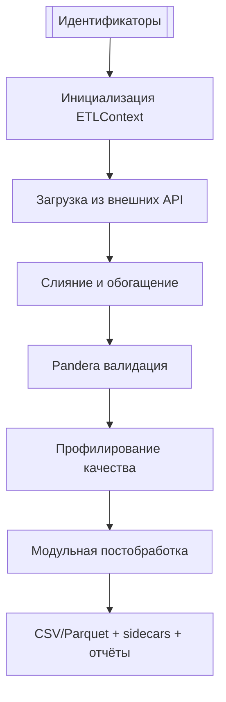

# DATA PROCESSING PROTOCOL

**[ChEMBL BIOACTIVITY DATA COLLECTION]**

| Protocol Title: | ChEMBL Bioactivity Data Collection |
|---|---|
| Protocol Number: | CHEMBL/DPP01.2 |
| Protocol Version & Date | Version: 2.1<br>October 10, 2025 |
| Study Title: | A Statistical Evaluation of Experimental Uncertainty of Heterogeneous Public Bioactivity Data |
| Repository | SatoryKono/ChEMBL_data_acquisition |

**Prepared:**

Amir Mrasov
Date and Signature:

**Approved:**

Oleg Stroganov
Date and Signature:

Fedor Novikov
Date and Signature:

---

## Оглавление
- [Введение](#введение)
- [1. Программное окружение и зависимости](#1-программное-окружение-и-зависимости)
- [2. Структура библиотечных модулей](#2-структура-библиотечных-модулей)
- [3. Источники данных](#3-источники-данных)
- [4. Модель данных (Star Schema)](#4-модель-данных-star-schema)
- [5. Workflow извлечения данных](#5-workflow-извлечения-данных)
- [6. Контроль качества](#6-контроль-качества)
- [7. Нормализация и постобработка](#7-нормализация-и-постобработка)
- [8. Финальные выходные таблицы и отчётность](#8-финальные-выходные-таблицы-и-отчётность)
- [9. Приложения](#9-приложения)

---

## Введение
Протокол приобретения данных ChEMBL разработан для стандартизации процесса извлечения, нормализации и контроля качества данных, получаемых из базы данных ChEMBL. Его цель состоит в создании единой методологической основы для обработки информации о биологической активности соединений, обеспечивающей воспроизводимость, сопоставимость и соответствие установленным требованиям к технической документации. Использование этого протокола упрощает интеграцию данных ChEMBL в аналитические пайплайны, снижает риск ошибок при работе с неоднородными источниками и гарантирует соблюдение стандартов качества.

Назначение протокола. Основная задача этого документа — регламентировать процесс доступа к данным ChEMBL с использованием официальных веб-сервисов и клиентских библиотек. Протокол формализует весь жизненный цикл данных: от начального извлечения через API до создания финальных нормализованных наборов данных, подходящих для последующей аналитики, машинного обучения или интеграции в корпоративные ETL-процессы. Он минимизирует ручные вмешательства, устраняет неоднозначности в структурах данных и повышает надежность использования ChEMBL как базового источника данных.

Контекст. База данных ChEMBL является одной из наиболее полных и признанных мировым сообществом коллекций данных о биологической активности малых молекул. Ее использование требует унифицированного подхода из-за изначальной неоднородности источников и форматов. Этот протокол обеспечивает согласованность между различными компонентами пайплайна: от REST API ChEMBL до генерации стандартизированных выходных наборов данных. Документ ориентирован на соответствие внутренним и международным стандартам, повторяя структуру протокола сбора данных CHEMBL-DM01. Протокол создает мост между базой данных ChEMBL и практическими сценариями ее использования, закрепляя единый стандарт качества и воспроизводимости.

---
## 1. Программное окружение и зависимости

| Компонент | Конфигурация | Примечание |
|---|---|---|
| Python | `>=3.11,<3.13` | Официально поддерживаются CPython 3.11.x и 3.12.x; блокируется 3.13 для CI-стабильности. |
| Основные пакеты | `numpy>=2.3.3`, `pandas>=2.3.3`, `requests>=2.32.5`, `PyYAML>=6.0.3`, `openpyxl>=3.1.5`, `pyarrow>=17.0.0`, `jsonschema>=4.25.1`, `pandera>=0.26.1`, `cachetools>=5.3.3`, `pydantic>=2.11.9` | Версии заданы в `pyproject.toml` и синхронизированы с `requirements*.txt`. |
| Dev/QA инструменты | `pytest>=8.4.2`, `pytest-json-report>=1.5.0`, `pytest-cov>=6.0.0`, `hypothesis>=6.138.15`, `responses>=0.25.8`, `black>=25.1.0`, `ruff>=0.13.0`, `mypy>=1.17.1`, `pre-commit>=3.7.1` | Доступны через extras `pip install .[dev]`; обеспечивают тестирование, статанализ и форматирование. |
| CLI entrypoints | `get-data`, `get-activity-data`, `get-assay-data`, `get-target-data`, `get-document-data`, `get-testitem-data`, `get-document-type`, `get-input-initialisation`, `csv-utils`, `mapper`, `table-quality`, `chunk-io`, `get-activities`, `check-determinism`, `make-md-summary` | Объявлены в `[project.scripts]` (`pyproject.toml`) и реализованы в `library/cli/commands/` и `library/utils/cli_tools/`. |

---
## 2. Структура библиотечных модулей:
- **`library/clients/`**: API-клиенты (ChEMBL, CrossRef/OpenAlex, PubChem, UniProt, GtoPdb) с политикой ретраев и rate limiting.
- **`library/io/`**: чтение/запись CSV/Parquet, управление путями, генерация sidecar-метаданных.
- **`library/utils/`**: вспомогательные функции (CLI-инструменты, валидация аргументов, контроль идемпотентности).
- **`library/postprocess/{table}/`**: модульные шаги постобработки для таблиц (activities, assays, documents, targets) плюс общее ядро `common/`.
- **`library/pipelines/testitem/`**: специализированный конвейер тест-айтемов (чтение идентификаторов, ChEMBL, PubChem, финализация).
- **`library/qa/`**: профилирование качества, отчёты и вспомогательные хуки (`reporting.py`, `table_quality.py`).
- **`library/orchestration/context.py`**: `ETLContext` с менеджментом клиентов, лимитов запросов и общими ресурсами для CLI-скриптов.

**Примечание:** В кодовой базе также присутствуют директории `processing/`, `postprocessing/`, `testitem_pipeline/`, которые являются избыточными или недокументированными. Рекомендуется провести рефакторинг для унификации структуры.

---
## 3. Источники данных
- **ChEMBL API** (`library/integration/chembl_library.py`, `chembl_client.py`) — базовый источник для активностей, ассев, целей и молекул.
- **PubMed & Semantic Scholar** (`library/integration/pubmed_library.py`, `semantic_scholar_library.py`) — расширение документной витрины, агрегация метаданных публикаций.
- **OpenAlex & CrossRef** (`library/integration/openalex_crossref_library.py`) — DOI- и citation-обогащение; поддерживают лимит RPS и fallback-механизмы.
- **UniProt** (`library/integration/uniprot_library.py`) — белковые и таксономические атрибуты целей, маппинг идентификаторов.
- **Guide to Pharmacology (GtoPdb/IUPHAR)** (`library/integration/iuphar_library.py`) — классификация таргетов, статусы и синонимы.
- **PubChem** (`library/integration/pubchem_library.py`) — структуры и идентификаторы для тест-айтемов, обработка нестандартных ответов.
- **Молекулярный каталог** (`library/integration/molecule_catalog.py`, `config/molecule_catalog/*`) — родительские связи и доменные исключения.
- **Локальные словари** (`config/dictionary/*`, `config/pipeline/*.yaml`) — стандартизованные значения BAO, confirmatory terms, параметры постобработки.

---
## 4. Модель данных (Star Schema)
Таблица `activity` связывает измерения `assay`, `target`, `document`, `testitem` по ключам `assay_chembl_id`, `target_chembl_id`, `document_chembl_id`, `molecule_chembl_id`. Схемы поддерживаются Pandera-валидацией и модульной постобработкой (`library/postprocess/{table}/schema.py`).

| Таблица | Ключ | Связанные атрибуты |
|---|---|---|
| activity | `activity_id` | `standard_type`, `standard_value`, `quality_flag`, `pipeline_version`, `assay_chembl_id`, `target_chembl_id`, `document_chembl_id`, `molecule_chembl_id` |
| assay | `assay_chembl_id` | `assay_type`, `assay_test_type`, `description`, `is_confirmatory`, `target_chembl_id` |
| target | `target_chembl_id` | `pref_name`, `target_type`, `organism`, `synonyms`, `uniprot_id`, `gtopdb_id` |
| document | `document_chembl_id` | `title`, `doc_type`, `publication_year`, `doi`, `PubMed.PMID`, `OpenAlex.Id`, `CrossRef.Type` |
| testitem | `molecule_chembl_id` | `parent_molecule_chembl_id`, `canonical_smiles`, `pubchem_cid`, `development flags` |

---
## 5. Workflow извлечения данных
### 5.1 Общая оркестрация

- **`library.orchestration.context.ETLContext`**: используется для ограничения запросов (chembl, pubchem, openalex_crossref).
- **`library.postprocess.common.run_steps`**: используется для постобработки данных, шаги описаны в `config/pipeline/*.yaml` и могут переопределяться переменными окружения.
- **`library.qa.reporting.build_table_quality_hook`**: используется для генерации CSV/JSON отчётов (`*_quality_report_table.csv`, `*.quality.json`) и интеграции в логи `*_pipeline_done`.
- **`library.postprocess.common.collect_postprocess_metrics`**: используется для создания JSON `<table>.postprocess.report.json` с метриками (rows, columns, duration_s, steps, extras по таблице).

### 5.2 Активности — `scripts/get_activity_data.py`
**I. Основные этапы:**
чтение идентификаторов → пакетная загрузка через `run_activity_pipeline` → нормализация (`library.postprocess.activities.steps`) → Pandera (`library.schemas.activities`) → QA.

**II. Аргументы:**
`--input-csv`, `--output-csv`, `--final-out`, `--dry-run`, `--skip-existing`, `--force`, `--limit`, `--offset`, `--timeout`, `--batch-size`, `--workers`.

**III. Пример запуска:**
```bash
python scripts/get_activity_data.py \
--config config/config.yaml \
--input-csv data/input/activity.csv \
--final-out data/output/activity/output.activity.csv \
--batch-size 5 --timeout 90 --workers 1
```

### 5.3 Эксперименты — `scripts/get_assay_data.py`
**I. Основные этапы:**
Использует `run_assay_pipeline` для загрузки ChEMBL, слияния словарей и шагов `library.postprocess.assays.steps`.

**II. Аргументы:**
`--input-csv`, `--output-csv`, `--final-out`, `--limit`, `--offset`, `--timeout`, `--batch-size`.
*(**Примечание:** Аргументы `--workers`, `--dry-run`, `--force` в коде отсутствуют).*

**III. Пример запуска:**
```bash
python scripts/get_assay_data.py \
--config config/config.yaml \
--input-csv data/input/assay.csv \
--final-out data/output/assays/output.assays.csv \
--batch-size 10 --timeout 30
```

### 5.4 Документы — `scripts/get_document_data.py`
**I. Основные этапы:**
Скрипт использует аргумент `--mode {chembl,pubmed,all}` вместо подкоманд. Базовый режим (`all`) собирает совокупные данные, управляет RPS (`--openalex-rps`, `--crossref-rps`) и fallback DOI CSV (`--fallback-doi-csv`, `--fallback-doi-overwrite`).

**II. Аргументы:**
`--input-csv`, `--final-out`, `--command-timeout`, `--max-retries`, `--disable-pubmed`, `--disable-crossref`.

**III. Пример:**
```bash
python scripts/get_document_data.py --mode all \
--config config/config.yaml \
--input-csv data/input/document.csv \
--final-out data/output/document/output.document.csv
```

### 5.5 Мишени — `scripts/get_target_data.py`
**I. Подкоманды:**
`chembl`, `uniprot`, `iuphar`, `all`; каждая поддерживает свои наборы аргументов (например, `--chembl-out`, `--uniprot-out`, `--iuphar-out`).

**II. Аргументы:**
`--input-csv`, `--output-csv`, `--final-out`, `--dry-run`, `--skip-existing`, `--force`, `--limit`, `--offset`, `--timeout`, `--batch-size`, `--workers`.

**III. Пример запуска:**
```bash
python scripts/get_target_data.py all --config config/config.yaml \
    --input-csv data/targets.ids.csv --final-out output/targets.csv \
    --chembl-out tmp/targets.chembl.csv --uniprot-out tmp/targets.uniprot.csv \
    --disable-gtop --chunk-size 25
```

### 5.6 Исследуемые соединения — `scripts/get_testitem_data.py`
**I. Основные этапы:**
чтение идентификаторов (`read_identifiers`) → пакетная загрузка через `fetch_chembl_metadata` → нормализация (`finalize_export`) → Pandera (`library.schemas.activities`).

**II. Аргументы:**
`--input-csv`, `--output-csv`, `--final-out`, `--skip-existing`, `--force`, `--limit`, `--offset`, `--timeout`, `--batch-size`.
*(**Примечание:** Аргументы `--workers`, `--dry-run` в коде отсутствуют).*

**III. Пример:**
```bash
python scripts/get_testitem_data.py --config config/config.yaml \
--input-csv data/testitems.ids.csv --final-out output/testitems.csv \
--batch-size 1000 --timeout 30
```

---
## 6. Контроль качества

| Компонент | Метрики / Артефакты | Реализация |
|---|---|---|
| Pandera валидация | Обязательные/опциональные колонки, типы, правила nullable | `library/schemas/*.py`, `library/postprocess/{table}/schema.py`. |
| Table Quality профилирование | `row_count`, `non_null_ratio`, `pattern_*`, `numeric_*`, `bool_like_ratio`, `distinct_ratio` | `library/qa/table_quality.py` через хук `build_table_quality_hook`. |
| Postprocess metrics | `rows`, `columns`, `duration_s`, `steps`, `validation.schema`, `extras` (input_rows, ambiguous_classifications) | `library.postprocess.common/utils.collect_postprocess_metrics`. |
| Логирование этапов | события `*_pipeline_done`, `quality_report_*`, `failure-case CSV` | `library.qa.reporting` и `library.utils.logging`. |
| Тестовый контур | `reports/test_report.json`, `reports/test_summary.md`, `success-rate ≥95%` | Pytest + json-report, консолидируется `tools/make_md_summary.py`. |

---
## 7. Нормализация и постобработка
Модульная система управляется YAML-конфигами (`config/pipeline/*.yaml`). В коде используется двухфайловая система: один файл (например, `activity.yaml`) определяет высокоуровневый ETL-пайплайн, а другой (`activities.yaml`) — шаги постобработки. `library.postprocess.common.run_steps` исполняет цепочки шагов, применяет `infer_pipeline_version` и пишет артефакты (`*.postprocess.report.json`).

### 7.1 Активности
- **Шаги:** `normalize_activity_records`, `enrich_activity_quality`, `finalize_activity_records` (`library/postprocess/activities/steps.py`).
- **Схема:** `library/postprocess/activities/schema.py` контролирует типы идентификаторов (Int64, string) и обязательность ключей.
- **Конфигурация:** `config/pipeline/activities.yaml` параметры `relation_normalization`, `enforce_uppercase_units`.

### 7.2 Эксперименты
- **Шаги:** `normalize_assay_metadata`, `enrich_assay_flags`, `finalize_assay_records` (`library/postprocess/assays/steps.py`).
- **Схема:** `library/postprocess/assays/schema.py`, включает проверки BAO-кодов и confirmatory-флага.
- **Конфигурация:** `config/pipeline/assays.yaml` — параметры `uppercase_categories`, `confirmatory_terms`.

### 7.3 Документы
- **Шаги:** `normalize_document_fields`, `enrich_document_publication_year`, `finalize_document_records` (`library/postprocess/documents/steps.py`).
- **Схема:** `library/postprocess/documents/schema.py`, следит за уникальностью `document_chembl_id` и заполнением DOI/годов.
- **Конфигурация:** `config/pipeline/documents.yaml` (`normalise_unicode`, `fallback_year`, `ensure_unique_ids`).

### 7.4 Молекулярные мишени
- **Шаги:** `normalize_target_fields`, `enrich_target_synonyms`, `finalize_target_records` (`library/postprocess/targets/steps.py`).
- **Схема:** `library/postprocess/targets/schema.py`, проверяет `target_type`, `organism`, агрегированные синонимы.
- **Конфигурация:** `config/pipeline/targets.yaml` (`normalize_taxonomy`, `synonym_sources`, `sort_by`).

### 7.5 Исследуемые соединения
- **Конвейер:** определён в `config/pipeline/testitem.yaml`, исполняется `library.pipelines.testitem.cli.run`.
- **Функции:** `catalog.resolve_parent_ids`, `pubchem.fetch_pubchem_details`, `cli.finalize_output`.
- **Схема:** `library/pipelines/testitem/core.py` (класс `TestitemsSchema`).

---
## 8. Финальные выходные таблицы и отчётность
### 8.1 Activity Export
| name | type | nullable | domain | source | description |
|---|---|---|---|---|---|
| activity_id | Int64 | No | Primary activity identifier | ChEMBL Activities API | Ключ факта; нормализуется `finalize_activity_records`. |
| molecule_chembl_id | string | No | Molecule ID | ChEMBL + testitem_dim | FK → testitem_dim, uppercase. |
| assay_chembl_id | string | No | Assay ID | ChEMBL + assay_dim | FK → assay_dim, строгие идентификаторы. |
| target_chembl_id | string | Yes | Target ID | Assay metadata | Заполняется при наличии связанного таргета. |
| standard_type | string | No | Тип измерения | Postprocess | Обязательное поле, нормализованные значения. |
| standard_value | float64 | Yes | Нормализованное значение | ChEMBL + нормализация единиц | Проверка диапазонов и пропусков. |
| quality_flag | boolean | Yes | QA flag | Постпроцесс | Производный признак `enrich_activity_quality`. Схема не накладывает строгого ограничения на тип. |
| pipeline_version | string | Yes | Pipeline version | Package metadata | Ставится автоматически `infer_pipeline_version`. |

### 8.2 Assay Export
| name | type | nullable | domain | source | description |
|---|---|---|---|---|---|
| assay_chembl_id | string | No | Assay identifier | ChEMBL | Первичный ключ. |
| assay_type | string | No | BAO type | ChEMBL + словари | Uppercase, выверяется Pandera. |
| assay_test_type | string | No | Test type | ChEMBL | Нормализация whitespace. |
| description | string | No | Assay description | ChEMBL | Текстовое описание. |
| target_chembl_id | string | Yes | Related target | ChEMBL | Связь с target_dim. |
| is_confirmatory | boolean | Yes | Confirmatory flag | Derived | Настраивается в config/pipeline/assays.yaml. |
| pipeline_version | string | Yes | Pipeline version | Postprocess | Для трассировки выпусков. |

### 8.3 Document Export
| name | type | nullable | domain | source | description |
|---|---|---|---|---|---|
| document_chembl_id | string | No | Document ID | ChEMBL | Первичный ключ. |
| title | string | Yes | Title | ChEMBL/PubMed | Unicode-NFKC нормализация. |
| doc_type | string | No | Document type | ChEMBL | Категориальное поле. |
| publication_year | Int64 | Yes | Publication year | ChEMBL/CrossRef/OpenAlex/PubMed | Алгоритм приоритетов см. enrich_document_publication_year. |
| doi | string | Yes | DOI | ChEMBL/CrossRef/OpenAlex | Может дополняться fallback CSV. |
| PubMed.PMID | string | Yes | PMID | PubMed API | Хранится отдельно. |
| OpenAlex.Id | string | Yes | Work identifier | OpenAlex API | Используется для валидации источников. |
| CrossRef.Type | string | Yes | CrossRef type | CrossRef API | Категория публикации. |
| pipeline_version | string | Yes | Pipeline version | Postprocess | Версия документа. |

### 8.4 Target Export
| name | type | nullable | domain | source | description |
|---|---|---|---|---|---|
| target_chembl_id | string | No | Target ID | ChEMBL | Первичный ключ. |
| pref_name | string | Yes | Preferred name | ChEMBL/UniProt | Тримминг, fallback placeholder. |
| target_type | string | No | Target type | ChEMBL | Категория объекта. |
| organism | string | Yes | Organism | ChEMBL/UniProt | Нормализуется normalize_taxonomy. |
| synonyms | string | Yes | Synonym set | Aggregated | Список через ;. |
| uniprot_id | string | Yes | UniProt accession | UniProt API | Может быть пустым. |
| gtopdb_id | string | Yes | Guide to Pharmacology | IUPHAR/GtoPdb | Интеграция классификации. |
| pipeline_version | string | Yes | Pipeline version | Postprocess | Контроль изменений. |

### 8.5 Test Item Export
| name | type | nullable | domain | source | description |
|---|---|---|---|---|---|
| molecule_chembl_id | string | Yes | Molecule ID | ChEMBL | Первичный ключ, допускает пустые значения для place-holder строк. |
| parent_molecule_chembl_id | string | Yes | Parent molecule | Molecule catalog | Разрешает сопоставление с родительскими сущностями. |
| canonical_smiles | string | Yes | Canonical SMILES | ChEMBL | Основная структура. |
| pubchem_cid | string | Yes | PubChem CID | PubChem | Нормализуется в finalize_export. |
| natural_product, prodrug, oral, parenteral, topical | boolean | Yes | Development flags | ChEMBL | Переносят флаги разработки. |
| pipeline_version | string | Yes | Pipeline version | Postprocess | Добавляется при финализации. |
| timestamp_utc | datetime64[ns] | Yes | Export timestamp | CLI runtime | Временная метка запуска. |

---
## 9. Приложения
### 9.1 YAML-конфигурации постобработки
| Файл | Назначение | Ключевые параметры |
|---|---|---|
| `config/pipeline/activities.yaml` | Нормализация активностей | `relation_normalization`, `enforce_uppercase_units`, `quality_terms`. |
| `config/pipeline/assays.yaml` | Постобработка ассев | `uppercase_categories`, `confirmatory_terms`, `normalize_identifiers`. |
| `config/pipeline/documents.yaml` | Документный постпроцесс | `normalise_unicode`, `fallback_year`, `ensure_unique_ids`. |
| `config/pipeline/targets.yaml` | Конвейер целей | `normalize_taxonomy`, `synonym_sources`, `sort_by`. |
| `config/pipeline/testitem.yaml` | Конвейер тест-айтемов | Шаги high-level, привязка схемы `TestitemsSchema`, artefacts (`*.meta.yaml`). |

### 9.2 Быстрый справочник CLI
| Скрипт | Основной сценарий | Ключевые опции |
|---|---|---|
| `get_activity_data.py` | ETL активностей | `--batch-size`, `--timeout`, `--workers`, `--dry-run`, `--skip-existing`, `--force`. |
| `get_assay_data.py` | Выгрузка ассев | `--batch-size`, `--timeout`, `--limit`, `--offset`. |
| `get_document_data.py` | Документная витрина | `--mode {chembl,pubmed,all}`, `--openalex-rps`, `--crossref-rps`, `--fallback-doi-*`. |
| `get_target_data.py` | Цели и классификация | Подкоманды (`chembl`, `uniprot`, `iuphar`, `all`), `--disable-gtop`, `--chunk-size`. |
| `get_testitem_data.py` | Тест-айтемы | `--batch-size`, `--timeout`, `--limit`, `--offset`, `--force`. |
| `get-data` | Объединённый драйвер | Делегирует к соответствующим подкомандам. |
| `table-quality` | Профилирование | Анализ существующих CSV, экспорт отчётов QA. |

### 9.3 Отчёты QA/тестирования
*(Без изменений)*
