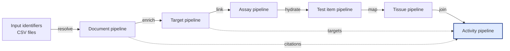

# ChEMBL Data Acquisition Utilities

> **Languages:** English · [Русский](README_RU.md)

The English text is mirrored in [`README_EN.md`](README_EN.md) to keep the
language pairs in sync.

This repository provides reproducible pipelines for downloading, normalising and
quality-controlling ChEMBL datasets. The utilities bundle command line scripts,
HTTP clients, schema validations and reporting helpers that allow analysts to
run individual entity pipelines or orchestrate the full end-to-end workflow in
a single command.

## End-to-end pipeline



Each pipeline is idempotent and can be executed independently. The
[`get-data`](./scripts/get_data.py) orchestrator reuses the same configuration
and logging options to run the Document → Target → Assay → Test item → Tissue →
Activity sequence automatically while producing consistent outputs.

## Repository layout

| Path | Description |
|------|-------------|
| `scripts/` | Command line entry points for each pipeline and orchestration helpers. |
| `library/` | Reusable packages: API clients, pipelines, validation schemas, post-processing and QA utilities. |
| `config/` | Default YAML configuration, schemas and dictionary resources used during enrichment. |
| `data/` | Lightweight fixtures and smoke-test inputs that mirror the expected CSV structure. |
| `docs/` | Full bilingual documentation set (`en`/`ru`) kept in sync. |
| `tests/` | Deterministic pytest suite covering unit, integration and end-to-end scenarios. |
| `reports/` | Location where JSON/Markdown test reports are emitted by CI and local runs. |
| `Makefile` | Convenience targets for formatting, linting, tests and documentation checks. |

A detailed breakdown of sub-packages, glossary and extended guides is available
in [`docs/en/SUMMARY.md`](./docs/en/SUMMARY.md) and
[`docs/ru/SUMMARY.md`](./docs/ru/SUMMARY.md).

## Quick start

```bash
python -m venv .venv
source .venv/bin/activate
pip install -r requirements-lock.txt
pre-commit install
```

Inspect the orchestrator and pipeline-specific flags:

```bash
python scripts/get_data.py --help
python scripts/get_document_data.py --help
```

Run the complete workflow against the sample identifiers and write outputs to
`./output`:

```bash
python scripts/get_data.py \
  --base-path . \
  --input-dir data/input \
  --output-dir output \
  --config config/config.yaml \
  --date $(date -u +%Y%m%d)
```

### CLI quick reference

| Command | Example invocation | Highlights |
|---------|--------------------|------------|
| Orchestrator | `python scripts/get_data.py --base-path . --input-dir data/input --output-dir output --config config/config.yaml --date 20250228 --limit 100 --dry-run` | Runs the full pipeline chain once, forwarding `--limit`, `--force`, `--skip-existing` and `--dry-run` to individual stages. |
| Document | `python scripts/get_document_data.py --mode all --input data/input/document.csv --final-out output/documents.csv --fallback-doi-enabled --fallback-doi-path data/input/fallback.csv --openalex-rps 2` | Supports `--mode chembl|pubmed|all`, per-source batch sizing and fallback DOI overrides. |
| Target | `python scripts/get_target_data.py all --input data/input/target.csv --final-out output/targets.csv --chembl-chunk-size 10 --uniprot-data-dir cache/uniprot --raw-out output/targets_raw.parquet --raw-format parquet` | Sub-commands (`uniprot`, `chembl`, `iuphar`, `all`) accept prefixed overrides and optional raw exports. |
| Assay | `python scripts/get_assay_data.py --input data/input/assay.csv --final-out output/assays.csv --chunk-size 25 --timeout 45` | Shares global options plus per-request chunk size and timeout tuning. |
| Test item | `python scripts/get_testitem_data.py --input data/input/testitem.csv --final-out output/testitems.csv --request-limit 500 --hierarchy-path config/dictionary/_testitem/molecule_hierarchy.csv` | Provides parent-molecule enrichment controls and request throttling (`--request-limit`, `--batch-size`, `--dry-run`). |
| Tissue | `python scripts/get_tissue_data.py --input data/input/tissue.csv --final-out output/tissues.csv --chunk-size 50 --xref-sources uberon,efo,bto` | Resolves tissue metadata, merges ontology cross-references and normalises synonyms for downstream joins. |
| Cell line | `python scripts/get_cellline_data.py --input data/input/cellline.csv --output output/cellline.csv --batch-size 20 --limit 100` | Retrieves ChEMBL cell line records, normalises nullable identifiers and enforces deterministic ordering. |
| Activity | `python scripts/get_activity_data.py --input data/input/activity.csv --final-out output/activities.csv --action-type-enabled --bounds-enabled --quality-threshold warn` | Toggles enrichment hooks (`--action-type-enabled`, `--bounds-enabled`), derived bounds and QA thresholds. |

Each pipeline writes a deterministic CSV, a `<name>.meta.yaml` metadata sidecar
and table-quality reports under the same directory. The target pipeline also
emits helper lookups named `organism.output.target_<stamp>.csv`,
`isoform.output.target_<stamp>.csv`, `names.output.target_<stamp>.csv`, and
`IUPHAR.output.target_<stamp>.csv` — all detailed in
[`docs/OUTPUT_TARGETS_EN.md`](./docs/OUTPUT_TARGETS_EN.md) and
[`docs/OUTPUT_TARGETS_RU.md`](./docs/OUTPUT_TARGETS_RU.md). The isoform helper
is produced by `library.postprocessing.target.process_targets`, a direct port of
the original Power Query workbook that keeps every row byte-identical. Refer to
the [output reference](./docs/en/OUTPUT.md) for the complete specification.

## Documentation

All guides are provided in English and Russian. The structure is mirrored across
languages:

- Overview and table of contents: [`docs/en/README.md`](./docs/en/README.md),
  [`docs/ru/README.md`](./docs/ru/README.md)
- Usage and CLI reference: [`docs/en/USAGE.md`](./docs/en/USAGE.md),
  [`docs/ru/USAGE.md`](./docs/ru/USAGE.md)
- Guides (advanced usage, debugging, FAQ):
  [`docs/en/guides/ADVANCED_SCENARIOS.md`](./docs/en/guides/ADVANCED_SCENARIOS.md),
  [`docs/en/guides/DEBUGGING.md`](./docs/en/guides/DEBUGGING.md),
  [`docs/en/guides/FAQ.md`](./docs/en/guides/FAQ.md) and their Russian twins under
  `docs/ru/guides/`
- Configuration guide: [`docs/en/CONFIG.md`](./docs/en/CONFIG.md),
  [`docs/ru/CONFIG.md`](./docs/ru/CONFIG.md)
- Output specification and validation rules:
  [`docs/en/OUTPUT.md`](./docs/en/OUTPUT.md), [`docs/ru/OUTPUT.md`](./docs/ru/OUTPUT.md)
- Architecture and data model:
  [`docs/en/architecture/ARCHITECTURE.md`](./docs/en/architecture/ARCHITECTURE.md),
  [`docs/ru/architecture/ARCHITECTURE.md`](./docs/ru/architecture/ARCHITECTURE.md)
- Developer and CI/CD guidance:
  [`docs/en/development/README.md`](./docs/en/development/README.md),
  [`docs/ru/development/README.md`](./docs/ru/development/README.md)

## Testing policy

Tests are organised under `tests/` and executed with `pytest`. Local and CI runs
must produce:

- `reports/test_report.json` — machine readable execution log
- `reports/test_summary.md` — condensed Markdown summary

Smoke runs can use `pytest -q -k "not slow and not e2e"`, while full validation
uses `pytest -q`. See [`docs/en/development/TESTING.md`](./docs/en/development/TESTING.md)
for fixtures, determinism requirements and coverage targets.
