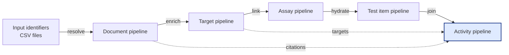

# ChEMBL Data Acquisition Utilities

> **Languages:** English · [Русский](README_RU.md)

The English text is mirrored in [`README_EN.md`](README_EN.md) to keep the
language pairs in sync.

This repository provides reproducible pipelines for downloading, normalising and
quality-controlling ChEMBL datasets. The utilities bundle command line scripts,
HTTP clients, schema validations and reporting helpers that allow analysts to
run individual entity pipelines or orchestrate the full end-to-end workflow in
a single command.

## End-to-end pipeline



Each pipeline is idempotent and can be executed independently. The
[`get-data`](./scripts/get_data.py) orchestrator reuses the same configuration
and logging options to run the sequence automatically while producing consistent
outputs.

## Repository layout

| Path | Description |
|------|-------------|
| `scripts/` | Command line entry points for each pipeline and orchestration helpers. |
| `library/` | Reusable packages: API clients, pipelines, validation schemas, post-processing and QA utilities. |
| `config/` | Default YAML configuration, schemas and dictionary resources used during enrichment. |
| `data/` | Lightweight fixtures and smoke-test inputs that mirror the expected CSV structure. |
| `docs/` | Full bilingual documentation set (`en`/`ru`) kept in sync. |
| `tests/` | Deterministic pytest suite covering unit, integration and end-to-end scenarios. |
| `reports/` | Location where JSON/Markdown test reports are emitted by CI and local runs. |
| `Makefile` | Convenience targets for formatting, linting, tests and documentation checks. |

A detailed breakdown of sub-packages, glossary and extended guides is available
in [`docs/en/SUMMARY.md`](./docs/en/SUMMARY.md) and
[`docs/ru/SUMMARY.md`](./docs/ru/SUMMARY.md).

## Quick start

```bash
python -m venv .venv
source .venv/bin/activate
pip install -r requirements-lock.txt
pre-commit install
```

Inspect the orchestrator and pipeline-specific flags:

```bash
python scripts/get_data.py --help
python scripts/get_document_data.py --help
```

Run the complete workflow against the sample identifiers and write outputs to
`./output`:

```bash
python scripts/get_data.py \
  --base-path . \
  --input-dir data/input \
  --output-dir output \
  --config config/config.yaml \
  --date $(date -u +%Y%m%d)
```

Each pipeline writes a deterministic CSV, a `<name>.meta.yaml` metadata sidecar
and table-quality reports under the same directory. The target pipeline also
emits helper lookups named `organism.output.target_<stamp>.csv`,
`isoform.output.target_<stamp>.csv`, `names.output.target_<stamp>.csv`, and
`IUPHAR.output.target_<stamp>.csv` — all described in
[`docs/OUTPUT_TARGETS_EN.md`](./docs/OUTPUT_TARGETS_EN.md) and
[`docs/OUTPUT_TARGETS_RU.md`](./docs/OUTPUT_TARGETS_RU.md). Refer to the
[output reference](./docs/en/OUTPUT.md) for the complete specification.

## Documentation

All guides are provided in English and Russian. The structure is mirrored across
languages:

- Overview and table of contents: [`docs/en/README.md`](./docs/en/README.md),
  [`docs/ru/README.md`](./docs/ru/README.md)
- Usage and CLI reference: [`docs/en/USAGE.md`](./docs/en/USAGE.md),
  [`docs/ru/USAGE.md`](./docs/ru/USAGE.md)
- Configuration guide: [`docs/en/CONFIG.md`](./docs/en/CONFIG.md),
  [`docs/ru/CONFIG.md`](./docs/ru/CONFIG.md)
- Output specification and validation rules:
  [`docs/en/OUTPUT.md`](./docs/en/OUTPUT.md), [`docs/ru/OUTPUT.md`](./docs/ru/OUTPUT.md)
- Architecture and data model:
  [`docs/en/architecture/ARCHITECTURE.md`](./docs/en/architecture/ARCHITECTURE.md),
  [`docs/ru/architecture/ARCHITECTURE.md`](./docs/ru/architecture/ARCHITECTURE.md)
- Developer and CI/CD guidance:
  [`docs/en/development/README.md`](./docs/en/development/README.md),
  [`docs/ru/development/README.md`](./docs/ru/development/README.md)

## Testing policy

Tests are organised under `tests/` and executed with `pytest`. Local and CI runs
must produce:

- `reports/test_report.json` — machine readable execution log
- `reports/test_summary.md` — condensed Markdown summary

Smoke runs can use `pytest -q -k "not slow and not e2e"`, while full validation
uses `pytest -q`. See [`docs/en/development/TESTING.md`](./docs/en/development/TESTING.md)
for fixtures, determinism requirements and coverage targets.
