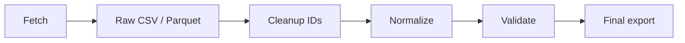

# ChEMBL Data Acquisition Utilities

The primary documentation and reference material live in the [docs/](docs/) directory.

## Features


* Unified CLI flags such as `--input`, `--output` (primary destination flag; `--final-out` is currently
  available only in `scripts.get_target_data` and `library.utils.cli_tools.pipeline_targets_main`, while the
  legacy `--out` alias remains for compatibility but now emits a deprecation warning), `--log-level`, `--sep`,
  `--encoding`, `--column`, plus `--config` and `--print-config` to manage configuration files. Batch size is
  controlled via `--chunk-size` or `--batch-size` depending on the pipeline. The `--raw-out`, `--raw-format`,
  and `--id-cols` switches are currently available through the target pipeline; other commands will expose them
  once the shared CLI is extended.

* Streaming CSV handling with deterministic output for large datasets.
* Schema validators in [`schemas/`](schemas/) and dictionaries in [`dictionary/`](dictionary/) that enforce types,
  ranges and reference data.
* Configuration driven by `config/config.yaml`, environment variables and CLI overrides.
* Logging based on the standard `logging` module with configurable verbosity.
* Full static typing (PEP 484), linting with `ruff`, formatting with `black`, type checking via `mypy` and tests with `pytest`.

## Requirements

| Component | Minimum supported | Latest tested |
|-----------|-------------------|---------------|
| Python    | ≥3.11             | 3.12          |
| numpy     | ≥1.26             | 2.3.3         |
| pandas    | ≥2.0              | 2.3.3         |
| requests  | ≥2.31             | 2.32.5        |
| PyYAML    | ≥6.0              | 6.0.3         |

`requirements-lock.txt` is the single source of truth for pinned dependency
versions; `pyproject.toml` documents the supported version ranges. Runtime
dependencies follow compatible release ranges so patch updates within each
minor version remain supported. Continuous integration validates both the
minimum and latest rows above.

### Runtime environment

* Linux or macOS shell with Bash or PowerShell support (Windows users should rely on WSL2).
* Up-to-date versions of `pip`, `setuptools` and `wheel`; follow the steps in [Installation](#installation).
* Network access to ChEMBL/PubChem/UniProt APIs (port 443).

## Installation

### Runtime environment

* Upgrade packaging tools before installing the project.

  ```bash
  python -m pip install --upgrade pip setuptools wheel
  ```

* Create an isolated virtual environment to keep dependencies local.

  ```bash
  python -m venv .venv
  source .venv/bin/activate  # Windows: .venv\\Scripts\\activate
  ```

### Steps

Clone the repository, change into it and install dependencies from the lock file.
Afterwards enable pre-commit hooks so formatting, linting, type checking and unit
tests run automatically.

```bash
git clone https://github.com/<org>/ChEMBL_data_acquisition.git
cd ChEMBL_data_acquisition
pip install -r requirements-lock.txt
pre-commit install
```

Installing from `requirements-lock.txt` keeps local development and CI in sync.
Whenever dependency ranges change in `pyproject.toml`, generate a fresh lock by
creating a clean virtual environment, running `pip install .[dev]` and freezing
the result via `pip freeze > requirements-lock.txt`.

Sensitive configuration such as API tokens belongs in a local `.env` file – see [Configuration via `.env`](#configuration-via-env)
for usage guidelines.

## Quick Start

1. **Install dependencies** – follow the steps in [Installation](#installation).
2. **Initialise pre-commit hooks**

   ```bash
   pre-commit install
   ```

   Git hooks ensure formatting, linting, static type checks and tests run before each commit.

3. **Explore the installed console scripts**

   After running `pip install .`, the package exposes dedicated entry points for each pipeline. The commands mirror the
   `python -m …` launches used during development:

   | Console script | Module equivalent |
   | -------------- | ----------------- |
   | `get-data` | `python -m scripts.get_data` |
   | `get-activity-data` | `python -m scripts.get_activity_data` |
   | `get-assay-data` | `python -m scripts.get_assay_data` |
   | `get-document-data` | `python -m scripts.get_document_data` |
   | `get-target-data` | `python -m scripts.get_target_data` |
   | `get-testitem-data` | `python -m scripts.get_testitem_data` |

   Use `--help` to inspect the interface and run smoke-grade exports straight from the shell:

  ```bash
  get-activity-data --input tests/data/activity_ids_small.csv \
      --output out/activities.csv \
      --limit 10 --log-level INFO
  get-document-data pubmed --input tests/data/pmids.csv \
      --output out/documents.csv \
      --limit 5 --log-level INFO

  ```

  The target pipeline is the only one that currently honours `--raw-out`, `--raw-format`, and `--final-out`.
  Other pipelines should continue using `--output` (or the deprecated `--out` alias) until the shared parser is
  extended.

   The console scripts accept the same options as their module counterparts, so existing `python -m …` workflows remain valid:

  ```bash
  python -m library.utils.cli_tools.get_activities --limit 10 --log-level INFO
  python -m library.utils.cli_tools.mapper_main --input tests/data/chembl_targets_min.csv \
      --column target_chembl_id --output out/targets_mapped.csv --log-level DEBUG
  python -m library.utils.cli_tools.table_quality_main --input tests/data/chembl_targets_min.csv \
      --output out/quality --table-name chembl_targets --log-level INFO
  ```

  In the reporting example above `--output` sets the destination. `--final-out` is currently exclusive to
  `scripts.get_target_data` and `library.utils.cli_tools.pipeline_targets_main`. The legacy `--out` alias remains
  available for compatibility but now raises a deprecation warning when invoked.

4. **Run the tests** – see [Tests](#tests).

## Tests

The `pre-commit` suite runs formatting, linting and static type checks. Execute `pytest` for unit tests and add coverage flags
when required. Determinism and smoke checks are available through dedicated CLI helpers. The canonical checklist lives in the
QA process documents listed below.

| Language | Checklist |
|----------|-----------|
| English  | [docs/QA_PROCESS_EN.md](docs/QA_PROCESS_EN.md) |
| Русский  | [docs/QA_PROCESS_RU.md](docs/QA_PROCESS_RU.md) |

```bash
pre-commit run --all-files
pip check
pytest
pytest --cov=library --cov=scripts --cov-report=term-missing --cov-report=xml
python -m library.utils.cli_tools.check_determinism --log-level DEBUG
python -m library.utils.cli_tools.mapper_batch_main --input chembl_ids.csv \
    --output out/mapped.csv --log-level INFO
```

Before running the smoke command, create a `chembl_ids.csv` file with a `chembl_id` header and the required identifiers.

### Document post-processing QA

The document pipeline now emits QA artefacts next to `output.document_YYYYMMDD.csv` when a legacy
Power Query export (`input/full/document.csv`) is available under the data root. The helper writes a JSON report,
Markdown summary and, on divergence, a CSV diff capped at 100 rows. You can also run the checker manually:

```bash
python -m qa.check_document_postprocessing \
    --base-path data \
    --out output\\document\\output.document_20230101.csv \
    --reports-dir qa_reports
```

The command exits with status code `1` when mismatches occur and stores the diff in
`qa_document_postprocessing_diff_YYYYMMDD.csv` keyed by (`PMID`, `document_chembl_id`, `completed`).

## Data generation

Five production pipelines live in [`scripts/`](scripts/) and write CSV outputs to `data/output/`:

* `get_activity_data.py` — retrieves activity data from ChEMBL and enriches it with derived value ranges.
* `get_assay_data.py` — exports assay descriptions.
* `get_document_data.py` — merges publication metadata from ChEMBL and aggregators (PubMed, Semantic Scholar, OpenAlex, Crossref).
* `get_target_data.py` — collects target information from ChEMBL, UniProt and IUPHAR.
* `get_testitem_data.py` — enriches compounds with structural attributes and PubChem data.

The cached harness `library.utils.cli_tools.pipeline_targets_main`, located under
[`library/utils/cli_tools/`](library/utils/cli_tools/), reuses the CLI contract of the
production target pipeline while operating solely on local files and prepared identifier
batches without network calls.

Example full pipeline execution:

```bash
python -m scripts.get_activity_data --input tests/data/activity_ids_small.csv \
    --output data/output/activities.csv --limit 10 --log-level INFO
```

The command reads data from the ChEMBL API, writes the CSV table and the accompanying `*.meta.yaml`. Development utilities are in
`library/utils/cli_tools/`; for instance, the `get_activities` module focuses on demo logging and performs no file operations. See
[`docs/CLI_TOOLS.md`](docs/CLI_TOOLS.md) for descriptions and command patterns. The output directory is ignored by Git and exposed
as a CI artifact.

> **Note.** The legacy `activity_extraction_main.py` entry point has been superseded by the modular
> `python -m scripts.get_activity_data`, improving maintainability and virtual environment compatibility.

## Usage


The examples below demonstrate how to run the main CLI tools with common options such as `--input`, `--output`, and
`--limit`. `--final-out` is currently restricted to `scripts.get_target_data` and
`library.utils.cli_tools.pipeline_targets_main`. The compatibility alias `--out` is still recognised but now emits a
deprecation warning. Using `--limit 0` short-circuits processing before any network or filesystem access, which is useful for
smoke-testing configuration overrides. The target pipeline already exposes `--raw-out`, `--final-out`, `--raw-format`, and
`--id-cols`; the remaining commands will pick up the staged switches as the shared parser is extended.
After installing the project with `pip install .`, the same pipelines can be started via the console scripts listed in the
[Quick Start](#quick-start) table—for example, `get-activity-data --help` is equivalent to `python -m scripts.get_activity_data --help`.
Both forms accept identical arguments, so feel free to swap between them depending on your environment.

Within the target pipeline the staged export surfaces separate destinations for raw payloads and cleaned tables. Use
`--raw-out` to persist the unprocessed API response, optionally changing the `--raw-format` between `csv` (default) and
`parquet`, and `--final-out` to override the normalised export while keeping the metadata sidecars. The legacy
`--output`/`--out` aliases act as compatibility shims for now but emit a warning on each invocation. Multi-identifier payloads
accept multiple columns via `--id-cols`, allowing you to keep composite keys in the raw snapshot before the cleanup step runs.


### `scripts/get_document_data.py`

Retrieve document metadata for a list of PubMed IDs using the bundled sample file:

```bash
python -m scripts.get_document_data pubmed \
    --input tests/data/pmids.csv \
    --output out/documents.csv \
    --limit 5 \
    --log-level INFO
```

The `tests/data/pmids.csv` file contains a small set of PMIDs for experimentation.

You can also run the PubMed pipeline directly via the library module:

```bash
python -m library.pubmed_library \
    --input-csv tests/data/pmids.csv \
    --output out/documents.csv \
    --log-level INFO
```

Raw snapshots for document exports are part of the roadmap and will reuse the reserved `--raw-out`/`--raw-format` switches once
implemented.

### `scripts/get_target_data.py`

Fetch basic target information from ChEMBL:

```bash
python -m scripts.get_target_data chembl \
    --input path/to/targets.csv \
    --final-out out/targets.final.csv \
    --raw-out out/targets.raw.csv \
    --limit 5 \
    --log-level INFO
```

Replace `path/to/targets.csv` with a CSV containing a `target_chembl_id` column. The `--raw-out` switch keeps the
pre-normalised snapshot for debugging, while `--final-out` produces the cleaned export aligned with the validation schemas.
The compatibility aliases `--output`/`--out` remain for migration support and issue warnings when used.

### `library.utils.cli_tools.pipeline_targets_main`

Exercise the chunking and batch configuration used by the production target pipeline without contacting remote services:

```bash
python -m library.utils.cli_tools.pipeline_targets_main \
    --input tests/data/chembl_targets_min.csv \
    --final-out out/targets_cached.csv \
    --chunk-size 25 \
    --batch-size 25 \
    --limit 100
```

The command reads target identifiers from the CSV, chunks them according to `--chunk-size` and `--limit`, forwards the batch size to
`library.pipeline_targets.run_pipeline` and writes the cached ChemBL table with pipeline metadata via `write_csv`. Use it to verify
CLI overrides, logging and deterministic output before launching the network-backed `get_target_data` pipeline.

### `library/utils/cli_tools/get_activities.py`

Generate dummy activity entries without contacting external services:

```bash
python -m library.utils.cli_tools.get_activities --limit 500 --dry-run
```

The command logs that it would generate 500 activity rows and exits without creating any files.

## Staged export pipeline

Every entity pipeline now follows the same staged contract, although the dedicated raw snapshot is currently implemented only
for targets:



* **Fetch** – read identifiers (single or composite via `--id-cols`) and call the upstream services.
* **Raw CSV / Parquet** – when the CLI exposes staging switches, persist the untouched payload to `--raw-out` using the
  selected `--raw-format`.
* **Cleanup IDs** – trim, deduplicate and patch placeholder identifiers before downstream work.
* **Normalize** – harmonise text, relations and datatypes so validation is deterministic.
* **Validate** – run `pandera` schemas, routing failures to the sidecar files recorded in the metadata YAML.
* **Final export** – write the cleaned table to `--final-out` (target pipeline) or `--output` for commands that
  have not yet adopted the staged switches. The deprecated `--out` alias continues to function but emits warnings
  during the migration period.

> **Note.** At the moment `--raw-out`, `--final-out`, `--raw-format`, and `--id-cols` are available through
> `get-target-data` and `library.utils.cli_tools.pipeline_targets_main`. Other pipelines will adopt the same
> switches once the shared CLI is extended.

When `--raw-out` is omitted the raw snapshot is skipped, keeping backwards compatibility with legacy runs. Sidecars continue
to store CLI arguments, configuration diffs and run hashes regardless of the format choices.

### Placeholder identifiers

Some providers occasionally return placeholder identifiers (for example `CHEMBL_PENDING` or temporary PubMed IDs). During the
**Cleanup IDs** stage they are normalised into explicit placeholder rows and counted in the metadata under
`error_placeholder_counts`. The clean export excludes the placeholder values by default, while the raw snapshot retains them for
auditing.

## Updating dependencies

Refresh pinned dependencies periodically and confirm compatibility:

```bash
pip install -r requirements-lock.txt --upgrade
pre-commit run --all-files
```

The first command reinstalls the exact versions recorded in the lock and fails early if constraints drift. To adopt newer
releases, update `pyproject.toml`, recreate `requirements-lock.txt` as described in the installation section and commit the
refreshed lock alongside the source changes.

## Configuration via `.env`

Some utility parameters can be provided through environment variables. To avoid exporting them manually each time, place
`NAME=value` pairs in a `.env` file and load them with [`python-dotenv`](https://pypi.org/project/python-dotenv/).

Example file:

```dotenv
CHEMBL_DA_LOG_LEVEL=INFO
CHEMBL_DA_BASE=https://www.ebi.ac.uk/chembl/api/data
```

Use either the short alias `CHEMBL_DA_BASE` or the fully qualified
`CHEMBL_DA__SOURCES__CHEMBL__API__CHEMBL_BASE`; both expand to the same setting.
See the [alias table](library/config.py#L1531-L1634) in `library/config.py` for
the complete mapping list.

See `.env.example` for typical contact e-mail variables.

Run a script with automatic configuration loading:

```bash
python -m dotenv run -- python -m scripts.get_assay_data --input assay_ids.csv \
    --output out/assays.csv
```

The `assay_ids.csv` file must contain an `assay_chembl_id` column with the required identifiers, for example:

```csv
assay_chembl_id
CHEMBL1234567
CHEMBL2345678
```

Utilities read environment variables automatically, so values from `.env` are available to all CLI tools without extra arguments.

## `api.user_agent`

The `api.user_agent` parameter identifies the application in API requests and must contain **real** contact details. Keeping the
placeholder `contact@example.org` causes configuration validation to fail. Default value:

```yaml
api:
  user_agent: "chembl-da/1.0 (mailto:chembl-data@ebi.ac.uk)"
```

Override the parameter in `config/config.yaml` or via the environment variable `CHEMBL_DA__SOURCES__CHEMBL__API__USER_AGENT`. Replace the
`chembl-data@ebi.ac.uk` contact with your own mailbox before production use—the bundled address is provided only as a documented default.
The validator still rejects the legacy placeholder `contact@example.org`, so any occurrence prevents the tools from starting. There is
no dedicated CLI flag (see `library/cli/parser.py`), so configuration is limited to files or environment variables.


## Configuration validation

`library.config.load_config` checks the values inside `config/config.yaml`. An invalid URL raises `ValueError` during loading:

```yaml
api:
  chembl_base: https://
```

```
ValueError: api.chembl_base must be a valid URL
```

Correct configuration must specify the full service URL:

```yaml
api:
  chembl_base: https://www.ebi.ac.uk/chembl/api/data
```

## Configuration errors

Invalid values in `config/config.yaml` raise `ValidationError`. Example:

```yaml
api:
  rps: -1
```

```python
from library.config import load_config
load_config("config/config.yaml")
```

Output:

```
pydantic_core._pydantic_core.ValidationError: 1 validation error for Config
api.rps
  Input should be greater than or equal to 1 [type=greater_than_equal, input_value=-1, input_type=int]
    For further information visit https://errors.pydantic.dev/2.11/v/greater_than_equal
```

Fix the value to a positive number:

```yaml
api:
  rps: 5  # or any value >= 1
```

Allowed ranges are documented in [`config.schema.json`](./config.schema.json), which is exported from the Pydantic models and serves
as a reference artifact with the minimum `1` specified for `api.rps`.

## Logging

CLI helpers configure structured JSON logging via `library.logging_setup.configure_logger`. Use environment variables or CLI flags to
adjust verbosity. The JSON structure is fixed and cannot be customised and now stamps each record with the staging phase:
`fetch`, `raw`, `cleanup`, `normalize`, `validate`, or `final_export`.

Set the log level via the `--log-level` flag or the `CHEMBL_DA_LOG_LEVEL` environment variable:

```bash
CHEMBL_DA_LOG_LEVEL=DEBUG python -m scripts.get_assay_data --input assay_ids.csv \
    --output out/assays.final.csv
```

Sample log entry:

```json
{"ts":"2024-05-01T12:00:00Z","level":"INFO","event":"pipeline_start","run_id":"abc123","stage":"pipeline"}
```

Key fields:

* `ts` – UTC timestamp in ISO 8601 format.
* `level` – severity such as `DEBUG`, `INFO`, `WARN` or `ERROR`.
* `event` – short machine-readable event name.
* `run_id` – unique identifier for the current run.
* `stage` – optional pipeline stage.
* `msg` – optional human-readable message.
* Additional keys – event-specific context such as `elapsed`, `url` or `rows`.

Dry-run executions emit logs with `event` set to `dry_run`, enabling easy filtering, for example:

```bash
jq 'select(.event=="dry_run")' log.jsonl
```

The run identifier is generated by the CLI helpers using `uuid.uuid4().hex` and passed to the logger, which includes it with every
record. Override the value before calling `configure_logger` to inject a custom identifier.

Secrets are automatically redacted: values for keys ending in `token`, `key`, `secret` or `password` are replaced with `"***"`.
Log-level filtering drops records below the configured `--log-level` or `CHEMBL_DA_LOG_LEVEL` setting.

Typical log entries look like:

```json
{"ts":"2024-05-01T12:00:00Z","level":"INFO","event":"pipeline_start","run_id":"abc123","stage":"pipeline"}
{"ts":"2024-05-01T12:00:01Z","level":"DEBUG","event":"request_ok","run_id":"abc123","stage":"fetch","url":"https://api.example.org","status":200}
{"ts":"2024-05-01T12:00:01Z","level":"DEBUG","event":"cache_set","run_id":"abc123","stage":"fetch","url":"https://api.example.org","status":"hit"}
{"ts":"2024-05-01T12:00:02Z","level":"INFO","event":"validate_done","run_id":"abc123","stage":"validate","rows":42}
{"ts":"2024-05-01T12:00:03Z","level":"INFO","event":"pipeline_done","run_id":"abc123","stage":"pipeline","elapsed":3.2}
```

Smoke fixtures covering the full pipeline live in `tests/data/input-smoke/`. Structured logging expectations (including stage
names and placeholder counters) are validated by `tests/test_logging.py`, `tests/test_logging_setup.py`, and the orchestration
smoke harness `tests/smoke/test_get_data_scripts.py`.

## Reproducibility

Deterministic CSV writers in `library.io` keep outputs and metadata stable across runs. The function
`library.csv_utils.write_csv_deterministic` normalises column ordering and metadata so repeated executions yield identical files.
All CLI scripts share a common set of flags:

```bash
python -m library.utils.cli_tools.table_quality_main --input data.csv --table-name data
```

`--output` defaults to `output.<input_name>_YYYYMMDD.csv` in the directory defined by `local.io.output_dir`. The deprecated
`--out` alias continues to map to the same path but now emits deprecation warnings. Target pipeline invocations additionally
accept `--final-out`, which reuses the same default while enabling distinct destinations once raw snapshots are enabled. Combine
it with `--raw-out` (and optional `--raw-format parquet`) to persist the unprocessed payload. For additional examples see
[`docs/USAGE_EN.md`](docs/USAGE_EN.md) (Russian version:

[`docs/USAGE_RU.md`](docs/USAGE_RU.md)).

## Project structure

```
ChEMBL_data_acquisition/
├── config/config.yaml
├── dictionary/
├── library/
│   ├── __init__.py
│   ├── chembl_client.py
│   ├── csv_utils.py
│   ├── config.py
│   └── ...
├── scripts/
│   ├── get_activity_data.py
│   ├── get_assay_data.py
│   ├── ...
├── tests/
│   └── data/
└── docs/
    ├── CONFIG_EN.md / CONFIG_RU.md
    ├── OUTPUT_EN.md / OUTPUT_RU.md
    └── USAGE_EN.md / USAGE_RU.md
```

## Configuration

Parameters are read from `config/config.yaml`, environment variables (`CHEMBL_DA__...`) and CLI flags. Details are documented in
[`docs/CONFIG_EN.md`](docs/CONFIG_EN.md) (Russian version: [`docs/CONFIG_RU.md`](docs/CONFIG_RU.md)).

### Environment variables

Environment variables override values from the YAML file. Names follow the `CHEMBL_DA__...` pattern with double underscores
separating each nested section. For example, to enable debug logging:

```bash
export CHEMBL_DA__LOG__LEVEL=DEBUG
```

Most options also provide short aliases for backwards compatibility. The table lists every supported alias and the canonical key it
 maps to. See [`_ALIAS_OVERRIDES`](library/config.py#L1569-L1634) and [`_ALIAS_MAP`](library/config.py#L1637-L1640) for the authoritative
source:

| Alias | Equivalent key |
|-------|----------------|
| `CHEMBL_DA_BASE` | `CHEMBL_DA__SOURCES__CHEMBL__API__CHEMBL_BASE` |
| `CHEMBL_DA_BURST` | `CHEMBL_DA__SOURCES__CHEMBL__API__BURST` |
| `CHEMBL_DA_CACHE_DIR` | `CHEMBL_DA__LOCAL__IO__CACHE_DIR` |
| `CHEMBL_DA_CACHE_MAXSIZE` | `CHEMBL_DA__SOURCES__CHEMBL__CACHE__CACHE_MAXSIZE` |
| `CHEMBL_DA_CACHE_TTL` | `CHEMBL_DA__SOURCES__CHEMBL__CACHE__CACHE_TTL` |
| `CHEMBL_DA_CROSSREF_BASE` | `CHEMBL_DA__SOURCES__CROSSREF__BASE` |
| `CHEMBL_DA_CROSSREF_MAILTO` | `CHEMBL_DA__SOURCES__CROSSREF__MAILTO` |
| `CHEMBL_DA_CROSSREF_TIMEOUT_CONNECT` | `CHEMBL_DA__SOURCES__CROSSREF__TIMEOUT_CONNECT` |
| `CHEMBL_DA_CROSSREF_TIMEOUT_READ` | `CHEMBL_DA__SOURCES__CROSSREF__TIMEOUT_READ` |
| `CHEMBL_DA_DICT_DIR` | `CHEMBL_DA__LOCAL__RESOURCES__DICTIONARY_DIR` |
| `CHEMBL_DA_GLOBAL_BURST` | `CHEMBL_DA__SYSTEM__RATE__GLOBAL_BURST` |
| `CHEMBL_DA_GLOBAL_RPS` | `CHEMBL_DA__SYSTEM__RATE__GLOBAL_RPS` |
| `CHEMBL_DA_IUPHAR_BASE` | `CHEMBL_DA__SOURCES__IUPHAR__BASE` |
| `CHEMBL_DA_IUPHAR_FAMILY_CSV` | `CHEMBL_DA__LOCAL__RESOURCES__IUPHAR_FAMILY_CSV` |
| `CHEMBL_DA_IUPHAR_TARGET_CSV` | `CHEMBL_DA__LOCAL__RESOURCES__IUPHAR_TARGET_CSV` |
| `CHEMBL_DA_LIMITER_CACHE_MAXSIZE` | `CHEMBL_DA__SYSTEM__RATE__LIMITER_CACHE_MAXSIZE` |
| `CHEMBL_DA_LIMITER_CACHE_TTL` | `CHEMBL_DA__SYSTEM__RATE__LIMITER_CACHE_TTL` |
| `CHEMBL_DA_LOG_LEVEL` | `CHEMBL_DA__SYSTEM__LOG__LEVEL` |
| `CHEMBL_DA_MOLECULE_CATALOG_CACHE` | `CHEMBL_DA__SOURCES__CHEMBL__MOLECULE_CATALOG__CACHE_PATH` |
| `CHEMBL_DA_OPENALEX_BASE` | `CHEMBL_DA__SOURCES__OPENALEX__BASE` |
| `CHEMBL_DA_OPENALEX_MAILTO` | `CHEMBL_DA__SOURCES__OPENALEX__MAILTO` |
| `CHEMBL_DA_OPENALEX_TIMEOUT_CONNECT` | `CHEMBL_DA__SOURCES__OPENALEX__TIMEOUT_CONNECT` |
| `CHEMBL_DA_OPENALEX_TIMEOUT_READ` | `CHEMBL_DA__SOURCES__OPENALEX__TIMEOUT_READ` |
| `CHEMBL_DA_OUTDIR` | `CHEMBL_DA__LOCAL__IO__OUTPUT_DIR` |
| `CHEMBL_DA_PUBCHEM_BASE` | `CHEMBL_DA__SOURCES__PUBCHEM__BASE` |
| `CHEMBL_DA_PUBCHEM_USER_AGENT` | `CHEMBL_DA__SOURCES__PUBCHEM__USER_AGENT` |
| `CHEMBL_DA_RETRY_BACKOFF_FACTOR` | `CHEMBL_DA__SYSTEM__RETRY__BACKOFF_FACTOR` |
| `CHEMBL_DA_RETRY_MAX_ATTEMPTS` | `CHEMBL_DA__SYSTEM__RETRY__MAX_ATTEMPTS` |
| `CHEMBL_DA_RPS` | `CHEMBL_DA__SOURCES__CHEMBL__API__RPS` |
| `CHEMBL_DA_PUBMED_RPS` | `CHEMBL_DA__SOURCES__PUBMED__RPS` |
| `CHEMBL_DA_PUBMED_BURST` | `CHEMBL_DA__SOURCES__PUBMED__BURST` |
| `CHEMBL_DA_SEMANTIC_SCHOLAR_RPS` | `CHEMBL_DA__SOURCES__SEMANTIC_SCHOLAR__RPS` |
| `CHEMBL_DA_SEMANTIC_SCHOLAR_BURST` | `CHEMBL_DA__SOURCES__SEMANTIC_SCHOLAR__BURST` |
| `CHEMBL_DA_TARGETS_TYPE_CSV` | `CHEMBL_DA__LOCAL__RESOURCES__TARGETS_TYPE_CSV` |
| `CHEMBL_DA_TIMEOUT_CONNECT` | `CHEMBL_DA__SOURCES__CHEMBL__API__TIMEOUT_CONNECT` |
| `CHEMBL_DA_TIMEOUT_READ` | `CHEMBL_DA__SOURCES__CHEMBL__API__TIMEOUT_READ` |
| `CHEMBL_DA_UNIPROT_BASE` | `CHEMBL_DA__SOURCES__UNIPROT__API__BASE` |
| `CHEMBL_DA_UNIPROT_DATA_DIR` | `CHEMBL_DA__LOCAL__RESOURCES__UNIPROT_DATA_DIR` |
| `CHEMBL_DA__IO__CACHE_DIR` | `CHEMBL_DA__LOCAL__IO__CACHE_DIR` |
| `CHEMBL_DA__IO__EXIST_OK` | `CHEMBL_DA__LOCAL__IO__EXIST_OK` |

See [`docs/CONFIG_EN.md`](docs/CONFIG_EN.md) for a complete overview of all configuration options (Russian version —
[`docs/CONFIG_RU.md`](docs/CONFIG_RU.md)).

### Schema validation

Configuration values are validated by :func:`library.config.load_config`, which calls :meth:`Config.model_validate <pydantic.BaseModel.model_validate>`.
Validation follows the model definitions and produces detailed error messages for nested fields. The accompanying `config.schema.json`
is generated from the same Pydantic model for IDE hints and documentation; it is not executed at runtime and should not be passed to
`jsonschema`.

Command-line flags have the highest priority. All utilities accept `--config` to point at a configuration file and `--print-config`
to show the effective values after all overrides have been applied. The final precedence is:

```
YAML < environment variables < CLI options
```

Only the top-level command line scripts read the configuration file. Modules under `library/` expect a `Config` (or one of its
subsections) to be passed explicitly, making dependencies clear and avoiding hidden global state.

The directories referenced by `local.io.output_dir` and `local.io.cache_dir` are checked but not created when loading the
configuration. Scripts that need these paths can call `library.config.ensure_dirs` after `load_config` to create them if they are
missing and `local.io.exist_ok` permits it.

Path values such as `local.io.output_dir`, `local.io.cache_dir` and the `local.init` workbook paths are exposed as `pathlib.Path`
objects. String values in `config/config.yaml` or overrides from the environment and command line are automatically converted.

```bash
python -m library.utils.cli_tools.table_quality_main \
    --input tests/data/activity.csv \
    --table-name activity
```

`--final-out` defaults to `output.<input_name>_YYYYMMDD.csv` in the directory specified by `local.io.output_dir`. Legacy
aliases `--output`/`--out` continue to resolve to the same path but issue a deprecation warning. Target pipeline invocations can
use `--raw-out` and `--final-out` when the raw snapshot and the cleaned export must be separated explicitly. For additional
examples see [`docs/USAGE_EN.md`](docs/USAGE_EN.md) (Russian version:
[`docs/USAGE_RU.md`](docs/USAGE_RU.md)).


## Output and metadata

Pipelines persist deterministic CSV tables via `library.io.write_csv` and store accompanying `*.meta.yaml` sidecars in
`data/output`. Each sidecar records the Git commit, launch parameters, SHA-256 checksum and row/column statistics. See
[`docs/OUTPUT_EN.md`](docs/OUTPUT_EN.md) / [`docs/OUTPUT_RU.md`](docs/OUTPUT_RU.md) for layout details.

## Dtype Inspector

The `dtype_inspector` utility executes each `get_*_data` helper on a small identifier set and logs the resulting pandas dtypes. Run
it periodically to spot schema drift when upstream services change responses.

```bash
python -m library.utils.cli_tools.dtype_inspector_main --log-level INFO
```

Consider wiring the script into CI to detect dtype changes early. The tool is lightweight and makes only a handful of requests per
dataset.

## Development and testing

Individual tools such as `ruff`, `black` and `mypy` are wired into `pre-commit` but can be executed manually when iterating on
specific modules.

```bash
ruff check scripts library library/utils/cli_tools
black scripts library library/utils/cli_tools
mypy scripts library
pytest
```

Test datasets live in `tests/data`; `library.utils.cli_tools.check_determinism` verifies repeatable CSV output.

## Licence

MIT License. See the `LICENSE` file (if present).

Add new reference materials directly to the `docs` directory when updating documentation.
