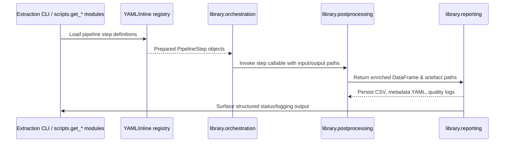

# Post-processing and orchestration guide

This note documents the refactored post-processing stack that underpins CSV exports across the ChEMBL data acquisition pipelines. It complements the high-level [Architecture overview](docs/en/ARCHITECTURE.md) and focuses on how the dedicated orchestration, schema and reporting packages interact during development and runtime.

## Package layout

| Package | Responsibility |
| --- | --- |
| `library/orchestration` | Composes prepared pipeline steps, wires runtime context (rate limiters, clients) and exposes execution helpers decoupled from CLI parsing so that pipelines can be scripted programmatically. 【F:library/orchestration/workflow.py†L1-L75】【F:library/orchestration/context.py†L1-L89】
| `library/pipelines/registry.py` | Loads the canonical YAML/inline registry, resolves dotted callables, captures dependencies and output metadata for each step, and standardises argument construction. 【F:library/pipelines/registry.py†L1-L151】
| `library/postprocessing` | Houses the reusable transformation helpers (encoding fallbacks, cellularity rules, multifunctional flags) and the higher-level entry points that emit the enriched CSV plus lookup tables. 【F:library/postprocessing/helpers.py†L1-L120】【F:library/postprocessing/main.py†L1-L97】
| `library/reporting` | Finalises successful runs by hashing artefacts, writing metadata YAML, emitting table-quality diagnostics and surfacing structured errors for QA hooks. 【F:library/reporting/run_manifest.py†L1-L169】
| `library/schemas` | Centralises table schemas and normalisation entry points that downstream exporters and validators import to guarantee consistent column order, dtype coercion and metadata payloads. 【F:library/schemas/__init__.py†L1-L34】

Keep these boundaries in mind when extending the stack: orchestration manages how steps run, post-processing transforms the data, schemas guard the contract and reporting captures the evidence.

## Authoring pipeline steps

1. **Describe the step** in the registry (YAML file or Python mapping) with `name`, `callable`, expected input/output filenames, dependency markers, and optional flags such as `dry_run`. The loader resolves dotted callable names and returns immutable `PipelineStep` objects. 【F:library/pipelines/registry.py†L55-L156】
2. **Prepare execution hooks** by pairing the `PipelineStep` with a `StepCallable` that accepts the resolved config, input path, final output path and working directory. `execute_workflow` walks the sequence, computes deterministic temporary paths and short-circuits on non-zero exit codes. 【F:library/orchestration/workflow.py†L12-L74】
3. **Use the shared ETL context** when you need rate limiters or API clients. The context ensures resources are lazily constructed, shared between steps and properly cleaned up. 【F:library/orchestration/context.py†L1-L86】
4. **Emit artefacts via reporting helpers** instead of ad hoc file writes. `finalise_csv_output` stamps metadata, produces QA summaries and runs optional table-quality hooks in one place. 【F:library/reporting/run_manifest.py†L70-L169】

When contributing new steps, prefer pure functions or dataclasses over implicit globals so that the orchestrator can execute them both via CLI and programmatic workflows. Consult the [Architecture overview](docs/en/ARCHITECTURE.md) for the surrounding pipeline boundaries.

## Pipeline configuration files

Declarative YAML files under `config/pipeline/` list the default post-processing steps for each domain (`activities`, `assays`, `documents`, `targets`). Every file follows the schema below:

```yaml
pipeline_version: ${CHEMBL_DA_POSTPROCESS_VERSION:-dev}
steps:
  - name: normalize_activity_records
    enabled: true
    callable: library.postprocess.activities.steps:normalize_activity_records
    params:
      strip_columns:
        - molecule_chembl_id
```

- `pipeline_version` supports `${VAR}` placeholders with optional `:-default` segments. When `CHEMBL_DA_POSTPROCESS_VERSION` is not defined, the loader falls back to `dev`.
- Each `steps` entry resolves the `callable` using `library.postprocess.common.import_utils.resolve_dotted_path` and applies the supplied `params` as keyword arguments.
- Disabled steps (`enabled: false`) remain in the YAML for auditability but are skipped at runtime.

`library.postprocess.config.load_pipeline_config` reads the YAML using a UTF-8 safe loader and exposes both the resolved `StepDefinition` instances and the configured `pipeline_version`. Scripts and notebooks import `PIPELINE_STEPS`/`PIPELINE_VERSION` from the respective `library.postprocess.<domain>.steps` module to stay in sync with the declarative configuration.

## Schema validation strategy

Schema definitions live under `library/schemas` and expose both dataclasses (`TargetsSchema`, `TestitemsSchema`, …) and `normalize_*` helpers. Downstream stages import these to coerce pandas frames into the canonical dtype mix, enforce required columns and reorder outputs before they hit disk. 【F:library/schemas/__init__.py†L1-L34】

During post-processing, helpers such as `helpers.fill_missing`, `cellularity.ensure_cellularity` and `multifunctional.normalise_multifunctional` normalise the frame before it is handed to schema-aware exporters like `helpers.write_csv`. The target pipeline exemplifies this flow: it reads with encoding fallbacks, normalises string columns, applies domain-specific rules, fills missing columns according to the schema order and only then writes artefacts. 【F:library/postprocessing/helpers.py†L1-L120】【F:library/postprocessing/main.py†L37-L96】

Once the CSV lands, `finalise_csv_output` generates metadata YAML (with schema identifiers) and optional quality reports. The manifest hashes both the CSV and metadata so regressions surface immediately in QA dashboards. 【F:library/reporting/run_manifest.py†L70-L169】

## Adding a new table

Follow this checklist to bolt a new export onto the stack:

1. **Model the schema**: add a dataclass and normaliser under `library/schemas/` (or extend an existing module) and wire it into `__all__`. Update `config.schema.json` if the table participates in JSON schema validation or downstream tooling. 【F:library/schemas/__init__.py†L1-L34】【F:config/schema/document.yaml†L463-L463】
2. **Describe the step**: extend the pipeline registry (YAML or inline default) so orchestration knows how to invoke the export, which resources it produces and which upstream artefacts it consumes. 【F:library/pipelines/registry.py†L55-L156】
3. **Implement post-processing**: create a helper module under `library/postprocessing/` (mirroring the Power Query logic if applicable) and expose a public entry point from `library/postprocessing/__init__.py`. 【F:library/postprocessing/__init__.py†L1-L21】
4. **Hook reporting**: ensure your CLI entry point (or orchestrated callable) calls `finalise_csv_output` with the schema identifier and any quality profiler/summary objects so metadata and QA artefacts stay in sync. 【F:library/reporting/run_manifest.py†L70-L169】
5. **Cover it with tests**: add unit coverage for the helper logic, integration tests for file I/O and schema validation, and update e2e fixtures if the table participates in the aggregated run (see testing expectations below). 【F:tests/README.md†L1-L88】

## Runtime flow



This mirrors the CLI-to-library execution path described in the [Architecture overview](docs/en/ARCHITECTURE.md) while emphasising the YAML-driven orchestration and reporting hook-up.

## Testing expectations

The pytest suite is partitioned into `tests/unit/`, `tests/integration/`, `tests/postprocessing/` and `tests/e2e/` to mirror the pipeline layers above. Each directory enforces deterministic fixtures, strict naming conventions (`test_<module>.py`, `test_<unit_of_work>__<case>`) and coverage of the key QA checklist (schema validation, normalisation, enrichment, logging, export invariants, degradation paths and idempotence). 【F:tests/README.md†L1-L88】

Pytest defaults (`-q --disable-warnings --maxfail=1 --durations=10`) are configured in `pytest.ini`; combine them with markers (`unit`, `integration`, `e2e`) to scope local runs. 【F:pytest.ini†L1-L6】

Quality gates:

- ≥95 % success rate across the suite (enforced by the reporting wrapper and CI policy).
- 100 % coverage of the pipeline scenarios listed above before merging into `main`.
- Deterministic tests: fix seeds/time, avoid network I/O, rely on `tests/resources/` snapshots and tmp paths.
- Explicit slow/network markers when deviations are unavoidable.

Consult `tests/conftest.py` for shared fixtures that enforce deterministic environments and stub external dependencies.

## Generating reports

Run the wrapper to execute the suite, produce the JSON protocol and Markdown summary, and mirror logs under `data/logs/`:

```bash
python tests/run_tests.py
```

The script runs pytest, writes `reports/test_report.json`, renders `reports/test_summary.md`, checks the ≥95 % success-rate threshold and persists structured logs for regression triage. Pass `--pytest-args` to forward options (for example `--pytest-args -m unit`) and `--verbose` for DEBUG-level logs. 【F:tests/README.md†L58-L87】

## Related reading

- [Architecture overview](docs/en/ARCHITECTURE.md) — big-picture component relationships.
- [Test suite layout](tests/README.md) — detailed testing guardrails and reporting workflow.
