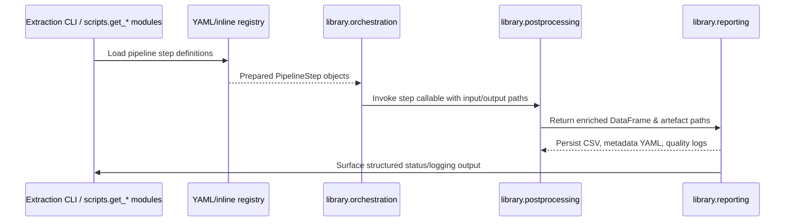

# Post-processing and orchestration guide

> **Languages:** English · [Русский](README_postprocess_RU.md)

The English text is mirrored in [`README_postprocess_EN.md`](README_postprocess_EN.md) to keep the language pair in sync.

This note documents the refactored post-processing stack that underpins CSV exports across the ChEMBL data acquisition pipelines. It complements the high-level [Architecture overview](docs/en/ARCHITECTURE.md) and focuses on how the dedicated orchestration, schema and reporting packages interact during development and runtime.

## Package layout

| Package | Responsibility |
| --- | --- |
| `library/orchestration` | Composes prepared pipeline steps, wires runtime context (rate limiters, clients) and exposes execution helpers decoupled from CLI parsing so that pipelines can be scripted programmatically. 【F:library/orchestration/workflow.py†L1-L75】【F:library/orchestration/context.py†L1-L89】
| `library/pipelines/registry.py` | Loads the canonical YAML/inline registry, resolves dotted callables, captures dependencies and output metadata for each step, and standardises argument construction. 【F:library/pipelines/registry.py†L1-L151】
| `library/postprocessing` | Houses the reusable transformation helpers (encoding fallbacks, cellularity rules, multifunctional flags) and the higher-level entry points that emit the enriched CSV plus lookup tables. 【F:library/postprocessing/helpers.py†L1-L120】【F:library/postprocessing/main.py†L1-L97】
| `library/reporting` | Finalises successful runs by hashing artefacts, writing metadata YAML, emitting table-quality diagnostics and surfacing structured errors for QA hooks. 【F:library/reporting/run_manifest.py†L1-L169】
| `library/schemas` | Centralises table schemas and normalisation entry points that downstream exporters and validators import to guarantee consistent column order, dtype coercion and metadata payloads. 【F:library/schemas/__init__.py†L1-L34】

Keep these boundaries in mind when extending the stack: orchestration manages how steps run, post-processing transforms the data, schemas guard the contract and reporting captures the evidence.

## Authoring pipeline steps

1. **Describe the step** in the registry (YAML file or Python mapping) with `name`, `callable`, expected input/output filenames, dependency markers, and optional flags such as `dry_run`. The loader resolves dotted callable names and returns immutable `PipelineStep` objects. 【F:library/pipelines/registry.py†L55-L156】
2. **Prepare execution hooks** by pairing the `PipelineStep` with a `StepCallable` that accepts the resolved config, input path, final output path and working directory. `execute_workflow` walks the sequence, computes deterministic temporary paths and short-circuits on non-zero exit codes. 【F:library/orchestration/workflow.py†L12-L74】
3. **Use the shared ETL context** when you need rate limiters or API clients. The context ensures resources are lazily constructed, shared between steps and properly cleaned up. 【F:library/orchestration/context.py†L1-L86】
4. **Emit artefacts via reporting helpers** instead of ad hoc file writes. `finalise_csv_output` stamps metadata, produces QA summaries and runs optional table-quality hooks in one place. 【F:library/reporting/run_manifest.py†L70-L169】

When contributing new steps, prefer pure functions or dataclasses over implicit globals so that the orchestrator can execute them both via CLI and programmatic workflows. Consult the [Architecture overview](docs/en/ARCHITECTURE.md) for the surrounding pipeline boundaries.

## Schema validation strategy

Schema definitions live under `library/schemas` and expose both dataclasses (`TargetsSchema`, `TestitemsSchema`, …) and `normalize_*` helpers. Downstream stages import these to coerce pandas frames into the canonical dtype mix, enforce required columns and reorder outputs before they hit disk. 【F:library/schemas/__init__.py†L1-L34】

During post-processing, helpers such as `helpers.fill_missing`, `cellularity.ensure_cellularity` and `multifunctional.normalise_multifunctional` normalise the frame before it is handed to schema-aware exporters like `helpers.write_csv`. The target pipeline exemplifies this flow: it reads with encoding fallbacks, normalises string columns, applies domain-specific rules, fills missing columns according to the schema order and only then writes artefacts. 【F:library/postprocessing/helpers.py†L1-L120】【F:library/postprocessing/main.py†L37-L96】

Once the CSV lands, `finalise_csv_output` generates metadata YAML (with schema identifiers) and optional quality reports. The manifest hashes both the CSV and metadata so regressions surface immediately in QA dashboards. 【F:library/reporting/run_manifest.py†L70-L169】

## Adding a new table

Follow this checklist to bolt a new export onto the stack:

1. **Model the schema**: add a dataclass and normaliser under `library/schemas/` (or extend an existing module) and wire it into `__all__`. Update `config.schema.json` if the table participates in JSON schema validation or downstream tooling. 【F:library/schemas/__init__.py†L1-L34】【F:config/schema/document.yaml†L463-L463】
2. **Describe the step**: extend the pipeline registry (YAML or inline default) so orchestration knows how to invoke the export, which resources it produces and which upstream artefacts it consumes. 【F:library/pipelines/registry.py†L55-L156】
3. **Implement post-processing**: create a helper module under `library/postprocessing/` (mirroring the Power Query logic if applicable) and expose a public entry point from `library/postprocessing/__init__.py`. 【F:library/postprocessing/__init__.py†L1-L21】
4. **Hook reporting**: ensure your CLI entry point (or orchestrated callable) calls `finalise_csv_output` with the schema identifier and any quality profiler/summary objects so metadata and QA artefacts stay in sync. 【F:library/reporting/run_manifest.py†L70-L169】
5. **Cover it with tests**: add unit coverage for the helper logic, integration tests for file I/O and schema validation, and update e2e fixtures if the table participates in the aggregated run (see testing expectations below). 【F:tests/README.md†L1-L88】

### Declarative pipeline configuration

The active step list for each post-processing domain now lives under `config/pipeline/<domain>.yaml`. These YAML files describe the pipeline version advertised in metadata, the enabled steps and domain-specific parameters that documentation and orchestration hooks may consume. Callables are referenced through dotted import paths such as `library.postprocessing.activities.steps:normalize_activity_records` and resolved lazily via `load_pipeline_config`. 【F:config/pipeline/activities.yaml†L1-L34】【F:library/postprocessing/common/config.py†L22-L170】

Environment variables can override YAML values using `${VAR}` or `${VAR:-default}` placeholders. For example, `${CHEMBL_ACTIVITY_PIPELINE_VERSION:-auto}` defaults to the installed library version unless `CHEMBL_ACTIVITY_PIPELINE_VERSION` is exported. Similarly, `${POSTPROCESS_LOG_LEVEL:-INFO}` sets the default log level consumed by orchestration. The loader expands these markers with UTF-8 safe reads and normalises `auto`/empty values to fall back to `get_pipeline_version()`. 【F:library/postprocessing/common/config.py†L64-L170】【F:library/postprocessing/activities/steps.py†L67-L104】

Available overrides:

- `CHEMBL_ACTIVITY_PIPELINE_VERSION`, `CHEMBL_ASSAY_PIPELINE_VERSION`, `CHEMBL_DOCUMENT_PIPELINE_VERSION`, `CHEMBL_TARGET_PIPELINE_VERSION` — override the exported `pipeline_version` per domain; defaults to `auto`.
- `POSTPROCESS_LOG_LEVEL` — baseline logger verbosity, defaulting to `INFO`.
- `POSTPROCESS_DEFAULT_ENCODING` — shared file encoding for CSV loads/saves, defaulting to `utf-8`.
- `POSTPROCESS_DEFAULT_CSV_SEPARATOR` — shared CSV delimiter, defaulting to `,`.

### Domain configuration defaults

The domain YAML files ship representative defaults that downstream tooling can rely on. Each file exposes the following top-level parameters, all of which honour the environment overrides listed above:

| Domain | Encoding | CSV separator | Selected defaults |
| --- | --- | --- | --- |
| Activities | `utf-8` | `,` | `relation_normalization: true`, `enforce_uppercase_units: true`, `numeric_identifier_dtype: Int64` |
| Assays | `utf-8` | `,` | `uppercase_categories: true`, `strip_whitespace: true`, `normalize_identifiers: true` |
| Targets | `utf-8` | `,` | `normalize_taxonomy: true`, `fill_missing_identifiers: true`, `sort_by: ['target_chembl_id']` |
| Documents | `utf-8` | `,` | `trim_whitespace: true`, `normalise_unicode: true`, `ensure_unique_ids: true` |
| Test items | `utf-8` | `,` | `uppercase_identifiers: true`, `coerce_booleans: true`, `fill_missing_columns: true` |

## CLI entry points

The postprocessing stages ship dedicated CLI wrappers under `scripts/make_<table>_postprocessing.py`. Each command wires argument
parsing, logging configuration and deterministic CSV export around the domain pipeline.

Shared interface:

- `--input`: path to the raw CSV exported by the extractor stage.
- `--output`: destination for the enriched CSV; parent directories are created automatically.
- `--config`: optional override YAML (defaults to `config/pipeline/<table>.yaml`, e.g. `config/pipeline/testitems.yaml`).
- `--log-level`: overrides the YAML/default log verbosity.

By default logs are written to `data/logs/make_<table>_postprocessing_<YYYYMMDD>.log`. Override the directory by exporting
`CHEMBL_POSTPROCESS_LOG_DIR`. Each run also emits `<table>.postprocess.report.json` alongside the output CSV with the pipeline
metrics collected via `collect_postprocess_metrics`.

Example invocation:

```bash
python -m scripts.make_activity_postprocessing --input data/raw/activities.csv --output data/out/activities.csv
```

The same pattern applies to assays, documents, targets and test items.

Each steps module imports its matching configuration, exposing `PIPELINE_CONFIG` and constructing `PIPELINE_STEPS` directly from the YAML definition so future additions require no code edits. 【F:library/postprocessing/assays/steps.py†L1-L76】【F:library/postprocessing/documents/steps.py†L1-L82】【F:library/postprocessing/targets/steps.py†L1-L80】

## Runtime flow



This mirrors the CLI-to-library execution path described in the [Architecture overview](docs/en/ARCHITECTURE.md) while emphasising the YAML-driven orchestration and reporting hook-up.

## QA checklist

### Run manifest

- Verify that the `run` block of `reports/run_*.json` always records `started_at`, `completed_at`, `duration_sec`, `exit_code`, `status`, `date_prefix`, path roots (`base_path`, `input_dir`, `output_dir`), `config_path`, execution toggles (`log_level`, `limit`, `force`, `skip_existing`, `dry_run`) and the optional `run_id` propagated from the orchestrator. 【F:library/cli/commands/get_data.py†L1855-L1889】
- Ensure each step entry retains its lifecycle fields (`name`, `status`, `exit_code`, `executed`, `reason`, timestamps and duration) even before execution, and that completion rewrites `output` / `sidecars` with the resolved file descriptors including checksums. 【F:library/cli/commands/get_data.py†L1815-L1851】
- Confirm that `merge_run_output` injects `stats.rows_total`, `rows_kept`, `rows_dropped`, the emitted SHA-256 hashes and sidecar checksums whenever `finalise_csv_output` produced metadata. Missing stats or hashes block QA sign-off. 【F:library/reporting/run_manifest.py†L34-L236】

### Rate limit verification

- Cross-check the active rate-limiter configuration against `system.rate` in `config/config.yaml`: `global_rps`, `global_burst`, cache size and TTL are mandatory knobs for reviewers to compare with environment overrides. 【F:config/config.yaml†L341-L349】
- During audits inspect the `ETLContext` initialisation trace (DEBUG logs) to ensure non-zero `global_rps` yielded a shared limiter and that instantiated clients reuse it; if the config disables it (`<=0`) the context must surface `None`. 【F:library/orchestration/context.py†L20-L107】
- When replaying runs, watch for throttling metrics (`rate_limit_hit`, `retry_attempt`) and confirm that the limiter delegates back-off through the shared token-bucket helpers; inconsistent sleep behaviour or missing cache wiring is a release blocker. 【F:library/common/rate_limiter.py†L1-L146】【F:docs/en/QA_PROCESS.md†L74-L78】

### Logging review

- Every structured log record must expose the core fields (`event`, `pipeline`, `run_id`, `level`, `details`) so QA can trace warnings to manifest entries and quality reports. 【F:docs/en/QA_PROCESS.md†L27-L47】
- Treat any WARN/ERROR about schema validation, profiling failures or retries as actionable: warnings are mirrored into `.quality.json`, while errors should coincide with non-zero step `exit_code` and a failed run manifest. 【F:docs/en/QA_PROCESS.md†L40-L78】【F:library/cli/commands/get_data.py†L1867-L1885】

## Testing expectations

The pytest suite is partitioned into `tests/unit/`, `tests/integration/`, `tests/integration/postprocessing/` and `tests/e2e/` to mirror the pipeline layers above. Each directory enforces deterministic fixtures, strict naming conventions (`test_<module>.py`, `test_<unit_of_work>__<case>`) and coverage of the key QA checklist (schema validation, normalisation, enrichment, logging, export invariants, degradation paths and idempotence). 【F:tests/README.md†L1-L88】

Pytest defaults (`-q --disable-warnings --maxfail=1 --durations=10`) are configured in `pytest.ini`; combine them with markers (`unit`, `integration`, `e2e`) to scope local runs. 【F:pytest.ini†L1-L6】

Quality gates:

- ≥95 % success rate across the suite (enforced by the reporting wrapper and CI policy).
- 100 % coverage of the pipeline scenarios listed above before merging into `main`.
- Deterministic tests: fix seeds/time, avoid network I/O, rely on `tests/resources/` snapshots and tmp paths.
- Explicit slow/network markers when deviations are unavoidable.

Consult `tests/conftest.py` for shared fixtures that enforce deterministic environments and stub external dependencies.

## Generating reports

Run the wrapper to execute the suite, produce the JSON protocol and Markdown summary, and mirror logs under `data/logs/`:

```bash
python -m scripts.run_tests
```

The script runs pytest, writes `reports/test_report.json`, renders `reports/test_summary.md`, checks the ≥95 % success-rate threshold and persists structured logs for regression triage. Forward options by appending them after `--` (for example `-- -m unit`) and use `--verbose` for DEBUG-level logs. 【F:tests/README.md†L58-L91】

## Related reading

- [Architecture overview](docs/en/ARCHITECTURE.md) — big-picture component relationships.
- [Test suite layout](tests/README.md) — detailed testing guardrails and reporting workflow.
