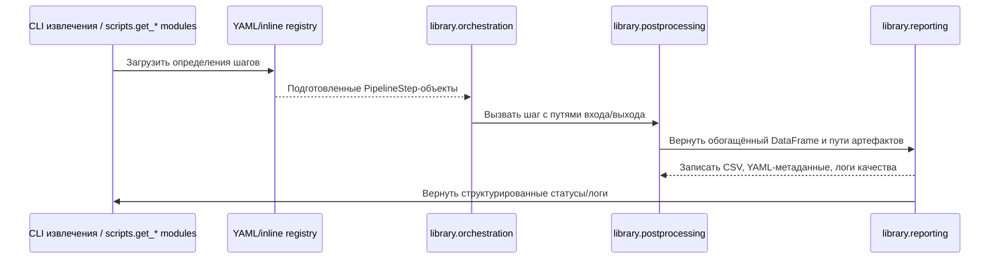

# Руководство по постобработке и оркестрации

> **Языки:** [English](README_postprocess.md) · Русский

Русский текст синхронизирован с [`README_postprocess.md`](README_postprocess.md); при расхождениях обновляйте обе версии параллельно.

Эта памятка описывает переработанный стек постобработки, который формирует CSV-экспорты всех конвейеров загрузки данных ChEMBL. Материал дополняет [обзор архитектуры](docs/ru/ARCHITECTURE.md) и показывает, как взаимодействуют специализированные пакеты оркестрации, схем и отчётности на этапах разработки и выполнения.

## Структура пакетов

| Пакет | Ответственность |
| --- | --- |
| `library/orchestration` | Собирает подготовленные шаги конвейера, прокладывает контекст выполнения (ограничители скорости, клиенты) и предоставляет вспомогательные функции, не зависящие от CLI-парсинга, чтобы конвейеры можно было сценарно автоматизировать. 【F:library/orchestration/workflow.py†L1-L75】【F:library/orchestration/context.py†L1-L89】 |
| `library/pipelines/registry.py` | Загружает канонический реестр (YAML или встроенный), резолвит вызываемые сущности, фиксирует зависимости и метаданные выхода для каждого шага, а также унифицирует построение аргументов. 【F:library/pipelines/registry.py†L1-L151】 |
| `library/postprocessing` | Содержит переиспользуемые вспомогательные функции (обработка кодировок, правила клеточности, флаги мультифункциональности) и высокоуровневые точки входа, которые записывают обогащённые CSV плюс вспомогательные таблицы. 【F:library/postprocessing/helpers.py†L1-L120】【F:library/postprocessing/main.py†L1-L97】 |
| `library/reporting` | Завершает успешные прогоны: хэширует артефакты, записывает YAML-метаданные, генерирует диагностические отчёты качества и поднимает структурированные ошибки для QA-хуков. 【F:library/reporting/run_manifest.py†L1-L169】 |
| `library/schemas` | Централизует определения схем таблиц и точки входа нормализации, которые используют экспортеры и валидаторы, чтобы гарантировать порядок колонок, приведение типов и состав метаданных. 【F:library/schemas/__init__.py†L1-L34】 |

При расширении стека держите границы модулей в уме: оркестрация управляет исполнением, постобработка трансформирует данные, схемы обеспечивают контракт, а отчётность фиксирует доказательства.

## Создание шага конвейера

1. **Опишите шаг** в реестре (YAML-файл или Python-словарь), указав `name`, `callable`, ожидаемые имена входа/выхода, маркеры зависимостей и опции вроде `dry_run`. Загрузчик резолвит пути к функциям и возвращает неизменяемые объекты `PipelineStep`. 【F:library/pipelines/registry.py†L55-L156】
2. **Подготовьте хуки выполнения**, связав `PipelineStep` с `StepCallable`, принимающим финальную конфигурацию, путь к входу, путь к итоговому файлу и рабочую директорию. `execute_workflow` проходит по последовательности, рассчитывает детерминированные временные пути и останавливается при первом ненулевом коде возврата. 【F:library/orchestration/workflow.py†L12-L74】
3. **Используйте общий ETL-контекст**, когда требуются ограничители скорости или API-клиенты. Контекст лениво создаёт ресурсы, шарит их между шагами и корректно очищает. 【F:library/orchestration/context.py†L1-L86】
4. **Записывайте артефакты через помощники отчётности**, избегая разрозненных файловых операций. `finalise_csv_output` проставляет метаданные, формирует QA-сводки и запускает дополнительные проверки качества в единой точке. 【F:library/reporting/run_manifest.py†L70-L169】

Добавляя новые шаги, предпочитайте чистые функции или dataclass-объекты вместо неявных глобальных переменных, чтобы оркестратор мог вызывать их как из CLI, так и из программируемых сценариев. За контекстом границ конвейера обращайтесь к [обзору архитектуры](docs/ru/ARCHITECTURE.md).

## Стратегия валидации схем

Определения схем расположены в `library/schemas` и предоставляют как dataclass-описания (`TargetsSchema`, `TestitemsSchema` и др.), так и хелперы `normalize_*`. Нижележащие этапы импортируют их, чтобы приводить pandas-таблицы к каноническим типам, проверять обязательные поля и выстраивать порядок колонок перед записью на диск. 【F:library/schemas/__init__.py†L1-L34】

Во время постобработки вспомогательные функции `helpers.fill_missing`, `cellularity.ensure_cellularity`, `multifunctional.normalise_multifunctional` и другие нормализуют датафрейм перед передачей в экспортеры, понимающие схемы, например `helpers.write_csv`. Поток таргет-конвейера служит показательной последовательностью: чтение с учётом кодировок, нормализация строковых полей, применение предметных правил, заполнение отсутствующих колонок по порядку схемы и только затем запись артефактов. 【F:library/postprocessing/helpers.py†L1-L120】【F:library/postprocessing/main.py†L37-L96】

После записи CSV функция `finalise_csv_output` формирует YAML-метаданные (с идентификаторами схем) и дополнительные отчёты качества. Манифест хэширует и CSV, и метаданные, чтобы регрессии сразу проявлялись на QA-дашбордах. 【F:library/reporting/run_manifest.py†L70-L169】

## Добавление новой таблицы

Следуйте чек-листу, чтобы встроить новый экспорт в стек:

1. **Смоделируйте схему**: добавьте dataclass и нормализатор в `library/schemas/` (или расширьте существующий модуль) и подключите к `__all__`. Обновите `config.schema.json`, если таблица участвует в JSON-валидации или внешних инструментах. 【F:library/schemas/__init__.py†L1-L34】【F:config/schema/document.yaml†L463-L463】
2. **Опишите шаг**: расширьте реестр конвейеров (YAML или встроенный словарь), чтобы оркестрация знала, как вызывать экспорт, какие ресурсы он создаёт и какие артефакты потребляет. 【F:library/pipelines/registry.py†L55-L156】
3. **Реализуйте постобработку**: создайте модуль в `library/postprocessing/` (при необходимости повторяя логику Power Query) и экспортируйте публичную точку входа из `library/postprocessing/__init__.py`. 【F:library/postprocessing/__init__.py†L1-L21】
4. **Подключите отчётность**: убедитесь, что CLI-скрипт или вызываемый шаг обращается к `finalise_csv_output`, передавая идентификатор схемы и объекты профилирования качества, чтобы метаданные и QA-артефакты были согласованы. 【F:library/reporting/run_manifest.py†L70-L169】
5. **Покройте тестами**: добавьте модульные тесты для вспомогательных функций, интеграционные проверки файлового ввода/вывода и валидации, обновите e2e-фикстуры, если таблица участвует в суммарном запуске (см. требования тестирования ниже). 【F:tests/README.md†L1-L88】

### Декларативная конфигурация конвейеров

Актуальный список шагов для каждого домена постобработки хранится в `config/pipeline/<domain>.yaml`. Эти YAML-файлы описывают версию конвейера, отражаемую в метаданных, включённые шаги и предметные параметры, которые могут потребляться документацией и хуками оркестрации. Вызываемые объекты задаются через dotted-пути (например, `library.postprocessing.pipeline.activities.steps:normalize_activity_records`) и резолвятся лениво функцией `load_pipeline_config`. 【F:config/pipeline/activities.yaml†L1-L34】【F:library/postprocessing/pipeline/common/config.py†L22-L170】

Переменные окружения могут переопределять значения YAML через плейсхолдеры `${VAR}` или `${VAR:-default}`. Например, `${CHEMBL_ACTIVITY_PIPELINE_VERSION:-auto}` использует установленную версию библиотеки, если `CHEMBL_ACTIVITY_PIPELINE_VERSION` не задана. Аналогично `${POSTPROCESS_LOG_LEVEL:-INFO}` определяет уровень логирования, который подхватывает оркестрация. Загрузчик раскрывает плейсхолдеры в безопасном UTF-8-режиме и нормализует значения `auto`/пусто, чтобы вернуться к `get_pipeline_version()`. 【F:library/postprocessing/pipeline/common/config.py†L64-L170】【F:library/postprocessing/pipeline/activities/steps.py†L67-L104】

Доступные переопределения:

- `CHEMBL_ACTIVITY_PIPELINE_VERSION`, `CHEMBL_ASSAY_PIPELINE_VERSION`, `CHEMBL_DOCUMENT_PIPELINE_VERSION`, `CHEMBL_TARGET_PIPELINE_VERSION` — задают экспортируемое поле `pipeline_version` по доменам (по умолчанию `auto`).
- `POSTPROCESS_LOG_LEVEL` — базовый уровень логирования, по умолчанию `INFO`.
- `POSTPROCESS_DEFAULT_ENCODING` — кодировка CSV при чтении/записи, по умолчанию `utf-8`.
- `POSTPROCESS_DEFAULT_CSV_SEPARATOR` — разделитель CSV, по умолчанию `,`.

### Предустановленные значения доменов

YAML-файлы доменов поставляются с репрезентативными значениями по умолчанию, на которые может опираться внешняя автоматизация. Каждый файл содержит следующие параметры верхнего уровня (все уважают перечисленные выше переопределения окружения):

| Домен | Кодировка | Разделитель | Ключевые настройки |
| --- | --- | --- | --- |
| Activity | `utf-8` | `,` | `relation_normalization: true`, `enforce_uppercase_units: true`, `numeric_identifier_dtype: Int64` |
| Assay | `utf-8` | `,` | `uppercase_categories: true`, `strip_whitespace: true`, `normalize_identifiers: true` |
| Target | `utf-8` | `,` | `normalize_taxonomy: true`, `fill_missing_identifiers: true`, `sort_by: ['target_chembl_id']` |
| Document | `utf-8` | `,` | `trim_whitespace: true`, `normalise_unicode: true`, `ensure_unique_ids: true` |
| Test item | `utf-8` | `,` | `uppercase_identifiers: true`, `coerce_booleans: true`, `fill_missing_columns: true` |

## CLI-точки входа

Для этапов постобработки предусмотрены отдельные CLI-обёртки `scripts/make_<table>_postprocessing.py`. Каждый скрипт настраивает парсинг аргументов, конфигурацию логирования и детерминированную запись CSV вокруг доменного конвейера.

Общий интерфейс:

- `--input` — путь к «сырому» CSV, который сформировал этап извлечения.
- `--output` — итоговый CSV; родительские каталоги создаются автоматически.
- `--config` — опциональный YAML-override (по умолчанию `config/pipeline/<table>.yaml`, например `config/pipeline/testitems.yaml`).
- `--log-level` — переопределение уровня логирования из YAML/значения по умолчанию.

По умолчанию логи пишутся в `logs/make_<table>_postprocessing_<YYYYMMDD>.log`. Каталог можно изменить через переменную `CHEMBL_POSTPROCESS_LOG_DIR`. Каждый запуск также формирует рядом с CSV файл `<table>.postprocess.report.json` с метриками из `collect_postprocess_metrics`.

Пример запуска:

```bash
python -m scripts.make_activity_postprocessing --input data/raw/activities.csv --output data/out/activities.csv
```

Та же схема применяется к assay, document, target и test item.

Каждый модуль шагов импортирует свою конфигурацию, экспортирует `PIPELINE_CONFIG` и строит `PIPELINE_STEPS` напрямую на основе YAML, поэтому будущие дополнения не потребуют правок в коде. 【F:library/postprocessing/pipeline/assays/steps.py†L1-L76】【F:library/postprocessing/pipeline/documents/steps.py†L1-L82】【F:library/postprocessing/pipeline/targets/steps.py†L1-L80】

## Поток выполнения



Диаграмма повторяет путь исполнения «CLI → библиотека», описанный в [обзоре архитектуры](docs/ru/ARCHITECTURE.md), и подчёркивает YAML-управляемую оркестрацию и интеграцию с отчётностью.

## Требования к тестированию

Pytest-сьют разбит на `tests/unit/`, `tests/integration/`, `tests/postprocessing/` и `tests/e2e/` в соответствии со слоями конвейера. В каждом каталоге соблюдаются детерминированные фикстуры, строгие соглашения об именовании (`test_<module>.py`, `test_<unit_of_work>__<case>`) и покрытие ключевого QA-чек-листа (валидация схем, нормализация, обогащение, логирование, инварианты экспорта, деградационные сценарии и идемпотентность). 【F:tests/README.md†L1-L88】

Параметры pytest по умолчанию (`-q --disable-warnings --maxfail=1 --durations=10`) определены в `pytest.ini`; комбинируйте их с маркерами (`unit`, `integration`, `e2e`) для локальных прогонов. 【F:pytest.ini†L1-L6】

Контрольные показатели:

- Успешность ≥95 % по всему набору (проверяется оболочкой отчётности и политикой CI).
- 100 % покрытие перечисленных сценариев конвейера перед слиянием в `main`.
- Детерминированные тесты: фиксируем seed/время, избегаем сетевых вызовов, используем снимки в `tests/resources/` и временные каталоги.
- Явные маркеры `slow`/`network`, если отклонения неизбежны.

Общие фикстуры, обеспечивающие детерминированное окружение и заглушки внешних зависимостей, описаны в `tests/conftest.py`.

## Формирование отчётов

Запустите обёртку, чтобы прогнать тесты, сформировать JSON-протокол и Markdown-сводку и продублировать логи в `logs/`:

```bash
python -m scripts.run_tests
```

Скрипт вызывает pytest, записывает `reports/test_report.json`, генерирует `reports/test_summary.md`, контролирует порог успешности ≥95 % и сохраняет структурированные логи для анализа регрессий. Дополнительные опции передаются после `--` (например, `-- -m unit`), `--verbose` включает DEBUG-уровень логирования. 【F:tests/README.md†L58-L91】

## Дополнительные материалы

- [Обзор архитектуры](docs/ru/ARCHITECTURE.md) — взаимосвязь компонентов на верхнем уровне.
- [Структура тестового набора](tests/README.md) — детальные правила тестирования и порядок формирования отчётов.
