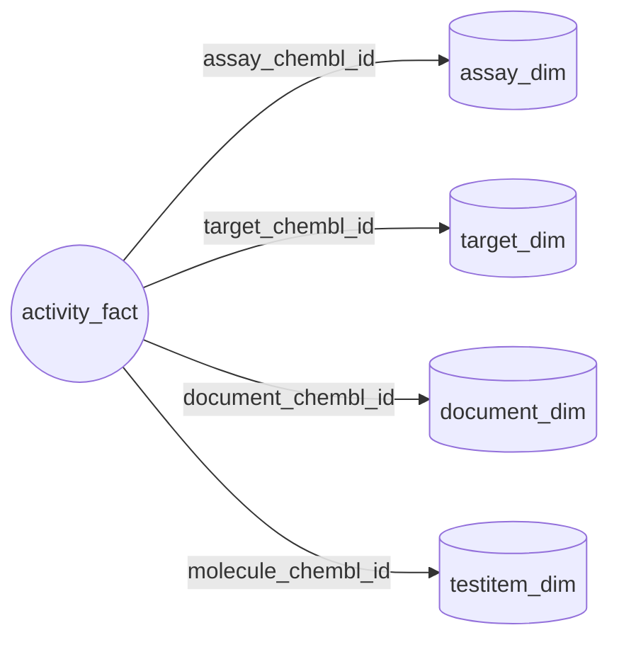
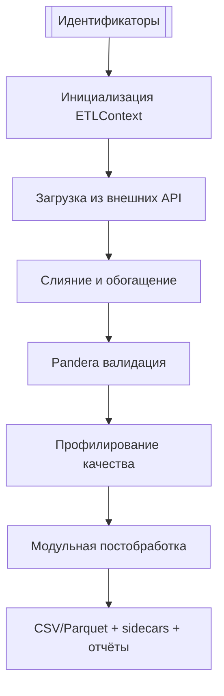

# ChEMBL Data Acquisition Protocol v2.1

*Версия:* 2.1 (October 2025)  
*Репозиторий:* `SatoryKono/ChEMBL_data_acquisition`  
*Назначение:* регламент ETL-конвейера ChEMBL → QC → нормализация → публикация выходных витрин  
*Статус:* утверждён для тестового контура (см. §5 и §8.3)

---

## 1. Программное окружение и зависимости

| Компонент | Конфигурация | Примечание |
|-----------|--------------|------------|
| Python | `>=3.11,<3.13` | Официально поддерживаются CPython 3.11.x и 3.12.x; блокируется 3.13 для CI-стабильности. |
| Основные пакеты | `numpy>=2.3.3`, `pandas>=2.3.3`, `requests>=2.32.5`, `PyYAML>=6.0.3`, `openpyxl>=3.1.5`, `pyarrow>=17.0.0`, `jsonschema>=4.25.1`, `pandera>=0.26.1`, `cachetools>=5.3.3`, `pydantic>=2.11.9` | Версии заданы в `pyproject.toml` и синхронизированы с `requirements*.txt`. |
| Dev/QA инструменты | `pytest>=8.4.2`, `pytest-json-report>=1.5.0`, `pytest-cov>=6.0.0`, `hypothesis>=6.138.15`, `responses>=0.25.8`, `black>=25.1.0`, `ruff>=0.13.0`, `mypy>=1.17.1`, `pre-commit>=3.7.1` | Доступны через extras `pip install .[dev]`; обеспечивают тестирование, статанализ и форматирование. |
| CLI entrypoints | `get-data`, `get-activity-data`, `get-assay-data`, `get-target-data`, `get-document-data`, `get-document-type`, `get-input-initialisation`, `get-testitem-data`, `csv-utils`, `mapper`, `table-quality`, `chunk-io`, `get-activities`, `check-determinism`, `make-md-summary` | Объявлены в `[project.scripts]` и доступны после установки пакета. |

Структура библиотечных модулей:

- `library/clients/` — API-клиенты (ChEMBL, CrossRef/OpenAlex, PubChem, UniProt, GtoPdb) с политикой ретраев и rate limiting.
- `library/io/` — чтение/запись CSV/Parquet, управление путями, генерация sidecar-метаданных.
- `library/utils/` — вспомогательные функции (CLI-инструменты, валидация аргументов, контроль идемпотентности).
- `library/postprocessing/pipeline/{table}/` — модульные шаги постобработки для таблиц (`activities`, `assays`, `documents`, `targets`) плюс общее ядро `common/`.
- `library/pipelines/testitem/` — специализированный конвейер тест-айтемов (чтение идентификаторов, ChEMBL, PubChem, финализация).
- `library/qa/` — профилирование качества, отчёты и вспомогательные хуки (`reporting.py`, `table_quality.py`).
- `library/orchestration/context.py` — `ETLContext` с менеджментом клиентов, лимитов запросов и общими ресурсами для CLI-скриптов.

---

## 2. Источники данных

- **ChEMBL API** (`library/integration/chembl_library.py`, `chembl_client.py`) — базовый источник для активностей, ассев, целей и молекул.
- **PubMed & Semantic Scholar** (`library/integration/pubmed_library.py`, `semantic_scholar_library.py`) — расширение документной витрины, агрегация метаданных публикаций.
- **OpenAlex & CrossRef** (`library/integration/openalex_crossref_library.py`) — DOI- и citation-обогащение; поддерживают лимит RPS и fallback-механизмы.
- **UniProt** (`library/integration/uniprot_library.py`) — белковые и таксономические атрибуты целей, маппинг идентификаторов.
- **Guide to Pharmacology (GtoPdb/IUPHAR)** (`library/integration/iuphar_library.py`) — классификация таргетов, статусы и синонимы.
- **PubChem** (`library/integration/pubchem_library.py`) — структуры и идентификаторы для тест-айтемов, обработка нестандартных ответов.
- **Молекулярный каталог** (`library/integration/molecule_catalog.py`, `config/molecule_catalog/*`) — родительские связи и доменные исключения.
- **Локальные словари** (`config/dictionary/*`, `config/pipeline/*.yaml`) — стандартизованные значения BAO, confirmatory terms, параметры постобработки.

---

## 3. Модель данных (Star Schema)

Факт-таблица `activity_fact` связывает измерения `assay_dim`, `target_dim`, `document_dim`, `testitem_dim` по ключам `assay_chembl_id`, `target_chembl_id`, `document_chembl_id`, `molecule_chembl_id`. Схемы поддерживаются Pandera-валидацией и модульной постобработкой (`library/postprocessing/pipeline/{table}/schema.py`).



| Таблица | Ключ | Связанные атрибуты | Источник |
|---------|------|--------------------|----------|
| `activity_fact` | `activity_id` | `standard_type`, `standard_value`, `quality_flag`, `pipeline_version`, `assay_chembl_id`, `target_chembl_id`, `document_chembl_id`, `molecule_chembl_id` | ChEMBL Activities API + словари ассев/целей и тест-айтемов. |
| `assay_dim` | `assay_chembl_id` | `assay_type`, `assay_test_type`, `description`, `is_confirmatory`, `target_chembl_id` | ChEMBL Assays API + локальные словари BAO. |
| `target_dim` | `target_chembl_id` | `pref_name`, `target_type`, `organism`, `synonyms`, `uniprot_id`, `gtopdb_id` | ChEMBL, UniProt, IUPHAR/GtoPdb. |
| `document_dim` | `document_chembl_id` | `title`, `doc_type`, `publication_year`, `doi`, `PubMed.PMID`, `OpenAlex.Id`, `CrossRef.Type` | ChEMBL, PubMed, Semantic Scholar, OpenAlex, CrossRef. |
| `testitem_dim` | `molecule_chembl_id` | `parent_molecule_chembl_id`, `canonical_smiles`, `pubchem_cid`, development flags | ChEMBL Molecules API, PubChem, локальные каталоги. |

---

## 4. Workflow извлечения данных

### 4.1 Общая оркестрация



- `scripts/` используют `library.orchestration.context.ETLContext` для переиспользования клиентов и ограничения запросов (`chembl`, `pubchem`, `openalex_crossref`).
- Постобработка вызывается через `library.postprocessing.pipeline.common.run_steps`, шаги описаны в `config/pipeline/*.yaml` и могут переопределяться переменными окружения.
- QA-хуки (`library.qa.reporting.build_table_quality_hook`) генерируют CSV/JSON отчёты (`*_quality_report_table.csv`, `*.quality.json`) и интегрируются в логи `*_pipeline_done`.
- `library.postprocessing.pipeline.common.collect_postprocess_metrics` создаёт JSON `<table>.postprocess.report.json` с метриками (`rows`, `columns`, `duration_s`, `steps`, extras по таблице).

### 4.2 Активности — `scripts/get_activity_data.py`

- Основные этапы: чтение идентификаторов → пакетная загрузка через `run_activity_pipeline` → нормализация (`library.postprocessing.pipeline.activities.steps`) → Pandera (`library.schemas.activities`) → QA.
- CLI параметры: `--input-csv`, `--output-csv`, `--final-out`, `--timeout`, `--limit`, `--offset`, `--batch-size`, `--workers`, `--dry-run`, `--skip-existing`, `--force`.
- Пример запуска:
  ```bash
  python scripts/get_activity_data.py --config config/config.yaml \
      --input-csv data/activities.ids.csv --final-out output/activities.csv \
      --batch-size 5 --timeout 90 --workers 4
  ```
- Лог `activity_pipeline_done` содержит путь итогового CSV и ссылку на отчёт постпроцесса.

### 4.3 Ассеи — `scripts/get_assay_data.py`

- Использует `run_assay_pipeline` для загрузки ChEMBL, слияния словарей и шагов `library.postprocessing.pipeline.assays.steps`.
- CLI параметры: `--input-csv`, `--output-csv`, `--final-out`, `--timeout`, `--limit`, `--offset`, `--batch-size`, `--skip-existing`.
- Пример:
  ```bash
  python scripts/get_assay_data.py --config config/config.yaml \
      --input-csv data/assays.ids.csv --final-out output/assays.csv \
      --batch-size 10 --timeout 30
  ```

### 4.4 Документы — `scripts/get_document_data.py`

- Скрипт управляется параметром `--mode` (или позиционным `command` для обратной совместимости) с вариантами `chembl`, `pubmed`, `all`. Режим `all` объединяет результаты конвейеров ChEMBL и PubMed.
- Общие опции: `--input/--final-out` (переопределение путей), `--column`, `--limit`, `--offset`, `--openalex-rps`, `--crossref-rps`.
- Специфичные для режимов ключи: `--batch-size`/`--sleep`/`--workers`/`--chunk-size`/`--timeout` (PubMed или ChEMBL), а также `--chembl-*` и `--pubmed-*` для настройки гибридного запуска `all`. Поддерживается опциональный блок fallback DOI (`--fallback-doi-enabled`, `--fallback-doi-path`, `--fallback-doi-overwrite`, настройки разделителя/кодировки/столбцов).
- Пример:
  ```bash
  python scripts/get_document_data.py --mode all --config config/config.yaml \
      --input data/documents.ids.csv --final-out output/documents.csv \
      --openalex-rps 2 --crossref-rps 1
  ```
- Постобработка: `library/postprocessing/pipeline/documents/steps` (нормализация полей, заполнение годов, дедупликация идентификаторов).

### 4.5 Цели — `scripts/get_target_data.py`

- Подкоманды: `chembl`, `uniprot`, `iuphar`, `all`; каждая поддерживает свои наборы аргументов (например, `--chembl-out`, `--uniprot-out`, `--iuphar-out`).
- Общие опции: `--input-csv`, `--final-out`, `--chunk-size`, `--timeout`, `--limit`, `--offset`, `--disable-gtop`, `--taxon-filter`, `--merge-mode`.
- Пример:
  ```bash
  python scripts/get_target_data.py all --config config/config.yaml \
      --input-csv data/targets.ids.csv --final-out output/targets.csv \
      --chembl-out tmp/targets.chembl.csv --uniprot-out tmp/targets.uniprot.csv \
      --disable-gtop --chunk-size 25
  ```
- Постобработка: `library/postprocessing/pipeline/targets/steps` с агрегацией синонимов и сортировкой по `target_chembl_id`.

### 4.6 Тест-айтемы — `scripts/get_testitem_data.py`

- Использует модуль `library.pipelines.testitem.cli` (шаги: `read_identifiers`, `fetch_chembl_metadata`, `enrich_pubchem`, `finalize_export`).
- Аргументы: базовые `--input/--final-out`, `--batch-size`, `--timeout`, `--limit`, `--offset`, `--force`, `--skip-existing` плюс стандартные параметры CSV (`--sep`, `--encoding`, `--column`).
- Пример:
  ```bash
  python scripts/get_testitem_data.py --config config/config.yaml \
      --input data/testitems.ids.csv --final-out output/testitems.csv \
      --batch-size 1000 --timeout 30
  ```
- Выход: основной CSV, sidecar `.meta.yaml`, failure-case CSV, QA и отчёт постпроцесса.

---

## 5. Контроль качества


| Компонент | Метрики / Артефакты | Реализация |
|-----------|---------------------|------------|
| Pandera валидация | Обязательные/опциональные колонки, типы, правила nullable | `library/schemas/*.py`, `library/postprocessing/pipeline/{table}/schema.py`. |
| Table Quality профилирование | `row_count`, `non_null_ratio`, `pattern_*`, `numeric_*`, `bool_like_ratio`, `distinct_ratio` | `library/qa/table_quality.py` через хук `build_table_quality_hook`. |
| Postprocess metrics | `rows`, `columns`, `duration_s`, `steps`, `validation.schema`, extras (`input_rows`, `ambiguous_classifications`) | `library/postprocessing/pipeline/common/utils.collect_postprocess_metrics`. |
| Логирование этапов | события `*_pipeline_done`, `quality_report_*`, failure-case CSV | `library.qa.reporting` и `library.utils.logging`. |
| Тестовый контур | `reports/test_report.json`, `reports/test_summary.md`, success-rate ≥95 % | Pytest + json-report, консолидируется `tools/make_md_summary.py`. |

Тестовая политика (§8.3) требует детерминированности: фиксация `PYTHONHASHSEED`, отсутствие сетевых вызовов без моков, использование `tmp_path` и снапшотов из `tests/resources/`.

---

## 6. Нормализация и постобработка

Модульная система управляется YAML-конфигами (`config/pipeline/*.yaml`). `library.postprocessing.pipeline.common.run_steps` исполняет цепочки шагов, применяет `infer_pipeline_version` и пишет артефакты (`*.postprocess.report.json`).

### 6.1 Активности

- Шаги: `normalize_activity_records` → `enrich_activity_quality` → `finalize_activity_records` (`library/postprocessing/pipeline/activities/steps.py`).
- Схема: `library/postprocessing/pipeline/activities/schema.py`, контролирует типы идентификаторов (`Int64`, `string`) и обязательность ключей.
- Конфигурация: `config/pipeline/activities.yaml` (параметры `relation_normalization`, `enforce_uppercase_units`).

### 6.2 Ассеи

- Шаги: `normalize_assay_metadata`, `enrich_assay_flags`, `finalize_assay_records` (`library/postprocessing/pipeline/assays/steps.py`).
- Схема: `library/postprocessing/pipeline/assays/schema.py`, включает проверки BAO-кодов и confirmatory-флага.
- Конфигурация: `config/pipeline/assays.yaml` (параметры `uppercase_categories`, `confirmatory_terms`).

### 6.3 Документы

- Шаги: `normalize_document_fields`, `enrich_document_publication_year`, `finalize_document_records` (`library/postprocessing/pipeline/documents/steps.py`).
- Схема: `library/postprocessing/pipeline/documents/schema.py`, следит за уникальностью `document_chembl_id` и заполнением DOI/годов.
- Конфигурация: `config/pipeline/documents.yaml` (`normalise_unicode`, `fallback_year`, `ensure_unique_ids`).

### 6.4 Цели

- Шаги: `normalize_target_fields`, `enrich_target_synonyms`, `finalize_target_records` (`library/postprocessing/pipeline/targets/steps.py`).
- Схема: `library/postprocessing/pipeline/targets/schema.py`, проверяет `target_type`, `organism`, агрегированные синонимы.
- Конфигурация: `config/pipeline/targets.yaml` (`normalize_taxonomy`, `synonym_sources`, `sort_by`).

### 6.5 Тест-айтемы

- Конвейер определён в `config/pipeline/testitem.yaml`, исполняется `library.pipelines.testitem.cli.run`.
- Ключевые функции: `catalog.resolve_parent_ids`, `pubchem.fetch_pubchem_details`, `cli.finalize_output` (создание `.meta.yaml`, QA, failure CSV).
- Схема: `library/pipelines/testitem/core.py` (класс `TestitemsSchema`).

---

## 7. Финальные выходные таблицы и отчётность

Все конвейеры формируют детерминированные CSV (упорядоченный экспорт, стабильные типы), sidecar `.meta.yaml`, отчёты QA (`*_quality_report_table.csv`, `*.quality.json`) и JSON постпроцесса (`*.postprocess.report.json`).

### 7.1 Activity Export

| name | type | nullable | domain | source | description |
|------|------|----------|--------|--------|-------------|
| `activity_id` | `Int64` | No | Primary activity identifier | ChEMBL Activities API | Ключ факта; нормализуется `finalize_activity_records`. |
| `molecule_chembl_id` | `string` | No | Molecule ID | ChEMBL + testitem_dim | FK → `testitem_dim`, uppercase. |
| `assay_chembl_id` | `string` | No | Assay ID | ChEMBL + assay_dim | FK → `assay_dim`, строгие идентификаторы. |
| `standard_type` | `string` | No | Тип измерения | Postprocess | Обязательное поле, нормализованные значения. |
| `standard_relation` | `string` | No | Отношение измерения | ChEMBL Activities API | Переносится из исходных данных, нормализуется. |
| `standard_value` | `float64` | Yes | Нормализованное значение | ChEMBL + нормализация единиц | Проверка диапазонов и пропусков. |
| `standard_units` | `string` | Yes | Единицы измерения | ChEMBL Activities API | Приводятся к верхнему регистру и унифицированным обозначениям. |
| `data_validity_comment` | `string` | Yes | Комментарий валидности | ChEMBL Activities API | Переносится при наличии. |
| `activity_comment` | `string` | Yes | Комментарий активности | ChEMBL Activities API | Дополнительные заметки об эксперименте. |
| `quality_flag` | `boolean` | Yes | QA flag | Постпроцесс | Производный признак `enrich_activity_quality`. |
| `pipeline_version` | `string` | Yes | Pipeline version | Package metadata | Ставится автоматически `infer_pipeline_version`. |

### 7.2 Assay Export

| name | type | nullable | domain | source | description |
|------|------|----------|--------|--------|-------------|
| `assay_chembl_id` | `string` | No | Assay identifier | ChEMBL | Первичный ключ. |
| `assay_type` | `string` | No | BAO type | ChEMBL + словари | Uppercase, выверяется Pandera. |
| `assay_test_type` | `string` | No | Test type | ChEMBL | Нормализация whitespace. |
| `description` | `string` | No | Assay description | ChEMBL | Текстовое описание. |
| `target_chembl_id` | `string` | Yes | Related target | ChEMBL | Связь с `target_dim`. |
| `is_confirmatory` | `boolean` | Yes | Confirmatory flag | Derived | Настраивается в `config/pipeline/assays.yaml`. |
| `pipeline_version` | `string` | Yes | Pipeline version | Postprocess | Для трассировки выпусков. |

### 7.3 Document Export

| name | type | nullable | domain | source | description |
|------|------|----------|--------|--------|-------------|
| `document_chembl_id` | `string` | No | Document ID | ChEMBL | Первичный ключ. |
| `title` | `string` | Yes | Title | ChEMBL/PubMed | Unicode-NFKC нормализация. |
| `doc_type` | `string` | No | Document type | ChEMBL | Категориальное поле. |
| `year` | `string` | Yes | Исторический год из ChEMBL | ChEMBL | Сохраняется для совместимости с наследием. |
| `publication_year` | `Int64` | Yes | Publication year | ChEMBL/PubMed/OpenAlex/CrossRef | Алгоритм приоритетов см. `enrich_document_publication_year`. |
| `doi` | `string` | Yes | DOI | ChEMBL/PubMed/OpenAlex | Может дополняться fallback CSV. |
| `journal` | `string` | Yes | Журнал публикации | ChEMBL | Переносится в текстовом виде. |
| `abstract` | `string` | Yes | Аннотация | ChEMBL/PubMed | Очищается от невалидных символов. |
| `pipeline_version` | `string` | Yes | Pipeline version | Postprocess | Версия документа. |

### 7.4 Target Export

| name | type | nullable | domain | source | description |
|------|------|----------|--------|--------|-------------|
| `target_chembl_id` | `string` | No | Target ID | ChEMBL | Первичный ключ. |
| `pref_name` | `string` | Yes | Preferred name | ChEMBL | Тримминг, fallback placeholder. |
| `target_type` | `string` | No | Target type | ChEMBL | Категория объекта. |
| `organism` | `string` | Yes | Organism | ChEMBL | Нормализуется `normalize_taxonomy`. |
| `target_class` | `string` | Yes | Класс таргета | ChEMBL | Сводится по справочнику классов. |
| `protein_family` | `string` | Yes | Белковая семья | ChEMBL | Дополнительная классификация. |
| `synonyms` | `string` | Yes | Synonym set | Aggregated | Список через `; `. |
| `pipeline_version` | `string` | Yes | Pipeline version | Postprocess | Контроль изменений. |

### 7.5 Test Item Export

| name | type | nullable | domain | source | description |
|------|------|----------|--------|--------|-------------|
| `molecule_chembl_id` | `string` | Yes | Molecule ID | ChEMBL | Первичный ключ, допускает пустые значения для place-holder строк. |
| `parent_molecule_chembl_id` | `string` | Yes | Parent molecule | Molecule catalog | Разрешает сопоставление с родительскими сущностями. |
| `canonical_smiles` | `string` | Yes | Canonical SMILES | ChEMBL | Основная структура. |
| `pubchem_cid` | `string` | Yes | PubChem CID | PubChem | Нормализуется в `finalize_export`. |
| `natural_product`, `prodrug`, `oral`, `parenteral`, `topical` | `boolean` | Yes | Development flags | ChEMBL | Переносят флаги разработки. |
| `pipeline_version` | `string` | Yes | Pipeline version | Postprocess | Добавляется при финализации. |
| `timestamp_utc` | `datetime64[ns]` | Yes | Export timestamp | CLI runtime | Временная метка запуска. |

---

## 8. Приложения

### 8.1 YAML-конфигурации постобработки

| Файл | Назначение | Ключевые параметры |
|------|------------|--------------------|
| `config/pipeline/activities.yaml` | Нормализация активностей | `relation_normalization`, `enforce_uppercase_units`, `quality_terms`. |
| `config/pipeline/assays.yaml` | Постобработка ассев | `uppercase_categories`, `confirmatory_terms`, `normalize_identifiers`. |
| `config/pipeline/documents.yaml` | Документный постпроцесс | `normalise_unicode`, `fallback_year`, `ensure_unique_ids`. |
| `config/pipeline/targets.yaml` | Конвейер целей | `normalize_taxonomy`, `synonym_sources`, `sort_by`. |
| `config/pipeline/testitem.yaml` | Конвейер тест-айтемов | Шаги high-level, привязка схемы `TestitemsSchema`, artefacts (`*.meta.yaml`). |

### 8.2 Быстрый справочник CLI

| Скрипт | Основной сценарий | Ключевые опции |
|--------|-------------------|----------------|
| `get_activity_data.py` | ETL активностей | `--batch-size`, `--timeout`, `--workers`, `--dry-run`, `--skip-existing`, `--force`. |
| `get_assay_data.py` | Выгрузка ассев | `--batch-size`, `--timeout`, `--limit`, `--offset`, `--skip-existing`. |
| `get_document_data.py` | Документная витрина | `--mode {chembl,pubmed,all}`, `--openalex-rps`, `--crossref-rps`, `--fallback-doi-*`, расширенные `--chembl-*`/`--pubmed-*` настройки. |
| `get_target_data.py` | Цели и классификация | Подкоманды (`chembl`, `uniprot`, `iuphar`, `all`), `--disable-gtop`, `--chunk-size`, `--merge-mode`, `--taxon-filter`. |
| `get_testitem_data.py` | Тест-айтемы | `--batch-size`, `--timeout`, `--limit`, `--offset`, `--force`, `--skip-existing`, стандартные CSV-параметры. |
| `get-data` | Объединённый драйвер | Делегирует к соответствующим подкомандам (`activities`, `assays`, `targets`, `documents`, `testitems`). |
| `table-quality` | Профилирование | Анализ существующих CSV, экспорт отчётов QA. |

### 8.3 Отчёты QA/тестирования

- Полный отчёт pytest: `reports/test_report.json` (структура `meta`, `summary`, `tests`).
- Краткая сводка: `reports/test_summary.md` — фиксирует репозиторий, коммит, ветку, timestamp, длительность, success rate.
- CI политика: success-rate ≥95 %, покрытие ключевых сценариев пайплайна 100 %, тесты детерминированы и без сетевых зависимостей (моки через `responses`, данные в `tests/resources/`).
- Перед релизом обязательны команды:
  ```bash
  pytest --json-report --json-report-file=reports/test_report.json
  python tools/make_md_summary.py reports/test_report.json reports/test_summary.md
  ```