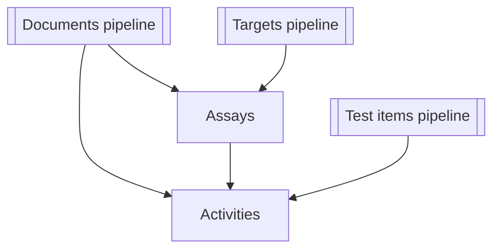

# ETL data flow for `get_*_data.py`

This document summarises the inputs, external data sources, processing steps and outputs for each
`get_*_data.py` command-line utility. Use it as a map for onboarding to the ChEMBL data acquisition
pipelines.

## `scripts/get_activity_data.py`

| Aspect | Details |
| --- | --- |
| **Input sources & format** | CSV containing an identifier column (default `activity_id`) read lazily via `io.read_ids`. Optional `--limit` and `--dry-run` flags gate processing.【F:scripts/get_activity_data.py†L78-L118】 |
| **External services / files** | ChEMBL API accessed through `ChemblClient` with configurable chunking and timeouts.【F:scripts/get_activity_data.py†L78-L117】 |
| **Key transformations** | Normalise API payloads, append pipeline metadata, enforce schema column ordering, validate against `ActivitiesSchema`, and log per-row validation failures to sidecar CSVs.【F:scripts/get_activity_data.py†L118-L188】 |
| **Outputs & storage** | Primary CSV written to the requested or default output path, metadata YAML containing run statistics, and table-quality diagnostics.【F:scripts/get_activity_data.py†L181-L221】 |
| **Downstream links** | Output rows include `molecule_chembl_id`, `assay_chembl_id`, and `document_chembl_id`, tying activities to molecules (test items), assays, and documents respectively.【F:schemas/activities.py†L13-L33】 |

## `scripts/get_assay_data.py`

| Aspect | Details |
| --- | --- |
| **Input sources & format** | CSV of assay identifiers (default `assay_chembl_id`) streamed from disk with optional row limits.【F:scripts/get_assay_data.py†L72-L108】 |
| **External services / files** | ChEMBL API via `ChemblClient`; assay-specific post-processing handled by `library.assay_postprocessing`.【F:scripts/get_assay_data.py†L72-L108】 |
| **Key transformations** | Post-process raw payloads, normalise column values, inject pipeline metadata, reorder columns per `AssaysSchema`, and validate with sidecar failure capture.【F:scripts/get_assay_data.py†L107-L206】 |
| **Outputs & storage** | CSV export with deterministic ordering, run metadata YAML, and table-quality analysis artefacts.【F:scripts/get_assay_data.py†L167-L213】 |
| **Downstream links** | Assay records reference `document_chembl_id` (documents) and `target_chembl_id` (targets), providing joins for the activity and target pipelines.【F:schemas/assays.py†L41-L83】 |

## `scripts/get_document_data.py`

This utility exposes `pubmed`, `chembl`, and `all` sub-commands.

| Sub-command | Input & sources | External services | Transformations | Outputs |
| --- | --- | --- | --- | --- |
| `pubmed` | CSV column of PMIDs (default `PMID`), with optional fallback DOI CSV for overrides.【F:scripts/get_document_data.py†L690-L757】 | Entrez PubMed batches, Semantic Scholar, OpenAlex, and CrossRef APIs coordinated with per-service rate limiting.【F:scripts/get_document_data.py†L242-L370】 | Fetch metadata concurrently, merge service responses, normalise, and hand off to common export routine.【F:scripts/get_document_data.py†L742-L758】【F:scripts/get_document_data.py†L552-L633】 | Normalised CSV, metadata YAML, `.quality.json` quality report, and table-quality metrics stored alongside the CSV.【F:scripts/get_document_data.py†L605-L668】 |
| `chembl` | CSV of ChEMBL document IDs (default `document_chembl_id`).【F:scripts/get_document_data.py†L786-L835】 | ChEMBL API (documents endpoint).【F:scripts/get_document_data.py†L811-L818】 | Optional DOI normalisation, column normalisation, and export via `_finalise_export`.【F:scripts/get_document_data.py†L826-L836】【F:scripts/get_document_data.py†L552-L668】 | Same artefact set as above.【F:scripts/get_document_data.py†L605-L668】 |
| `all` | CSV of document IDs used to seed both ChEMBL and PubMed lookups; optional limit and chunk-size controls.【F:scripts/get_document_data.py†L856-L918】 | Combines ChEMBL, PubMed, Semantic Scholar, OpenAlex, and CrossRef calls; reuses DOI values as fallbacks when PubMed lacks data.【F:scripts/get_document_data.py†L880-L947】 | Merge ChEMBL and literature metadata, post-process fields, and invoke shared export pipeline.【F:scripts/get_document_data.py†L948-L960】【F:scripts/get_document_data.py†L552-L668】 | CSV + metadata YAML + `.quality.json` + table-quality diagnostics.【F:scripts/get_document_data.py†L605-L668】 |

**Downstream links:** Document exports provide `document_chembl_id` and harmonised bibliographic columns consumed by assay and activity tables, enabling traceability of experimental records back to publications.【F:schemas/documents.py†L14-L118】【F:schemas/assays.py†L41-L83】【F:schemas/activities.py†L13-L33】 

## `scripts/get_target_data.py`

The target pipeline offers `uniprot`, `chembl`, `iuphar`, and `all` workflows.

| Sub-command | Input & sources | External services / files | Transformations | Outputs |
| --- | --- | --- | --- | --- |
| `uniprot` | CSV of UniProt accessions derived from earlier steps (default column `uniprot_id`).【F:scripts/get_target_data.py†L384-L456】 | UniProt REST/flat-file downloads via `library.uniprot_library`, with optional local cache directory.【F:scripts/get_target_data.py†L431-L475】 | Prepare temporary input list, trigger UniProt processing, and merge back mapping columns before export.【F:scripts/get_target_data.py†L420-L480】 | CSV, metadata YAML, and quality analysis for UniProt enrichment.【F:scripts/get_target_data.py†L456-L505】 |
| `chembl` | CSV of ChEMBL target IDs (default `target_chembl_id`).【F:scripts/get_target_data.py†L528-L575】 | ChEMBL API plus UniProt mapping service for protein accessions.【F:scripts/get_target_data.py†L537-L565】 | Normalise, add pipeline metadata, align to schema, validate, and persist with stats.【F:scripts/get_target_data.py†L574-L650】 | Target CSV, metadata YAML, table-quality results.【F:scripts/get_target_data.py†L611-L650】 |
| `iuphar` | CSV (usually combined ChEMBL/UniProt output) optionally limited for testing.【F:scripts/get_target_data.py†L669-L720】 | Local IUPHAR CSV resources (`target_csv`, `family_csv`).【F:scripts/get_target_data.py†L703-L714】 | Map UniProt IDs to IUPHAR classifications and export mapping table.【F:scripts/get_target_data.py†L703-L714】 | Classification CSV with metadata and quality analysis.【F:scripts/get_target_data.py†L708-L758】 |
| `all` | Master CSV of target IDs driving chained retrieval; configurable intermediate output paths.【F:scripts/get_target_data.py†L1064-L1107】 | Invokes the three pipelines above sequentially (ChEMBL API, UniProt services, IUPHAR files).【F:scripts/get_target_data.py†L1088-L1098】 | Merge intermediate outputs, perform target post-processing, and validate final schema before writing.【F:scripts/get_target_data.py†L1088-L1108】【F:scripts/get_target_data.py†L976-L1061】 | Consolidated target CSV plus intermediate artefacts for each sub-step, each with metadata and quality checks.【F:scripts/get_target_data.py†L1040-L1108】 |

**Downstream links:** Assay exports reference `target_chembl_id` and UniProt attributes produced here, feeding activity interpretation and enabling target-class filters.【F:schemas/assays.py†L41-L83】 

## `scripts/get_testitem_data.py`

| Aspect | Details |
| --- | --- |
| **Input sources & format** | CSV list of ChEMBL molecule IDs (default `molecule_chembl_id`) streamed with optional limits.【F:scripts/get_testitem_data.py†L151-L195】 |
| **External services / files** | ChEMBL API for compound core data plus PubChem API for SMILES-based augmentation.【F:scripts/get_testitem_data.py†L151-L194】【F:scripts/get_testitem_data.py†L49-L123】 |
| **Key transformations** | Enrich ChEMBL results with PubChem identifiers/properties, normalise, join against the cached parent catalogue, add pipeline metadata, and validate via `TestitemsSchema` capturing failures separately.【F:scripts/get_testitem_data.py†L193-L249】【F:library/molecule_catalog.py†L43-L136】 |
| **Outputs & storage** | CSV with combined ChEMBL/PubChem fields, metadata YAML, and quality diagnostics written beside the export.【F:scripts/get_testitem_data.py†L259-L299】 |
| **Downstream links** | Activities reference `molecule_chembl_id`, allowing potency and efficacy data to join back to the enriched compound properties.【F:schemas/testitems.py†L12-L38】【F:schemas/activities.py†L13-L33】 |

## Cross-pipeline relationships

*Documents pipeline* aggregates PubMed, Semantic Scholar, OpenAlex, CrossRef, and ChEMBL metadata into
`document_chembl_id`-centric records consumed by assays and activities.【F:scripts/get_document_data.py†L742-L960】【F:schemas/documents.py†L14-L118】

*Targets pipeline* merges ChEMBL, UniProt and IUPHAR attributes, producing IDs referenced by assays and downstream activity analysis.【F:scripts/get_target_data.py†L1088-L1108】【F:schemas/assays.py†L41-L83】

*Test item pipeline* enriches molecules with PubChem properties and surfaces parent-child relationships via the local catalogue, enabling contextualised joins to activity results through `molecule_chembl_id` and `parent_molecule_chembl_id` keys.【F:scripts/get_testitem_data.py†L151-L299】【F:library/molecule_catalog.py†L43-L136】【F:schemas/activities.py†L13-L33】
