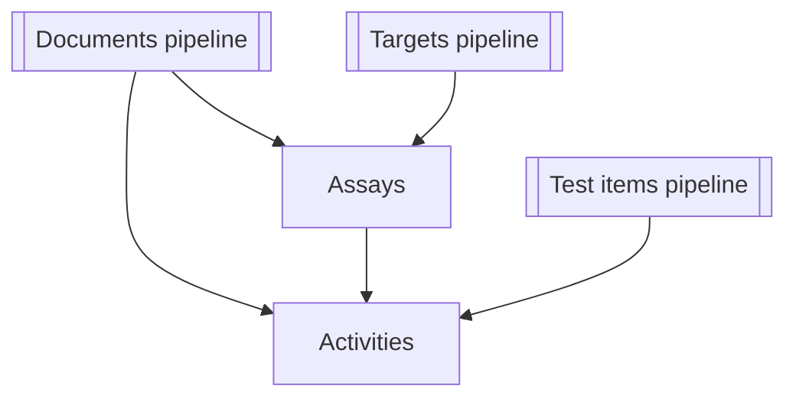

# Поток данных ETL для `get_*_data.py`

Этот документ суммирует источники входных данных, внешние сервисы, этапы обработки и конечные артефакты для каждой утилиты командной строки `get_*_data.py`. Используйте его как карту при онбординге в конвейеры получения данных ChEMBL.

## `scripts/get_activity_data.py`

| Аспект | Детали |
| --- | --- |
| **Источники и формат входа** | CSV с колонкой идентификаторов (по умолчанию `activity_chembl_id`, значение берётся из `activity.column` в `config.yaml`, если его не переопределить через `--column`) читается лениво через `io.read_ids`. Дополнительные флаги `--limit` и `--dry-run` позволяют ограничить обработку.【F:scripts/get_activity_data.py†L78-L118】【F:config.yaml†L33-L38】【F:scripts/get_activity_data.py†L1054-L1104】 |
| **Внешние сервисы / файлы** | API ChEMBL через `ChemblClient` с настраиваемой пакетной загрузкой и таймаутами.【F:scripts/get_activity_data.py†L78-L117】 |
| **Ключевые преобразования** | Нормализация ответов API, добавление метаданных запуска, приведение к порядку колонок схемы `ActivitiesSchema`, валидация и запись ошибок построчно во вспомогательные CSV.【F:scripts/get_activity_data.py†L118-L188】 |
| **Выход и хранение** | Основной CSV записывается в указанный (или стандартный) путь, рядом сохраняются YAML с метаданными запуска и диагностика качества таблицы.【F:scripts/get_activity_data.py†L181-L221】 |
| **Связи** | Строки выгрузки содержат `molecule_chembl_id`, `assay_chembl_id` и `document_chembl_id`, связывая активности с молекулами (test items), ассаями и документами соответственно.【F:schemas/activities.py†L13-L33】 |

## `scripts/get_assay_data.py`

| Аспект | Детали |
| --- | --- |
| **Источники и формат входа** | CSV с идентификаторами ассаев (по умолчанию `assay_chembl_id`), потоковое чтение с опциональным ограничением строк.【F:scripts/get_assay_data.py†L72-L108】 |
| **Внешние сервисы / файлы** | API ChEMBL через `ChemblClient`; постобработку для ассаев выполняет `library.assay_postprocessing`.【F:scripts/get_assay_data.py†L72-L108】 |
| **Ключевые преобразования** | Постобработка сырых данных, нормализация значений, добавление метаданных запуска, упорядочивание колонок по `AssaysSchema`, валидация с записью ошибок во вспомогательные файлы.【F:scripts/get_assay_data.py†L107-L206】 |
| **Выход и хранение** | CSV с детерминированным порядком строк, YAML с метаданными запуска и артефакты анализа качества таблицы.【F:scripts/get_assay_data.py†L167-L213】 |
| **Связи** | Записи ассаев содержат `document_chembl_id` (документы) и `target_chembl_id` (мишени), формируя связи для конвейеров активности и таргетов.【F:schemas/assays.py†L41-L83】 |

## `scripts/get_document_data.py`

Утилита поддерживает подкоманды `pubmed`, `chembl` и `all`.

| Подкоманда | Вход и источники | Внешние сервисы | Преобразования | Выход |
| --- | --- | --- | --- | --- |
| `pubmed` | CSV с колонкой PMIDs (по умолчанию `PMID`), опционально дополнительный CSV с DOI для переопределения значений.【F:scripts/get_document_data.py†L690-L757】 | Пакетные запросы к Entrez PubMed, а также API Semantic Scholar, OpenAlex и CrossRef с индивидуальными лимитами скорости.【F:scripts/get_document_data.py†L242-L370】 | Параллельное получение метаданных, объединение ответов, нормализация и передача в общую процедуру экспорта.【F:scripts/get_document_data.py†L742-L758】【F:scripts/get_document_data.py†L552-L633】 | Нормализованный CSV, YAML с метаданными, отчёт `.quality.json` и диагностические метрики качества таблицы рядом с CSV.【F:scripts/get_document_data.py†L605-L668】 |
| `chembl` | CSV с идентификаторами документов ChEMBL (по умолчанию `document_chembl_id`).【F:scripts/get_document_data.py†L786-L835】 | API ChEMBL (endpoint документов).【F:scripts/get_document_data.py†L811-L818】 | Опциональная нормализация DOI, выравнивание колонок и экспорт через `_finalise_export`.【F:scripts/get_document_data.py†L826-L836】【F:scripts/get_document_data.py†L552-L668】 | Тот же набор артефактов, что и выше.【F:scripts/get_document_data.py†L605-L668】 |
| `all` | CSV с идентификаторами документов для запуска последовательных запросов ChEMBL и PubMed; дополнительные параметры ограничения и размера пакета.【F:scripts/get_document_data.py†L856-L918】 | Комбинирует вызовы ChEMBL, PubMed, Semantic Scholar, OpenAlex и CrossRef; повторно использует DOI при отсутствии данных PubMed.【F:scripts/get_document_data.py†L880-L947】 | Объединяет метаданные ChEMBL и литературы, постобрабатывает поля и вызывает общую процедуру экспорта.【F:scripts/get_document_data.py†L948-L960】【F:scripts/get_document_data.py†L552-L668】 | CSV + YAML с метаданными + `.quality.json` + диагностические файлы качества таблицы.【F:scripts/get_document_data.py†L605-L668】 |

**Связи:** Выгрузка документов содержит `document_chembl_id` и унифицированные библиографические атрибуты, используемые в таблицах ассая и активности, что обеспечивает трассируемость экспериментальных записей до публикаций.【F:schemas/documents.py†L14-L118】【F:schemas/assays.py†L41-L83】【F:schemas/activities.py†L13-L33】

## `scripts/get_target_data.py`

Конвейер таргетов предоставляет сценарии `uniprot`, `chembl`, `iuphar` и `all`.

| Подкоманда | Вход и источники | Внешние сервисы / файлы | Преобразования | Выход |
| --- | --- | --- | --- | --- |
| `uniprot` | CSV с идентификаторами UniProt (по умолчанию `uniprot_id`), сформированный на предыдущих шагах.【F:scripts/get_target_data.py†L384-L456】 | REST/flat-file сервисы UniProt через `library.uniprot_library` с опциональным локальным кэшем.【F:scripts/get_target_data.py†L431-L475】 | Подготовка временного списка, запуск обработки UniProt и объединение соответствий перед экспортом.【F:scripts/get_target_data.py†L420-L480】 | CSV, YAML с метаданными и анализ качества для обогащения UniProt.【F:scripts/get_target_data.py†L456-L505】 |
| `chembl` | CSV с идентификаторами таргетов ChEMBL (по умолчанию `target_chembl_id`).【F:scripts/get_target_data.py†L528-L575】 | API ChEMBL и сервис сопоставления UniProt для протеиновых акцессий.【F:scripts/get_target_data.py†L537-L565】 | Нормализация, добавление метаданных запуска, согласование со схемой, валидация и сохранение со статистикой.【F:scripts/get_target_data.py†L574-L650】 | CSV таргетов, YAML с метаданными, отчёты качества таблицы.【F:scripts/get_target_data.py†L611-L650】 |
| `iuphar` | CSV (обычно объединённый вывод ChEMBL/UniProt) с опциональным ограничением для тестов.【F:scripts/get_target_data.py†L669-L720】 | Локальные CSV IUPHAR (`target_csv`, `family_csv`).【F:scripts/get_target_data.py†L703-L714】 | Сопоставление UniProt-ID с классификациями IUPHAR и экспорт таблицы соответствий.【F:scripts/get_target_data.py†L703-L714】 | CSV классификаций с метаданными и анализом качества.【F:scripts/get_target_data.py†L708-L758】 |
| `all` | Итоговый CSV идентификаторов таргетов, запускающий цепочку запросов; пути промежуточных файлов настраиваются.【F:scripts/get_target_data.py†L1064-L1107】 | Последовательно вызывает три конвейера выше (API ChEMBL, сервисы UniProt, файлы IUPHAR).【F:scripts/get_target_data.py†L1088-L1098】 | Объединяет промежуточные результаты, выполняет постобработку и валидацию итоговой схемы перед записью.【F:scripts/get_target_data.py†L1088-L1108】【F:scripts/get_target_data.py†L976-L1061】 | Консолидированный CSV таргетов плюс промежуточные артефакты каждого шага с метаданными и проверками качества.【F:scripts/get_target_data.py†L1040-L1108】 |

**Связи:** Выгрузка таргетов используется в ассаях через `target_chembl_id` и унипротовские атрибуты, что поддерживает анализ активности и фильтры по классам таргетов.【F:schemas/assays.py†L41-L83】

## `scripts/get_testitem_data.py`

| Аспект | Детали |
| --- | --- |
| **Источники и формат входа** | CSV со списком идентификаторов молекул ChEMBL (по умолчанию `molecule_chembl_id`), потоковое чтение с опциональными ограничениями.【F:scripts/get_testitem_data.py†L151-L195】 |
| **Внешние сервисы / файлы** | API ChEMBL для базовых данных соединений и API PubChem для обогащения по SMILES.【F:scripts/get_testitem_data.py†L151-L194】【F:scripts/get_testitem_data.py†L49-L123】 |
| **Ключевые преобразования** | Обогащение результатов ChEMBL идентификаторами/свойствами PubChem, нормализация, объединение с кэшированным каталогом родителей, добавление метаданных запуска и валидация схемой `TestitemsSchema` с вынесением ошибок в отдельные файлы.【F:scripts/get_testitem_data.py†L193-L249】【F:library/molecule_catalog.py†L43-L136】 |
| **Выход и хранение** | CSV с объединёнными полями ChEMBL/PubChem, YAML с метаданными и диагностикой качества рядом с экспортом.【F:scripts/get_testitem_data.py†L259-L299】 |
| **Связи** | Таблица активностей использует `molecule_chembl_id`, что позволяет связывать показатели активности с обогащёнными свойствами соединений.【F:schemas/testitems.py†L12-L38】【F:schemas/activities.py†L13-L33】 |

## Взаимосвязи конвейеров

*Документный конвейер* агрегирует метаданные PubMed, Semantic Scholar, OpenAlex, CrossRef и ChEMBL в записи вокруг `document_chembl_id`, которые используются ассаями и активностями.【F:scripts/get_document_data.py†L742-L960】【F:schemas/documents.py†L14-L118】

*Конвейер таргетов* объединяет атрибуты ChEMBL, UniProt и IUPHAR, формируя идентификаторы, на которые ссылаются ассаи и аналитика активностей.【F:scripts/get_target_data.py†L1088-L1108】【F:schemas/assays.py†L41-L83】

*Конвейер тест-айтемов* обогащает молекулы свойствами PubChem и добавляет связи родитель→потомок из локального каталога, что позволяет использовать как `molecule_chembl_id`, так и `parent_molecule_chembl_id` при объединении с активностями.【F:scripts/get_testitem_data.py†L151-L299】【F:library/molecule_catalog.py†L43-L136】【F:schemas/activities.py†L13-L33】
