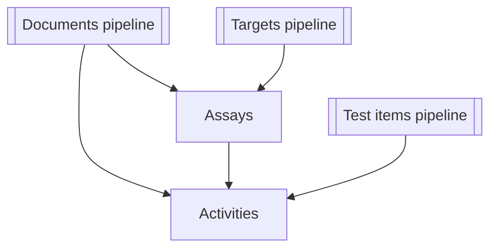

# Поток данных ETL для `get_*_data.py`

Этот документ суммирует источники входных данных, внешние сервисы, этапы обработки и конечные артефакты для каждой утилиты командной строки `get_*_data.py`. Используйте его как карту при онбординге в конвейеры получения данных ChEMBL.

## `scripts/get_activity_data.py`

| Аспект | Детали |
| --- | --- |
| **Источники и формат входа** | CSV с колонкой идентификаторов (по умолчанию `activity_chembl_id`, значение берётся из `activity.column` в `config.yaml`, если его не переопределить через `--column`) читается лениво через `io.read_ids`. Дополнительные флаги `--limit` и `--dry-run` позволяют ограничить обработку. |
| **Внешние сервисы / файлы** | API ChEMBL через `ChemblClient` с настраиваемой пакетной загрузкой и таймаутами. |
| **Ключевые преобразования** | Нормализация ответов API, добавление метаданных запуска, приведение к порядку колонок схемы `ActivitiesSchema`, валидация и запись ошибок построчно во вспомогательные CSV. |
| **Выход и хранение** | Основной CSV записывается в указанный (или стандартный) путь, рядом сохраняются YAML с метаданными запуска и диагностика качества таблицы. |
| **Связи** | Строки выгрузки содержат `molecule_chembl_id`, `assay_chembl_id` и `document_chembl_id`, связывая активности с молекулами (test items), ассаями и документами соответственно. |

## `scripts/get_assay_data.py`

| Аспект | Детали |
| --- | --- |
| **Источники и формат входа** | CSV с идентификаторами ассаев (по умолчанию `assay_chembl_id`), потоковое чтение с опциональным ограничением строк. |
| **Внешние сервисы / файлы** | API ChEMBL через `ChemblClient`; постобработку для ассаев выполняет `library.assay_postprocessing`. |
| **Ключевые преобразования** | Постобработка сырых данных, нормализация значений, добавление метаданных запуска, упорядочивание колонок по `AssaysSchema`, валидация с записью ошибок во вспомогательные файлы. |
| **Выход и хранение** | CSV с детерминированным порядком строк, YAML с метаданными запуска и артефакты анализа качества таблицы. |
| **Связи** | Записи ассаев содержат `document_chembl_id` (документы) и `target_chembl_id` (мишени), формируя связи для конвейеров активности и таргетов. |

## `scripts/get_document_data.py`

Утилита поддерживает подкоманды `pubmed`, `chembl` и `all`.

| Подкоманда | Вход и источники | Внешние сервисы | Преобразования | Выход |
| --- | --- | --- | --- | --- |
| `pubmed` | CSV с колонкой PMIDs (по умолчанию `PMID`), опционально дополнительный CSV с DOI для переопределения значений. | Пакетные запросы к Entrez PubMed, а также API Semantic Scholar, OpenAlex и CrossRef с индивидуальными лимитами скорости. | Параллельное получение метаданных, объединение ответов, нормализация и передача в общую процедуру экспорта. | Нормализованный CSV, YAML с метаданными, отчёт `.quality.json` и диагностические метрики качества таблицы рядом с CSV. |
| `chembl` | CSV с идентификаторами документов ChEMBL (по умолчанию `document_chembl_id`). | API ChEMBL (endpoint документов). | Опциональная нормализация DOI, выравнивание колонок и экспорт через `_finalise_export`. | Тот же набор артефактов, что и выше. |
| `all` | CSV с идентификаторами документов для запуска последовательных запросов ChEMBL и PubMed; дополнительные параметры ограничения и размера пакета. | Комбинирует вызовы ChEMBL, PubMed, Semantic Scholar, OpenAlex и CrossRef; повторно использует DOI при отсутствии данных PubMed. | Объединяет метаданные ChEMBL и литературы, постобрабатывает поля и вызывает общую процедуру экспорта. | CSV + YAML с метаданными + `.quality.json` + диагностические файлы качества таблицы. |

**Связи:** Выгрузка документов содержит `document_chembl_id` и унифицированные библиографические атрибуты, используемые в таблицах ассая и активности, что обеспечивает трассируемость экспериментальных записей до публикаций.

## `scripts/get_target_data.py`

Конвейер таргетов предоставляет сценарии `uniprot`, `chembl`, `iuphar` и `all`.

| Подкоманда | Вход и источники | Внешние сервисы / файлы | Преобразования | Выход |
| --- | --- | --- | --- | --- |
| `uniprot` | CSV с идентификаторами UniProt (по умолчанию `uniprot_id`), сформированный на предыдущих шагах. | REST/flat-file сервисы UniProt через `library.uniprot_library` с опциональным локальным кэшем. | Подготовка временного списка, запуск обработки UniProt и объединение соответствий перед экспортом. | CSV, YAML с метаданными и анализ качества для обогащения UniProt. |
| `chembl` | CSV с идентификаторами таргетов ChEMBL (по умолчанию `target_chembl_id`). | API ChEMBL и сервис сопоставления UniProt для протеиновых акцессий. | Нормализация, добавление метаданных запуска, согласование со схемой, валидация и сохранение со статистикой. | CSV таргетов, YAML с метаданными, отчёты качества таблицы. |
| `iuphar` | CSV (обычно объединённый вывод ChEMBL/UniProt) с опциональным ограничением для тестов. | Локальные CSV IUPHAR (`target_csv`, `family_csv`). | Сопоставление UniProt-ID с классификациями IUPHAR и экспорт таблицы соответствий. | CSV классификаций с метаданными и анализом качества. |
| `all` | Итоговый CSV идентификаторов таргетов, запускающий цепочку запросов; пути промежуточных файлов настраиваются. | Последовательно вызывает три конвейера выше (API ChEMBL, сервисы UniProt, файлы IUPHAR). | Объединяет промежуточные результаты, выполняет постобработку и валидацию итоговой схемы перед записью. | Консолидированный CSV таргетов плюс промежуточные артефакты каждого шага с метаданными и проверками качества. |

**Связи:** Выгрузка таргетов используется в ассаях через `target_chembl_id` и унипротовские атрибуты, что поддерживает анализ активности и фильтры по классам таргетов.

## `scripts/get_testitem_data.py`

| Аспект | Детали |
| --- | --- |
| **Источники и формат входа** | CSV со списком идентификаторов молекул ChEMBL (по умолчанию `molecule_chembl_id`), потоковое чтение с опциональными ограничениями. |
| **Внешние сервисы / файлы** | API ChEMBL для базовых данных соединений и API PubChem для обогащения по SMILES. |
| **Ключевые преобразования** | Обогащение результатов ChEMBL идентификаторами/свойствами PubChem, нормализация, объединение с кэшированным каталогом родителей, добавление метаданных запуска и валидация схемой `TestitemsSchema` с вынесением ошибок в отдельные файлы. |
| **Выход и хранение** | CSV с объединёнными полями ChEMBL/PubChem, YAML с метаданными и диагностикой качества рядом с экспортом. |
| **Связи** | Таблица активностей использует `molecule_chembl_id`, что позволяет связывать показатели активности с обогащёнными свойствами соединений. |

## Взаимосвязи конвейеров

*Документный конвейер* агрегирует метаданные PubMed, Semantic Scholar, OpenAlex, CrossRef и ChEMBL в записи вокруг `document_chembl_id`, которые используются ассаями и активностями.

*Конвейер таргетов* объединяет атрибуты ChEMBL, UniProt и IUPHAR, формируя идентификаторы, на которые ссылаются ассаи и аналитика активностей.

*Конвейер тест-айтемов* обогащает молекулы свойствами PubChem и добавляет связи родитель→потомок из локального каталога, что позволяет использовать как `molecule_chembl_id`, так и `parent_molecule_chembl_id` при объединении с активностями.
