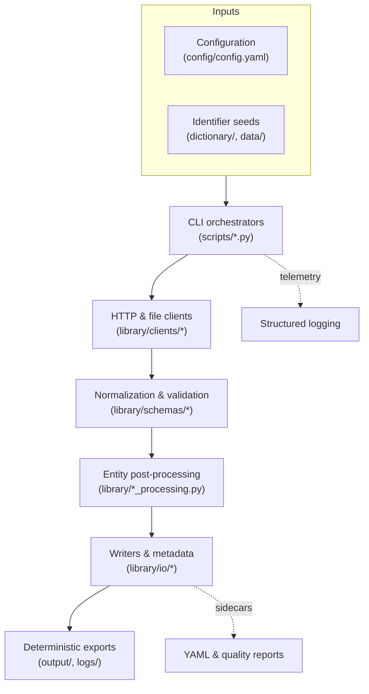
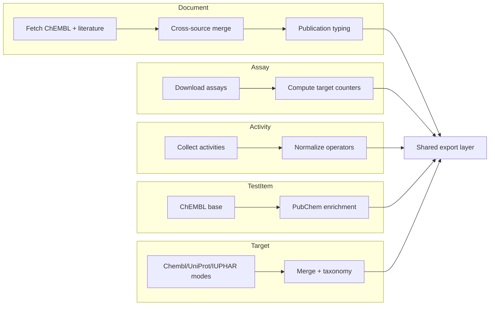

# Architecture Overview

This section gives newcomers a high-level view of how the ChEMBL data acquisition toolkit orchestrates its ETL pipelines. The diagrams map data lineage, staging artefacts, and component responsibilities so engineers can immediately see how configuration, clients, and exporters interact.

## End-to-end ETL flow

* **Configuration** consolidates API hosts, rate limits, chunk sizes, file paths, and feature switches that govern each run.
* **Identifier seeds** in `dictionary/` and `data/` limit outbound requests to curated entity lists and provide lookups for joins.
* **CLI orchestrators** in `scripts/` resolve CLI flags, load configuration, and hand off entity-specific tasks to the library layer while emitting progress logs.
* **Clients** abstract HTTP retries, rate limiting, and chunked pagination for ChEMBL, PubMed, UniProt, IUPHAR, and PubChem, keeping the orchestration layer declarative.
* **Normalization & validation** ensure consistent datatypes, operator semantics, and schema conformance through shared Pandera models and helper utilities.
* **Post-processing modules** (documents, assays, activities, targets, test items) derive metrics, harmonise taxonomies, and align column ordering prior to export.
* **Exporters** enforce deterministic CSV ordering, generate YAML sidecars with checksums and configuration snapshots, and assemble quality reports.

## Pipeline responsibilities by stage

* **Document pipeline** calls ChEMBL first, then enriches with PubMed, Semantic Scholar, OpenAlex, and CrossRef before deriving publication classifications and review flags.
* **Assay pipeline** batches ChEMBL requests, enriches rows with per-target counters, and validates schema alignment.
* **Activity pipeline** emphasises operator normalization and deterministic validation for high-volume datasets.
* **Test-item pipeline** adds PubChem identifiers and properties to ChEMBL extracts, preserving raw SMILES for audits.
* **Target pipeline** supports independent (`chembl`, `uniprot`, `iuphar`) and composite (`all`) modes, merges taxonomies, and infers protein classes before the shared export layer writes final artefacts.

## Component cross-reference

| Layer | Modules | Responsibilities |
| ----- | ------- | ---------------- |
| Configuration | `config/config.yaml`, `config.schema.json` | Central definitions for hosts, rate limits, defaults, staging toggles, and validation switches. |
| Entry points | `scripts/*.py`, console wrappers | Parse CLI options, load configuration, coordinate staging directories, and orchestrate entity-specific modules. |
| Clients & providers | `library/clients/*`, `library/utils/http.py` | Maintain shared sessions, enforce retries, respect rate limits, and expose batched fetch helpers. |
| Normalization & schemas | `library/schemas/*`, `library/normalization/*` | Harmonise datatypes and operators, apply Pandera schemas, and route validation errors to sidecars. |
| Post-processing | `library/document_processing.py`, `library/assay_processing.py`, `library/activity_processing.py`, `library/target_processing.py`, `library/testitem_processing.py` | Derive calculated fields, align column layouts, and prepare deterministic exports per entity. |
| Export | `library/io/*`, `library/utils/quality.py` | Write CSV and Parquet outputs, generate YAML metadata, compute checksums, and produce quality diagnostics. |
| Observability | `logs/`, `library/utils/logging.py`, `library/utils/cli_tools/table_quality_main.py` | Capture structured logs, provide table-quality summaries, and surface validation issues for stakeholders. |

The architecture diagrams and cross-reference table align onboarding conversations and technical reviews, making it clear how data enters the system, how each component transforms it, and which modules to extend when introducing new entities.
