# Architecture overview

This reference maps the shared architecture behind the ChEMBL data acquisition utilities. It complements the per-pipeline walkthroughs documented in [ETL data flow](../qa/ETL_DATA_FLOW.md).

## System context

```mermaid
flowchart LR
  subgraph Inputs
    A[Identifier CSV/TSV files]
    B[Configuration files]\n(config.yaml, CLI flags)
    C[Environment variables]
  end
  subgraph Orchestration
    D[Console entry points\n(get-*/pipeline CLI)]
    E[scripts.get_* modules]
  end
  subgraph Core Pipeline Layer
    F[library.pipelines.*\n(pipeline orchestrators)]
    G[library.io\n(streaming loaders)]
    H[library.clients\n(API clients)]
    I[library.integration\n(local resources)]
    J[library.postprocessing]
    K[library.validation\n& schemas]
    L[library.table_quality]
    M[library.metadata]
  end
  subgraph Outputs
    N[Deterministic CSV exports]
    O[Metadata YAML]
    P[Quality diagnostics\n(.quality.json, CSV)]
    Q[Raw snapshots\n(optional)]
  end
  Inputs --> D
  D --> E --> F
  F --> G
  F --> H
  F --> I
  F --> J
  F --> K
  F --> L
  F --> M
  G --> F
  H -->|Fetches| External[(ChEMBL, PubMed, UniProt, PubChem, OpenAlex, Semantic Scholar, CrossRef APIs)]
  I -->|Reads| Local[(Cached CSV/Parquet resources\n& lookup tables)]
  F --> N
  F --> O
  F --> P
  F --> Q
```

Key points:

* **Console entry points** expose each pipeline as a standalone CLI and forward arguments to the corresponding `scripts.get_*` module.
* **Pipeline orchestrators** in `library.pipelines` coordinate chunked IO, API calls, post-processing, validation, and exports.
* **Streaming loaders** under `library.io` abstract chunked reading/writing so pipelines stay memory-light while providing deterministic output ordering.
* **Clients and integrations** encapsulate access to remote APIs and local knowledge bases, enforcing retry policies, throttling, and caching.
* **Post-processing modules** apply domain-specific transformations that prepare records for validation and export.
* **Validation and quality checks** ensure schema compliance and produce artefacts consumed by downstream QA tooling.

## Dependency relationships

The following diagram highlights the internal dependencies shared by the major pipelines. Each pipeline reuses the same helper layers, ensuring consistent behaviour and easier cross-pipeline updates.

```mermaid
graph TD
  subgraph Shared helpers
    IO[library.io]
    Clients[library.clients]
    Integrations[library.integration]
    Post[library.postprocessing]
    Validation[library.validation & schemas]
    Metadata[library.metadata]
    Quality[library.table_quality]
  end

  Activity[scripts.get_activity_data\n& library.pipelines.activity] --> IO
  Activity --> Clients
  Activity --> Post
  Activity --> Validation
  Activity --> Metadata
  Activity --> Quality

  Assay[scripts.get_assay_data\n& library.pipelines.assay] --> IO
  Assay --> Clients
  Assay --> Post
  Assay --> Validation
  Assay --> Metadata
  Assay --> Quality

  Document[scripts.get_document_data\n& library.pipelines.document] --> IO
  Document --> Clients
  Document --> Integrations
  Document --> Post
  Document --> Validation
  Document --> Metadata
  Document --> Quality

  Target[scripts.get_target_data\n& library.pipelines.target] --> IO
  Target --> Clients
  Target --> Integrations
  Target --> Post
  Target --> Validation
  Target --> Metadata
  Target --> Quality

  Testitem[scripts.get_testitem_data\n& library.pipelines.testitem] --> IO
  Testitem --> Clients
  Testitem --> Integrations
  Testitem --> Post
  Testitem --> Validation
  Testitem --> Metadata
  Testitem --> Quality
```



*Pipelines marked `library.pipelines.*` share orchestrator scaffolding that normalises API payloads, enriches records, and hands the results off to exporters. The test item pipeline now lives in `library.pipelines.testitem`.*

## How pipelines collaborate

For a cross-pipeline view of identifiers and downstream consumers, refer to the [Cross-pipeline relationships](../qa/ETL_DATA_FLOW.md#cross-pipeline-relationships) section. That narrative explains how assay, activity, document, target, and test item exports reinforce each other via shared IDs.

## Design implications for contributors

* Implement new pipelines by composing the existing helper layers rather than building standalone scripts. Doing so guarantees deterministic exports, consistent metadata, and QA artefacts.
* When adjusting dependencies (for example, adding a new client or post-processing helper), document the change in this diagram so reviewers can quickly assess blast radius.
* Shared helpers are safe extension points: implement new API adapters under `library.clients`, new local file mappers under `library.integration`, and new validators under `library.validation` to keep orchestration modules slim.
