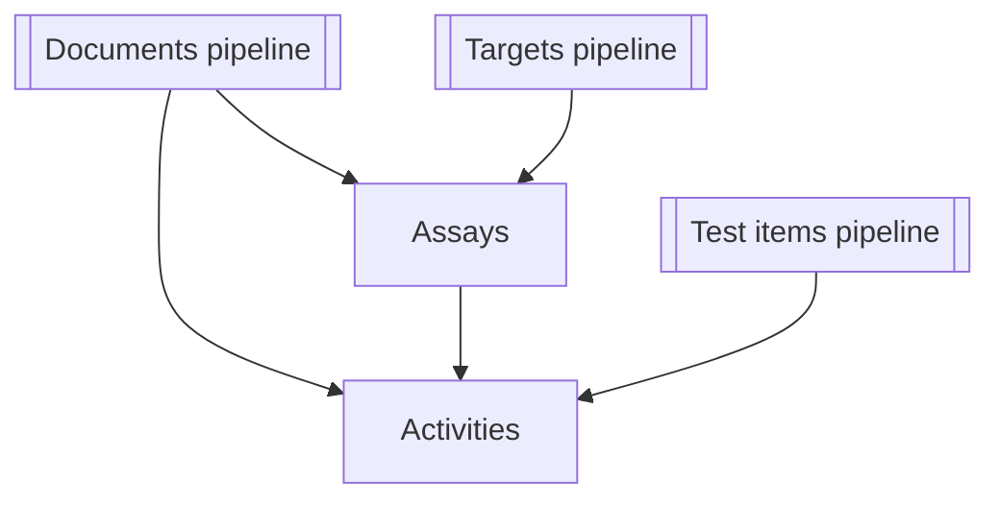

# ETL Data Flow Overview

> **Languages:** English · [Русский](../ru/ETL_DATA_FLOW.md)

This document provides a high-level overview of the ETL data flow for ChEMBL data acquisition pipelines. For detailed flow diagrams and technical specifications, see the [ETL Data Flow Reference](./architecture/ETL_DATA_FLOW.md).

## Quick Navigation

- **[Pipeline Overview](#pipeline-overview)** - Summary of all pipelines
- **[Cross-Pipeline Relationships](#cross-pipeline-relationships)** - How pipelines connect
- **[Data Sources](#data-sources)** - External services and APIs

## Detailed Documentation

For comprehensive flow diagrams and technical details, refer to:

- **[ETL Data Flow Reference](./architecture/ETL_DATA_FLOW.md)** - Detailed flow diagrams and sequences
- **[ETL Process Reference](./architecture/ETL_PROCESS.md)** - Step-by-step process documentation
- **[Architecture Overview](./ARCHITECTURE.md)** - System architecture overview

## `scripts/get_activity_data.py`

| Aspect | Details |
| --- | --- |
| **Input sources & format** | CSV containing an identifier column (default `activity_chembl_id`, inherited from the `activity.column` setting in `config/config.yaml` unless `--column` overrides it) read lazily via `io.read_ids`. Optional `--limit` and `--dry-run` flags gate processing. |
| **External services / files** | ChEMBL API accessed through `ChemblClient` with configurable chunking and timeouts. |
| **Key transformations** | Normalise API payloads, append pipeline metadata, enforce schema column ordering, validate against `ActivitiesSchema`, and log per-row validation failures to sidecar CSVs. |
| **Outputs & storage** | Primary CSV written to the requested or default output path, metadata YAML containing run statistics, and table-quality diagnostics. |
| **Downstream links** | Output rows include `molecule_chembl_id`, `assay_chembl_id`, and `document_chembl_id`, tying activities to molecules (test items), assays, and documents respectively. |

## `scripts/get_assay_data.py`

| Aspect | Details |
| --- | --- |
| **Input sources & format** | CSV of assay identifiers (default `assay_chembl_id`) streamed from disk with optional row limits. |
| **External services / files** | ChEMBL API via `ChemblClient`; assay-specific post-processing handled by `library.pipelines.assay.postprocessing`. |
| **Key transformations** | Post-process raw payloads, normalise column values, inject pipeline metadata, reorder columns per `AssaysSchema`, and validate with sidecar failure capture. |
| **Outputs & storage** | CSV export with deterministic ordering, run metadata YAML, and table-quality analysis artefacts. |
| **Downstream links** | Assay records reference `document_chembl_id` (documents) and `target_chembl_id` (targets), providing joins for the activity and target pipelines. |

## `scripts/get_document_data.py`

This utility exposes `pubmed`, `chembl`, and `all` sub-commands.

| Sub-command | Input & sources | External services | Transformations | Outputs |
| --- | --- | --- | --- | --- |
| `pubmed` | CSV column of PMIDs (default `PMID`), with optional fallback DOI CSV for overrides. | Entrez PubMed batches, Semantic Scholar, OpenAlex, and CrossRef APIs coordinated with per-service rate limiting. | Fetch metadata concurrently, merge service responses, normalise, and hand off to common export routine. | Normalised CSV, metadata YAML, `.quality.json` quality report, and table-quality metrics stored alongside the CSV. |
| `chembl` | CSV of ChEMBL document IDs (default `document_chembl_id`). | ChEMBL API (documents endpoint). | Optional DOI normalisation, column normalisation, and export via `_finalise_export`. | Same artefact set as above. |
| `all` | CSV of document IDs used to seed both ChEMBL and PubMed lookups; optional limit and chunk-size controls. | Combines ChEMBL, PubMed, Semantic Scholar, OpenAlex, and CrossRef calls; reuses DOI values as fallbacks when PubMed lacks data. | Merge ChEMBL and literature metadata, post-process fields, and invoke shared export pipeline. | CSV + metadata YAML + `.quality.json` + table-quality diagnostics. |

**Downstream links:** Document exports provide `document_chembl_id` and harmonised bibliographic columns consumed by assay and activity tables, enabling traceability of experimental records back to publications. 

## `scripts/get_target_data.py`

The target pipeline offers `uniprot`, `chembl`, `iuphar`, and `all` workflows.

| Sub-command | Input & sources | External services / files | Transformations | Outputs |
| --- | --- | --- | --- | --- |
| `uniprot` | CSV of UniProt accessions derived from earlier steps (default column `uniprot_id`). | UniProt REST/flat-file downloads via `library.integration.uniprot_library`, with optional local cache directory. | Prepare temporary input list, trigger UniProt processing, and merge back mapping columns before export. | CSV, metadata YAML, and quality analysis for UniProt enrichment. |
| `chembl` | CSV of ChEMBL target IDs (default `target_chembl_id`). | ChEMBL API plus UniProt mapping service for protein accessions. | Normalise, add pipeline metadata, align to schema, validate, and persist with stats. | Target CSV, metadata YAML, table-quality results. |
| `iuphar` | CSV (usually combined ChEMBL/UniProt output) optionally limited for testing. | Local IUPHAR CSV resources (`target_csv`, `family_csv`). | Map UniProt IDs to IUPHAR classifications and export mapping table. | Classification CSV with metadata and quality analysis. |
| `all` | Master CSV of target IDs driving chained retrieval; configurable intermediate output paths. | Invokes the three pipelines above sequentially (ChEMBL API, UniProt services, IUPHAR files). | Merge intermediate outputs, perform target post-processing, and validate final schema before writing. | Consolidated target CSV plus intermediate artefacts for each sub-step, each with metadata and quality checks. |

**Downstream links:** Assay exports reference `target_chembl_id` and UniProt attributes produced here, feeding activity interpretation and enabling target-class filters. 

## `scripts/get_testitem_data.py`

| Aspect | Details |
| --- | --- |
| **Input sources & format** | CSV list of ChEMBL molecule IDs (default `molecule_chembl_id`) streamed with optional limits. |
| **External services / files** | ChEMBL API for compound core data plus PubChem API for SMILES-based augmentation. |
| **Key transformations** | Enrich ChEMBL results with PubChem identifiers/properties, normalise, join against the cached parent catalogue, add pipeline metadata, and validate via `TestitemsSchema` capturing failures separately. |
| **Outputs & storage** | CSV with combined ChEMBL/PubChem fields, metadata YAML, and quality diagnostics written beside the export. |
| **Downstream links** | Activities reference `molecule_chembl_id`, allowing potency and efficacy data to join back to the enriched compound properties. |

## Cross-pipeline relationships

*Documents pipeline* aggregates PubMed, Semantic Scholar, OpenAlex, CrossRef, and ChEMBL metadata into
`document_chembl_id`-centric records consumed by assays and activities.

*Targets pipeline* merges ChEMBL, UniProt and IUPHAR attributes, producing IDs referenced by assays and downstream activity analysis.

*Test item pipeline* enriches molecules with PubChem properties and surfaces parent-child relationships via the local catalogue, enabling contextualised joins to activity results through `molecule_chembl_id` and `parent_molecule_chembl_id` keys.

## See also

- **[ETL Data Flow Reference](./architecture/ETL_DATA_FLOW.md)** - Detailed flow diagrams and sequences
- **[ETL Process Reference](./architecture/ETL_PROCESS.md)** - Step-by-step process documentation
- **[Architecture Overview](./ARCHITECTURE.md)** - System architecture overview
- **[Usage Guide](./guides/USAGE.md)** - How to run the pipelines
- **[Configuration Guide](./CONFIG.md)** - Pipeline configuration options
