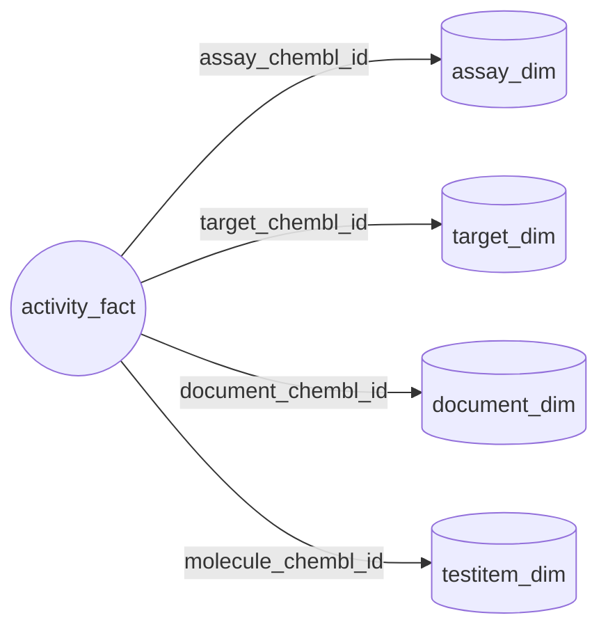

# ChEMBL Data Acquisition Protocol v2.1

*Version:* 2.1 (October 2025)
*Repository:* `SatoryKono/ChEMBL_data_acquisition`
*Scope:* End-to-end ETL for ChEMBL documents, targets, assays, test items and activities with deterministic QA sidecars.
*Status:* Approved for test environment (see §7).

> **Change control — CHEMBL-DM01**
>
> | Stage | Owner | Date | Signature |
> |-------|-------|------|-----------|
> | Prepared by | Documentation Steward, DocsOps | 2025-10-15 | `CHEMBL-DM01` |
> | Reviewed by | QA Lead, DataOps | 2025-10-15 | `CHEMBL-DM01` |
> | Approved by | Head of Data Management | 2025-10-15 | `CHEMBL-DM01` |

---

## 1. Runtime environment and dependencies

| Component | Configuration | Reference |
|-----------|---------------|-----------|
| Python | `>=3.11,<3.13` | `pyproject.toml` classifiers and `tox` envs. |
| Core libraries | `numpy>=2.3.3`, `pandas>=2.3.3`, `requests>=2.32.3`, `pyyaml>=6.0.2`, `pandera>=0.26.1`, `pyarrow>=17.0.0` | `pyproject.toml` and `requirements-lock.txt`. |
| QA / Dev tooling | `pytest>=8.4.2`, `pytest-json-report>=1.5.0`, `pytest-cov>=6.0.0`, `responses>=0.25.8`, `ruff>=0.13.1`, `mypy>=1.17.1`, `pre-commit>=3.7.1` | `pyproject.toml` extras `dev`. |
| Console entry points | `get-data`, `get-document-data`, `get-target-data`, `get-assay-data`, `get-testitem-data`, `get-tissue-data`, `get-cellline-data`, `get-activity-data`, `get-activities`, `check-determinism`, `table-quality`, `mapper`, `chunk-io` | `[project.scripts]` section. |

Library structure summary:

- `library/clients/*` — HTTP clients with retry, backoff and telemetry. 【F:library/clients/chembl.py†L1-L120】【F:library/clients/uniprot.py†L1-L150】
- `library/cli/commands/*` — thin adapters invoked by `scripts/get_*.py`. 【F:library/cli/commands/get_data.py†L97-L160】
- `library/pipelines/*` — domain pipelines orchestrating fetch, enrichment and persistence. 【F:library/pipelines/registry.py†L80-L128】
- `library/postprocessing/*` — modular transformations executed after fetch. 【F:library/postprocessing/common/runner.py†L178-L286】
- `library/schemas/*` — Pandera validation schemas for final exports. 【F:library/schemas/activities.py†L31-L83】
- `library/qa/*` — quality-report hooks and table profilers. 【F:library/qa/table_quality.py†L1-L210】

---

## 2. Data sources and enrichments

| Source | Modules | Purpose |
|--------|---------|---------|
| ChEMBL REST | `library/clients/chembl.py`, `library/pipelines/{activity,assay,document,target}` | Primary facts for all entities. |
| PubMed & Semantic Scholar | `library/clients/pubmed.py`, `library/clients/semanticscholar.py` | Publication augmentation for documents. |
| CrossRef & OpenAlex | `library/clients/crossref.py`, `library/clients/openalex.py` | DOI and citation metadata. |
| UniProt | `library/clients/uniprot.py`, `library/pipelines/target/uniprot.py` | Protein taxonomy, sequence features. |
| Guide to Pharmacology (IUPHAR) | `library/clients/iuphar.py`, `library/pipelines/target/iuphar.py` | Target classifications. |
| PubChem | `library/clients/pubchem.py`, `library/pipelines/testitem/pubchem.py` | Structural enrichment for test items. |
| Local dictionaries | `config/dictionary/**`, `config/pipeline/*.yaml` | Deterministic mappings for BAO terms, tissue metadata, activity quality flags. |

---

## 3. Data model

The ETL builds a star schema with the activity fact table referencing document, target, assay and test-item dimensions.

Key schema definitions are enforced by Pandera models:

- `library/schemas/activities.py` — activity exports.【F:library/schemas/activities.py†L31-L83】
- `library/schemas/assays.py` — assay exports.【F:library/schemas/assays.py†L33-L59】
- `library/schemas/targets.py` — target exports with legacy Power Query ordering.【F:library/schemas/targets.py†L18-L124】
- `library/schemas/testitems.py` — molecule/test item exports.【F:library/schemas/testitems.py†L12-L44】
- `config/schema/document.yaml` — declarative schema for document exports consumed by `DocumentsSchema`.【F:library/schemas/document_spec.py†L13-L118】

---

## 4. Extraction workflow

### 4.1 Orchestrator `get-data` (console script)

- Invoked via the `get-data` console command (`library.cli.entrypoints:get_data_main`). The compatibility wrapper `python scripts/get_data.py` remains available for automation but only forwards the shared stage flags and omits manifest emission and advanced overrides.
- Loads the default registry (`library/pipelines/registry.load_pipeline_registry`) with the sequence document → target → assay → testitem → activity.【F:library/pipelines/registry.py†L80-L128】
- Baseline invocation flags keep the canonical plan intact while letting operators tune paths, logging and rerun behaviour:

  | Option | Purpose | When to use |
  |--------|---------|-------------|
  | `--base-path`, `--input-dir`, `--output-dir` | Resolve shared input/output directories for all delegated pipelines. | Configure consistent staging areas for smoke runs, QA and production exports. |
  | `--config` | Load an alternative YAML configuration. | Point to environment-specific credentials or dictionary bundles. |
  | `--date` | Override the output filename prefix. | Align artefacts with a reporting cut-off or replay historical drops. |
  | `--log-level`, `--verbose` | Control orchestrator and child pipeline logging. `--verbose` forces `DEBUG`. | Raise verbosity during investigation without editing config files. |
  | `--limit` | Cap identifiers processed per pipeline (`0` skips execution). | Produce deterministic smoke builds. |
  | `--force`, `--skip-existing` | Decide whether to overwrite or skip when outputs already exist. | Recover from partial runs without clearing directories manually. |
  | `--rerun-postprocess` | Rebuild stage-aligned exports even when staging artefacts are present. | Refresh downstream tables after editing post-processing rules. |
  | `--dry-run` | Resolve the execution plan without writing artefacts. | Validate configuration in CI and notebooks. |
  | `--debug`, `--keep-intermediate` | Retain intermediate artefacts for inspection; `--debug` also enables verbose diagnostics. | Investigate data issues or rerun a failing stage locally. |
  | `--disable-pubchem` | Skip PubChem enrichment during the test item stage. | Reproduce legacy behaviour or isolate upstream causes of enrichment drift. |
  | `--print-config` | Emit the resolved configuration and exit. | Capture canonical settings for audit trails. |
  | `--run-id` | Supply a deterministic identifier instead of the computed hash. | Correlate orchestrator logs with external schedulers. |

  These switches are parsed by `_parse_args` and normalised in `PipelineRunConfig`, ensuring the canonical step order and validation rules remain enforced.【F:library/cli/commands/get_data.py†L949-L1108】 The manifest summarising each run is written only when invoking the console command.
- Advanced override knobs reshape the execution graph and should be reserved for targeted reruns or bespoke registries. They are available exclusively on the console command:

  | Option | Use when… |
  |--------|-----------|
  | `--pipeline-registry <path>` | Load an alternate registry YAML to add/remove steps or reorder execution for integration tests. |
  | `--override-input STEP=FILENAME` | Replace the input file for an individual stage without editing the registry. |
  | `--override-output-stem STEP=STEM` | Redirect the output stem (and sidecar names) for a single stage. |
  | `--override-subcommand STEP=SUBCOMMAND` | Run a non-default CLI sub-command (for example `target=chembl`) within the orchestrated flow. |

  Overrides are optional and cascade through `PipelineRunConfig` so ad-hoc plans behave the same as the CLI invocation.【F:library/cli/commands/get_data.py†L1048-L1108】

### 4.2 Document pipeline `scripts/get_document_data.py`

- Modes: `chembl`, `pubmed`, `all`; pass `--mode <...>` (or the positional
  command) explicitly—`--mode all` runs the combined workflow. 【F:library/cli/commands/get_document_data.py†L1737-L1975】
- Common options: `--input`, `--final-out`, `--column`, `--limit`, `--offset`, `--config`. 【F:library/cli/parser.py†L126-L204】
- Mode-specific flags: `--batch-size`, `--sleep`, `--workers` for PubMed; `--chunk-size`, `--chembl-timeout` for ChEMBL; fallback DOI block (`--fallback-doi-*`). 【F:library/cli/commands/get_document_data.py†L1216-L1718】
- Post-processing: `library/postprocessing/documents/steps`. 【F:library/postprocessing/documents/steps.py†L1-L82】

### 4.3 Target pipeline `scripts/get_target_data.py`

- Sub-commands: `uniprot`, `chembl`, `iuphar`, `all`. 【F:library/cli/commands/get_target_data.py†L1506-L4337】
- Shared flags: `--input`, `--final-out`, `--raw-out`, `--raw-format`, `--id-cols`, `--normalize-at-export/--no-normalize-at-export`. 【F:library/cli/commands/get_target_data.py†L1524-L1609】
- `all` orchestrates the three fetchers and honours prefixed overrides (`--chembl-*`, `--uniprot-*`, `--iuphar-*`). 【F:library/cli/commands/get_target_data.py†L3968-L4175】
- Post-processing: `library/postprocessing/targets/steps`. 【F:library/postprocessing/targets/steps.py†L1-L80】

### 4.4 Assay pipeline `scripts/get_assay_data.py`

- Options: `--input`, `--final-out`, `--chunk-size`, `--timeout`, `--limit`, `--offset`, `--config`. 【F:library/cli/commands/get_assay_data.py†L629-L721】
- Requires taxonomy and target dictionaries under `config/dictionary`. 【F:library/cli/commands/get_assay_data.py†L484-L602】
- Post-processing: `library/postprocessing/assays/steps`. 【F:library/postprocessing/assays/steps.py†L1-L76】

### 4.5 Test item pipeline `scripts/get_testitem_data.py`

- Fetch stages defined in `library/pipelines/testitem/cli.py` (identifier read, ChEMBL enrichment, PubChem enrichment, final export). 【F:library/pipelines/testitem/cli.py†L651-L1136】
- Flags: `--input`, `--final-out`, `--batch-size`, `--timeout`, `--limit`, `--offset`, `--request-limit`, `--config`. 【F:library/cli/commands/get_testitem_data.py†L646-L714】
- Default outputs: deterministic dataset CSV plus the table quality and data correlation reports. Pass `--emit-legacy-artifacts` to restore the legacy bundle (`<stem>_failure_cases.csv`, metadata `.meta.yaml`, postprocess manifests) for diagnostics. 【F:library/pipelines/testitem/cli.py†L864-L1186】【F:library/cli/commands/get_testitem_data.py†L564-L738】

### 4.6 Activity pipeline `scripts/get_activity_data.py`

- Delegates to `library.cli.entrypoints.activity.ActivityPipelineCLI`. 【F:library/cli/entrypoints/activity.py†L1879-L1966】
- Options: `--input`, `--final-out`, `--batch-size`, `--timeout`, `--limit`, `--offset`, `--workers`, `--dry-run`. 【F:library/cli/entrypoints/activity.py†L1888-L1934】
- Applies enrichment (`apply_activity_annotations`), bounds computation (`compute_activity_bounds`), Pandera validation (`validate_activities`) and QA sidecars. 【F:library/cli/entrypoints/activity.py†L1216-L1448】

### 4.7 Optional reference pipelines

- `scripts/get_tissue_data.py` — refreshes tissue lookups consumed by the activity extended export. 【F:scripts/get_tissue_data.py†L1-L220】
- `scripts/get_cellline_data.py` — deterministic cell line export. 【F:scripts/get_cellline_data.py†L1-L210】

---

## 5. Validation and QA

| Component | Artefacts | Implementation |
|-----------|-----------|----------------|
| Pandera validation | Ensures required columns, dtype coercion, nullability. | `library/schemas/*.py`, `library/pipelines/*/validation.py`. |
| Table quality profiler | `<stem>_quality_report_table.csv`, `<stem>.quality.json`. | `library/qa/table_quality.py`, invoked via hooks in CLI entry points. 【F:library/cli/entrypoints/activity.py†L1450-L1539】 |
| Post-processing metrics | `<stem>.postprocess.report.json` summarising rows, duration, validation status. | `library/postprocessing/common/utils.py`. 【F:library/postprocessing/common/utils.py†L180-L258】 |
| Logging | Structured JSON events (`*_pipeline_done`, `quality_report_generated`). | `library/common/logging_setup.py`. 【F:library/common/logging_setup.py†L1-L160】 |
| Test harness | `reports/test_report.json`, `reports/test_summary.md`; success-rate ≥95 %. | `scripts/run_tests.py`. 【F:scripts/run_tests.py†L40-L160】 |

---

## 6. Post-processing flows

Post-processing is driven by YAML definitions in `config/pipeline/*.yaml` and executed by `library.postprocessing.common.run_steps`. 【F:library/postprocessing/common/runner.py†L178-L286】

| Table | Steps | Schema | Notes |
|-------|-------|--------|-------|
| Activity | `normalize_activity_records` → `enrich_activity_quality` → `finalize_activity_records` | `library/postprocessing/activities/schema.py` | Drops intermediate columns (`standard_lower_value`, `standard_upper_value`) before writing. 【F:library/cli/entrypoints/activity.py†L1239-L1360】 |
| Assay | `normalize_assay_metadata` → `enrich_assay_flags` → `finalize_assay_records` | `library/postprocessing/assays/schema.py` | Enriches BAO categories from dictionaries. 【F:library/postprocessing/assays/steps.py†L20-L73】 |
| Document | `normalize_document_fields` → `enrich_document_publication_year` → `finalize_document_records` | `config/schema/document.yaml` | Schema groups maintained in YAML to avoid drift. 【F:config/schema/document.yaml†L1-L200】 |
| Target | `normalize_target_fields` → `enrich_target_synonyms` → `finalize_target_records` | `library/postprocessing/targets/schema.py` | Preserves `AddCellularitySmart ` column for backwards compatibility. 【F:library/postprocessing/targets/steps.py†L24-L76】 |
| Test item | `prepare_parent_enrichment` → `run_parent_enrichment` → `finalize_output` | `library/schemas/testitems.py` | Emits the dataset plus QA/correlation reports; legacy failure-case and metadata artefacts are opt-in via `--emit-legacy-artifacts`. 【F:library/pipelines/testitem/cli.py†L864-L1186】【F:library/cli/commands/get_testitem_data.py†L564-L738】 |

---

## 7. Quality gates and test policy

1. Deterministic pytest suite with success rate ≥95 %. `python scripts/run_tests.py` orchestrates JSON/Markdown reports. 【F:scripts/run_tests.py†L40-L160】
2. Determinism checks: `python scripts/check_determinism.py --no-dry-run` compares pipeline outputs. 【F:scripts/check_determinism.py†L34-L114】
3. CI enforces `ruff check` and `mypy --strict library`. 【F:pyproject.toml†L67-L118】
4. Failing or flaky tests must be quarantined via `xfail(strict=True)` and issue tracking. 【F:tests/README.md†L45-L120】
5. `python scripts/run_tests.py` returns `0` on success, `1` when the success-rate
   or coverage thresholds are violated, and `11` when JSON/Markdown reports
   cannot be generated or validated; consume the codes in CI dashboards. The
   wrapper also saves the raw pytest payload as `reports/pytest_raw_report.json`
   and clears destination directories before writing `--json`/`--markdown`
   outputs, so use dedicated folders when overriding the defaults.

---

## 8. Change log

| Version | Date | Author | Key updates |
|---------|------|--------|-------------|
| 2.1 | 2025-10-15 | DocsOps release board | Restored approved baseline, aligned release metadata with October 2025, formalised CHEMBL-DM01 change control block. |
| 2.0 | 2025-02-28 | Documentation audit | Updated CLI flags (`--input`, `--final-out`), added tissue/cell line references, aligned schema descriptions with Pandera models, refreshed QA policy. |

