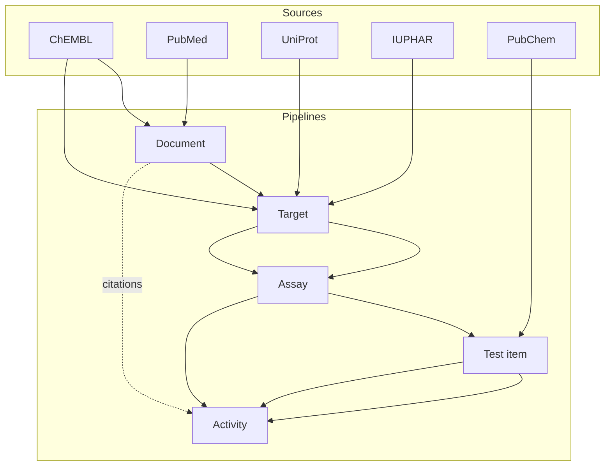

# ChEMBL Data Acquisition Toolkit

This document summarises the scope of the project, the structure of the
pipelines and the documentation layout. Treat it as an orientation guide before
diving into the specialised references.

## What the toolkit delivers

- **Entity pipelines** for documents, targets, assays, activities and test items.
  Each pipeline reads identifiers from CSV, calls external services, performs
  deterministic validation and writes reproducible exports accompanied by
  metadata.
- **Unified CLI layer** that shares common flags across scripts and provides
  namespaced overrides for complex scenarios.
- **Configurable orchestration** via the `get-data` console script
  (`library.cli.entrypoints:get_data_main`). It resolves paths, configuration
  files, logging and retry policies once and executes the full ETL chain in a
  reproducible fashion. The compatibility wrapper `python scripts/get_data.py`
  remains for legacy automation but only forwards the shared stage flags and
  omits the advanced orchestrator overrides.
- **Quality controls** including Pandera schema validation, deterministic CSV
  ordering, metadata sidecars, hash comparison helpers and table-quality
  profiling.
- **Developer tooling** covering static analysis (`ruff`, `mypy`), formatting
  (`black`), deterministic tests (`pytest`) and CI/CD automation.

## Pipeline overview

Key traits:

- Pipelines accept CSV identifiers via `--input` or an input directory resolved
  by `get-data`.
- Every pipeline writes deterministic CSV outputs, `<name>.meta.yaml` metadata,
  `<name>_quality_report_table.csv` and JSON quality summaries. Target runs also
  emit helper exports named `organism.output.target_<stamp>.csv`,
  `isoform.output.target_<stamp>.csv`, and `names.output.target_<stamp>.csv`
  described in [`OUTPUT_TARGETS.md`](./OUTPUT_TARGETS.md).
- Schema validation happens before and after enrichment; failures emit structured
  logs and optional fatal errors based on configuration.

## Documentation map

The documentation tree mirrors the English and Russian variants. Use the table
below to navigate the canonical English sources:

| Area | English | Russian |
|------|---------|---------|
| Summary and navigation | [`SUMMARY.md`](./SUMMARY.md) | [`../ru/SUMMARY.md`](../ru/SUMMARY.md) |
| Quick start | [`guides/QUICK_START.md`](./guides/QUICK_START.md) | [`../ru/guides/QUICK_START.md`](../ru/guides/QUICK_START.md) |
| Usage guides | [`guides/USAGE.md`](./guides/USAGE.md), [`guides/ADVANCED_SCENARIOS.md`](./guides/ADVANCED_SCENARIOS.md), [`guides/FAQ.md`](./guides/FAQ.md), [`guides/DEBUGGING.md`](./guides/DEBUGGING.md) | [`../ru/guides/USAGE.md`](../ru/guides/USAGE.md), [`../ru/guides/ADVANCED_SCENARIOS.md`](../ru/guides/ADVANCED_SCENARIOS.md), [`../ru/guides/FAQ.md`](../ru/guides/FAQ.md), [`../ru/guides/DEBUGGING.md`](../ru/guides/DEBUGGING.md) |
| CLI reference | [`USAGE.md`](./USAGE.md) | [`../ru/USAGE.md`](../ru/USAGE.md) |
| Configuration | [`CONFIG.md`](./CONFIG.md) | [`../ru/CONFIG.md`](../ru/CONFIG.md) |
| Outputs & validation | [`OUTPUT.md`](./OUTPUT.md) | [`../ru/OUTPUT.md`](../ru/OUTPUT.md) |
| Target helper exports | [`OUTPUT_TARGETS.md`](./OUTPUT_TARGETS.md) | [`../ru/OUTPUT_TARGETS.md`](../ru/OUTPUT_TARGETS.md) |
| Quality controls | [`QA_PROCESS.md`](./QA_PROCESS.md) | [`../ru/QA_PROCESS.md`](../ru/QA_PROCESS.md) |
| Architecture | [`architecture/ARCHITECTURE.md`](./architecture/ARCHITECTURE.md) | [`../ru/architecture/ARCHITECTURE.md`](../ru/architecture/ARCHITECTURE.md) |
| Architecture improvements | [`architecture/IMPROVEMENT_PROPOSALS.md`](./architecture/IMPROVEMENT_PROPOSALS.md) | [`../ru/architecture/IMPROVEMENT_PROPOSALS.md`](../ru/architecture/IMPROVEMENT_PROPOSALS.md) |
| Data model | [`architecture/DATA_MODEL.md`](./architecture/DATA_MODEL.md) | [`../ru/architecture/DATA_MODEL.md`](../ru/architecture/DATA_MODEL.md) |
| Development | [`development/README.md`](./development/README.md) | [`../ru/development/README.md`](../ru/development/README.md) |
| Dictionaries & glossary | [`reference/DICTIONARIES.md`](./reference/DICTIONARIES.md) | [`../ru/reference/DICTIONARIES.md`](../ru/reference/DICTIONARIES.md) |
| Post-processing runbook | [`guides/POSTPROCESSING_RUNBOOK.md`](./guides/POSTPROCESSING_RUNBOOK.md) | [`../ru/guides/POSTPROCESSING_RUNBOOK.md`](../ru/guides/POSTPROCESSING_RUNBOOK.md) |

For a description of the current Variant 1 modular post-processing pipeline,
refer to [`../postprocessing_variant1_tasks.md`](../postprocessing_variant1_tasks.md).

All English files have a one-to-one Russian counterpart with identical structure
and headings to simplify cross-referencing.

## Project structure

| Directory | Purpose |
|-----------|---------|
| `library/clients` | HTTP clients for ChEMBL, PubMed, UniProt, OpenAlex, CrossRef, PubChem. |
| `library/pipelines` | ETL steps per entity including fetchers, normalisers and exporters. |
| `library/qa` & `library/table_quality.py` | Quality checks, profiling utilities and report writers. |
| `library/utils` | Path resolution, logging, CLI bootstrap and deterministic CSV helpers. |
| `config/` | Default YAML configuration plus dictionary CSVs consumed during enrichment. |
| `tests/` | Unit, integration and end-to-end pytest suites with deterministic fixtures. |

Refer to [`development/README.md`](./development/README.md) for contributor
workflow, branching model and CI expectations.
