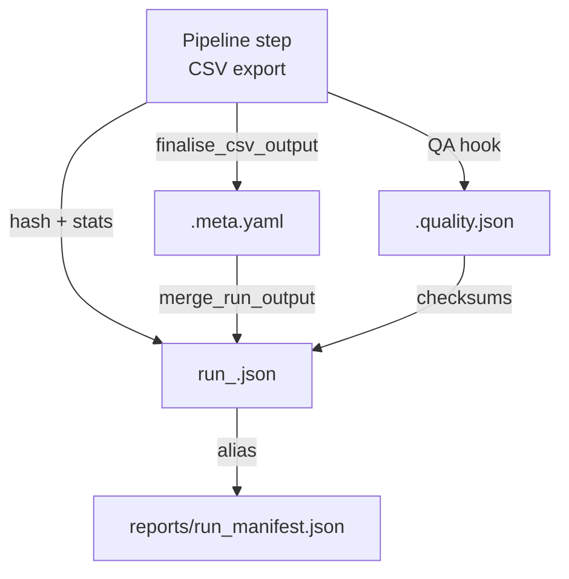

# Usage and CLI reference

All command line entry points are available through `python scripts/<name>.py`
or via the console scripts installed from `pyproject.toml` (`get-data`,
`get-document-data`, `get-target-data`, etc.).

## Common conventions

| Option | Description |
|--------|-------------|
| `--config` | Path to the YAML configuration file. Defaults to `config/config.yaml`. |
| `--input` | CSV file containing identifiers for the pipeline. When omitted the orchestrator builds the path from `--base-path` and `--input-dir`. |
| `--final-out` | Destination CSV. If omitted a deterministic filename `output.<stem>.csv` is generated inside the resolved output directory. Provide `--date` or set `io.output_stamp_mode=require` to append the date token. |
| `--sep`, `--encoding` | CSV delimiter and encoding. Inherit defaults from the configuration. |
| `--log-level` | Logging verbosity (`DEBUG`, `INFO`, `WARN`, `ERROR`). |
| `--verbose` | Enables DEBUG logging without modifying configuration files. |
| `--run-id` | Override the run identifier recorded in logs and metadata sidecars. Defaults to a value derived from the invocation or the `CHEMBL_DA_RUN_ID` environment variable. |
| `--force` | Overwrite existing outputs. |
| `--skip-existing` | Skip execution when the destination file already exists. |
| `--limit`, `--offset` | Restrict the number of identifiers processed or skip leading rows. Supplying `--limit 0` disables the pipeline. |
| `--print-config` | Emit the resolved configuration (defaults + YAML + environment + CLI) and exit. |

> 💡 **Tip:** Setting the `CHEMBL_DA_RUN_ID` environment variable pre-populates
> the `--run-id` default so automated jobs can stamp logs and manifests with a
> predictable identifier.

### Output artefacts

Every pipeline keeps a minimal deterministic bundle next to the final CSV:

- `<stem>_quality_report_table.csv` — table profile generated by
  `library.table_quality.analyze_table_quality`.
- `<stem>_data_correlation_report_table.csv` — cross-column correlation metrics
  used by downstream QA dashboards.

Legacy diagnostics (`<stem>.meta.yaml`, `<stem>.quality.json`,
`<stem>_failure_cases.csv` and related sidecars) are now opt-in to reduce disk
usage in long-running deployments. Enable them per run via
`--emit-legacy-artifacts`, `--debug` or `--keep-intermediate` whenever extended
investigation is required. The first invocation after upgrading purges the
outdated sidecars automatically; rerun `tools/cleanup_legacy_outputs.py` to
repeat the sweep or perform a dry run.

## Orchestrator `get-data`

Run the full sequence of pipelines with shared configuration:

```bash
python scripts/get_data.py \
  --base-path /data/chembl \
  --input-dir inbound \
  --output-dir outbound \
  --config config/config.yaml \
  --date 20250228 \
  --log-level INFO
```

Important flags:

- `--base-path`, `--input-dir`, `--output-dir` — resolve input/output folders.
- `--limit` — forward a maximum record count to every pipeline (useful for smoke
  runs). `0` skips all processing.
- `--force`, `--skip-existing` — pass-through execution controls.
- `--log-level`, `--verbose` — adjust logging; `--verbose` forces the `DEBUG` level without changing configuration files.
- `--rerun-postprocess` — rebuild stage-aligned exports even when previous runs already produced them so downstream post-processing is refreshed.
- `--debug` — enable verbose diagnostics and retain intermediate artefacts for every delegated pipeline.
- `--keep-intermediate` — preserve intermediate and diagnostic artefacts created by individual pipelines without forcing debug logging.
- `--dry-run` — validate configuration, log intended actions and exit without
  touching the filesystem.
- `--print-config` — resolve the effective configuration and exit without
  running pipelines.

### Advanced overrides

Customise the orchestrator without editing code by using the following options:

| Option | Purpose |
|--------|---------|
| `--pipeline-registry <path>` | Load an alternative pipeline registry YAML (see [`library/pipelines/registry.py`](../../library/pipelines/registry.py)) to change the execution order, provide custom callables or add/remove steps. |
| `--override-input STEP=FILENAME` | Replace the input CSV filename for a single step while keeping the rest of the registry intact. Multiple overrides may be supplied. |
| `--override-output-stem STEP=STEM` | Adjust the output stem for a step without touching the registry (affects the generated filename and metadata artefacts). |
| `--override-subcommand STEP=SUBCOMMAND` | Switch the CLI sub-command used to invoke a step (e.g. run the target pipeline in `chembl` mode only during a partial rerun). |

The orchestrator stops on the first non-zero exit code and reports per-pipeline
elapsed time in the logs.

After every execution the orchestrator writes a dedicated manifest such as
`reports/run_<timestamp>.json` relative to `--base-path` and updates the
`reports/run_manifest.json` pointer to reference the most recent run. Each
manifest records every step with the resolved CSV destination, discovered
sidecars, status (`success`, `skipped`, `failed`, `blocked`, etc.), timings and
SHA256
checksums for all artefacts. The file is emitted even when the workflow aborts
part way through so partial results can be inspected. When a step fails, the
remaining ones are marked as `blocked` with `reason: dependency_failed` to make
the dependency chain explicit in the manifest.

#### Manifest structure and metadata flow

The JSON manifest exposes a `run` object with timings, exit code, the effective
configuration (base path, input/output directories, config path, log level,
force/limit flags) and an optional structured `run_id` propagated from the
logger. The ordered `steps` array summarises each pipeline stage after
`finalise_csv_output` merges the metadata sidecars into the manifest entry. Every
successful step therefore contains:

- `output` — canonical path, existence flag, file size, SHA256 checksum plus
  `meta_path`/`meta_sha256` and optional `quality_path`/`quality_sha256`
  references when QA summaries are emitted.【F:library/reporting/run_manifest.py†L27-L166】
- `stats` — row counters and any additional per-table diagnostics computed when
  writing `<name>.meta.yaml`. The same payload stores the pipeline version so
  analysts can confirm which code produced the export.【F:library/common/metadata_writer.py†L69-L157】
- `sidecars` — auxiliary artefacts resolved on disk (post-process outputs,
  temporary files, diagnostics). Missing files are captured explicitly via
  `exists: false` markers.【F:library/cli/commands/get_data.py†L1800-L1889】

```json
{
  "run": {
    "started_at": "2025-03-18T10:41:12.345678+00:00",
    "completed_at": "2025-03-18T10:43:56.789012+00:00",
    "duration_sec": 164.443334,
    "exit_code": 0,
    "status": "success",
    "base_path": "/srv/chembl",
    "input_dir": "/srv/chembl/input",
    "output_dir": "/srv/chembl/output",
    "config_path": "/srv/chembl/config/config.yaml",
    "run_id": "2025-03-18T10:41:12Z/main",
    "log_level": "INFO",
    "limit": null,
    "skip_existing": false,
    "dry_run": false
  },
  "steps": [
    {
      "name": "documents",
      "status": "success",
      "exit_code": 0,
      "executed": true,
      "started_at": "2025-03-18T10:41:13.012345+00:00",
      "completed_at": "2025-03-18T10:41:52.456789+00:00",
      "duration_sec": 39.444444,
      "output": {
        "path": "/srv/chembl/output/output.documents_20250318.csv",
        "exists": true,
        "size_bytes": 275341,
        "checksum_sha256": "f1d3ff8443297732862df21dc4e57262a76d1b",
        "meta_path": "/srv/chembl/output/output.documents_20250318.csv.meta.yaml",
        "meta_sha256": "bc05c1fd2b9dd4d78ebcd1a786ea1d0500bcf9",
        "quality_path": "/srv/chembl/output/output.documents_20250318.quality.json",
        "quality_sha256": "0e3396dc8b7c72061aef5ed2687be6f0a6e77b"
      },
      "stats": {
        "rows_total": 1200,
        "rows_kept": 1187,
        "rows_dropped": 13,
        "output_sha256": "f1d3ff8443297732862df21dc4e57262a76d1b",
        "pipeline_version": "1.4.0"
      },
      "sidecars": [
        {
          "path": "/srv/chembl/output/output.documents_20250318.quality.json",
          "exists": true,
          "size_bytes": 1845,
          "checksum_sha256": "0e3396dc8b7c72061aef5ed2687be6f0a6e77b"
        }
      ]
    }
  ]
}
```



Automation can read `reports/run_manifest.json` to locate the most recent run
without scanning timestamps. Historical manifests remain intact for audits, and
the alias gracefully downgrades to an atomic copy when symlinks are not
supported by the filesystem.【F:library/cli/commands/get_data.py†L1916-L1958】

## Document pipeline `get_document_data`

Modes: `chembl`, `pubmed`, `all`.

Common options:

| Option | Default | Notes |
|--------|---------|-------|
| `--mode` | required | Selects the processing flow. |
| `--column` | Mode specific (`PMID` for `pubmed`, `document_chembl_id` otherwise) | Input column holding identifiers. |
| `--limit`, `--offset` | `None`, `0` | Control record ranges. |
| `--timeout` | `90.0` for `chembl`/`all`, `10.0` for `pubmed` | Applied to HTTP calls. |
| `--openalex-rps`, `--crossref-rps` | `None` | Optional overrides for partner APIs when running `pubmed` or `all`. |

PubMed specific flags (`--mode pubmed` or `all`):

- `--batch-size` — identifiers per request (`100` in pure `pubmed`, `50` in
  `all`).
- `--sleep` — pause between requests (seconds).
- `--workers` — concurrent PubMed requests.

ChEMBL specific flags (`--mode chembl` or `all`):

- `--chunk-size` — identifiers per API call (default `20`).
- `--chembl-chunk-size`, `--chembl-timeout` — overrides applied only when running
  `--mode all`.

Fallback DOI handling (`--mode all` or `pubmed`):

| Option | Purpose |
|--------|---------|
| `--fallback-doi-enabled` | Turn on fallback lookup. |
| `--fallback-doi-path` | CSV with overrides keyed by PMID. |
| `--fallback-doi-col-pmid`, `--fallback-doi-col-doi` | Column names inside the fallback CSV. |
| `--fallback-doi-delimiter`, `--fallback-doi-encoding` | Override CSV parsing behaviour. |
| `--fallback-doi-overwrite` | Allow replacement of DOIs already present in the enrichment payload. |

Example: fetch PubMed enrichments with fallback DOIs and partner rate limits.

```bash
python scripts/get_document_data.py --mode pubmed \
  --input data/input/document.csv \
  --final-out output/documents_pubmed.csv \
  --config config/config.yaml \
  --batch-size 50 \
  --sleep 3 \
  --workers 2 \
  --openalex-rps 3 --crossref-rps 3 \
  --fallback-doi-enabled \
  --fallback-doi-path data/input/document_fallback.csv
```

### Post-processing reruns

Use `--rerun-postprocess` when staged inputs already exist but the
stage-aligned exports must be refreshed. The flag rebuilds post-processed
artefacts even if earlier runs created them, helping recover from downstream
schema changes or manual edits. Pair it with `--emit-legacy-artifacts` to update
both the modern output directory and the optional legacy CSV sidecars, and add
`--keep-intermediate` if you plan to inspect the retained staging folders while
debugging.

## Target pipeline `get_target_data`

The command uses sub-commands: `uniprot`, `chembl`, `iuphar`, `all`.

Shared options across all modes:

- Common flags listed above (`--input`, `--final-out`, `--verbose`, etc.).
- `--raw-out`, `--raw-format` — persist the raw combined dataset before final
  normalisation (`csv` or `parquet`).
- `--id-cols` — columns enforcing deterministic ordering when writing the raw
  artefact.
- `--normalize-at-export` / `--no-normalize-at-export` — toggle final
  normalisation.

### Sub-command reference

#### `uniprot`

| Option | Default | Description |
|--------|---------|-------------|
| `--column` | `uniprot_id` | Input column containing UniProt accessions. |
| `--chunk-size` | `100` | Number of identifiers per HTTP call or local cache lookup. |
| `--timeout` | `30.0` | Timeout for API calls. |
| `--limit`, `--offset` | `None`, `0` | Range selection. |
| `--data-dir` | from config | Directory with cached `<accession>.json` payloads. |

#### `chembl`

| Option | Default | Description |
|--------|---------|-------------|
| `--column` | `target_chembl_id` | ChEMBL target identifier column. |
| `--chunk-size` | `3` | Identifiers per request. |
| `--timeout` | `90.0` | Request timeout. |

#### `iuphar`

| Option | Default | Description |
|--------|---------|-------------|
| `--column` | `uniprot_id` | Column used for UniProt→IUPHAR mapping. |
| `--chunk-size` | `100` | Batch size for lookups. |
| `--target-csv` | config default | `_IUPHAR_target.csv` location. |
| `--family-csv` | config default | `_IUPHAR_family.csv` location. |

#### `all`

Combines the three modes, writes intermediate exports when requested and accepts
prefixed overrides:

- `--chembl-out`, `--uniprot-out`, `--iuphar-out` — optional paths for
  intermediate CSVs.
- `--chembl-*`, `--uniprot-*`, `--iuphar-*` — overrides for chunk size, timeout,
  limits and offsets dedicated to each source.
- `--uniprot-column` — choose the column used to derive UniProt accessions from
  the ChEMBL response (default from configuration).

Example:

```bash
python scripts/get_target_data.py all \
  --input data/input/target.csv \
  --final-out output/targets_20250228.csv \
  --config config/config.yaml \
  --chembl-out output/targets_chembl_raw.csv \
  --uniprot-out output/targets_uniprot_raw.csv \
  --iuphar-out output/targets_iuphar_raw.csv \
  --chembl-chunk-size 10 --uniprot-chunk-size 200
```

#### Windows Command Prompt example

On Windows the shell prompt already shows the current directory
(`C:\\Users\\<you>\\Documents\\GitHub\\ChEMBL_data_acquisition>`). Type only the
command after the prompt:

```cmd
py -3 scripts\get_target_data.py all ^
  --input data\input\target.csv ^
  --final-out data\output\targets_20251002.csv ^
  --limit 10
```

The `^` line continuations are optional but keep the command readable.
`--final-out` replaces earlier flag names; a hidden `--out` compatibility alias
remains only for legacy automation.

## Assay pipeline `get_assay_data`

Options include:

| Option | Default | Description |
|--------|---------|-------------|
| `--column` | `assay_chembl_id` | Identifier column in the input CSV. |
| `--batch-size` | `25` | Identifiers per request (configuration default from `sources.chembl.pipelines.assay.batch_size`).【F:config/config.yaml†L35-L47】 |
| `--timeout` | `60.0` | HTTP timeout resolved from the configuration (`sources.chembl.pipelines.assay.timeout`).【F:config/config.yaml†L35-L47】 |
| `--limit`, `--offset` | `None`, `0` | Range selection. |
| `--postprocess` / `--no-postprocess` | `False` | Toggle the bundled post-processing stage that trims disallowed columns and rebuilds QA sidecars.【F:library/cli/commands/get_assay_data.py†L864-L908】 |

The parser keeps lightweight CLI defaults (10 identifiers, 30 s timeout) but the
effective execution values come from `config/config.yaml`, so overridable YAML
settings remain the single source of truth in automation.【F:library/cli/commands/get_assay_data.py†L864-L908】【F:config/config.yaml†L35-L47】

Example smoke run limiting to 100 assays:

```bash
python scripts/get_assay_data.py \
  --input data/input/assay.csv \
  --final-out output/assay_sample.csv \
  --limit 100
```

## Activity pipeline `get_activity_data`

Extends the assay options with range selection, per-request timeouts, optional
dry-run execution and parallel fetching controls. In addition to the shared
flags (including `--verbose` for DEBUG logging) the command accepts:

| Option | Default | Description |
|--------|---------|-------------|
| `--column` | `activity_id` | Column containing activity identifiers (configuration defaults to `activity_chembl_id`). |
| `--batch-size` | `5` | Number of identifiers per request (configuration usually lifts this to `20`). |
| `--timeout` | `90.0` | HTTP timeout per request. |
| `--limit`, `--offset` | `None`, `0` | Range selection; negative values are rejected. |
| `--workers` | `1` | Worker threads fetching activities. |
| `--dry-run` | `False` | Validate inputs without contacting ChEMBL or writing files. |

Example: fetch activities by their canonical `activity_id` column while running
multiple workers in parallel.

```bash
python scripts/get_activity_data.py \
  --input data/input/activity.csv \
  --final-out output/activities_subset.csv \
  --column activity_id \
  --batch-size 10 \
  --workers 4
```

## Test item pipeline `get_testitem_data`

Focuses on ChEMBL + PubChem enrichment. The CLI mirrors the assay pipeline with
`--column` defaulting to `molecule_chembl_id`. The most frequently adjusted
flags are:

| Option | Default | Description |
|--------|---------|-------------|
| `--column` | `molecule_chembl_id` | Identifier column in the input CSV. |
| `--batch-size` | `250` | Identifiers fetched per request (see `sources.chembl.pipelines.testitem.batch_size`).【F:config/config.yaml†L35-L69】 |
| `--timeout` | `90.0` | HTTP timeout per request (derived from the YAML defaults).【F:config/config.yaml†L35-L69】 |
| `--limit`, `--offset` | `None`, `0` | Range selection. |
| `--pubchem-enable` / `--no-pubchem-enable` | `Config driven` | Force-enable or disable PubChem enrichment regardless of the YAML flag.【F:library/cli/commands/get_testitem_data.py†L896-L934】 |
| `--postprocess` / `--no-postprocess` | `False` | Run the deterministic clean-up pipeline that merges PubChem columns, applies hierarchy lookups and emits QA artefacts.【F:library/cli/commands/get_testitem_data.py†L896-L934】 |

Retry, back-off and enrichment settings stay centralised in the YAML
configuration (`testitem` block) so batch size, timeout and PubChem behaviour
remain consistent between CLI runs and orchestrated workflows.【F:config/config.yaml†L35-L69】

## Tissue pipeline `get_tissue_data`

Aggregates tissue metadata from ChEMBL and companion ontologies, producing a
normalised lookup for downstream joins. Besides the shared options (such as
`--verbose` for DEBUG logging) the command supports:

| Option | Default | Description |
|--------|---------|-------------|
| `--column` | `tissue_chembl_id` | Input column containing tissue ChEMBL identifiers. |
| `--batch-size` | `20` | Identifiers per request to the `/tissue` endpoint. |
| `--timeout` | `30.0` | HTTP timeout per request. |
| `--limit`, `--offset` | `None`, `0` | Range selection applied before contacting the API. |
| `--mode` | `chembl` | Data source (currently only `chembl`). |

Example run writing the harmonised table and restricting the identifier window:

```bash
python scripts/get_tissue_data.py \
  --input data/input/tissue.csv \
  --final-out output/tissues.csv \
  --config config/config.yaml \
  --batch-size 25 \
  --limit 200 \
  --offset 10
```

## Cell line pipeline `get_cellline_data`

The command exports metadata for ChEMBL cell lines with stable typing and
ordering. Supported options in addition to the shared flags (remember that
`--verbose` switches logging to DEBUG without editing configuration files):

| Option | Default | Description |
|--------|---------|-------------|
| `--mode` | `chembl` | Selects the ChEMBL `/cell_line` endpoint. |
| `--column` | `cell_chembl_id` | Input column containing cell line identifiers. |
| `--batch-size` | `20` | Identifiers processed per request. |
| `--timeout` | `30.0` | Request timeout in seconds. |
| `--limit`, `--offset` | `None`, `0` | Range selection applied before fetching data. |

Example: write the output to a dedicated directory while restricting the run to
the first 25 rows of the input file.

```bash
python scripts/get_cellline_data.py \
  --input data/input/cellline.csv \
  --final-out output/cellline.csv \
  --batch-size 10 \
  --limit 25
```

## Utility commands

Console scripts located under `library/utils/cli_tools` provide supporting
functionality:

| Command | Purpose |
|---------|---------|
| `check-determinism` | Compare hashes of CSV artefacts between runs. |
| `table-quality` | Produce quality profiles for arbitrary CSV files. |
| `csv-utils` | Deterministic CSV transformations (sorting, column selection, hashing). |
| `mapper` | Interactive UniProt↔ChEMBL mapper backed by cached dictionaries. |
| `chunk-io` | Stream CSV chunks with deterministic ordering. |
| `get-input-initialisation` | Merge Excel initialisation templates into canonical CSV form. |
| `get-activities` | Generate synthetic activity rows and write deterministic CSV + `.meta.yaml` artefacts for smoke tests. |

See [`guides/ADVANCED_SCENARIOS.md`](./guides/ADVANCED_SCENARIOS.md) for usage
examples combining these utilities with the core pipelines.
