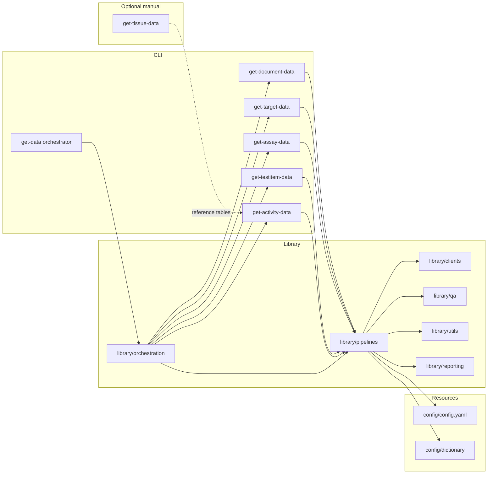

# Architecture overview

The orchestrator initialises shared configuration, logging and rate limiting,
then invokes each CLI module in order up to the activity stage. When tissue
lookups are required, operators run `get_tissue_data` manually to refresh the
reference tables before the activity join. Pipelines import reusable components
from `library/`:

- `library/orchestration` — workflow registry, shared execution context helpers
  and retry coordination used by `get_data.py`, tests and bespoke automation.
- `library/clients` — HTTP clients with retry and throttling logic for ChEMBL,
  UniProt, PubMed, OpenAlex, CrossRef, PubChem.
- `library/pipelines` — Fetching, transformation and export logic for each
  entity. Subpackages (`document`, `target`, `assay`, `testitem`, `tissue`,
  `activity`) expose orchestration primitives reused by the scripts, even when
  the orchestration chain executes only the document → target → assay → test
  item → activity subset.
- `library/utils` — CLI helpers, deterministic CSV I/O, configuration loaders,
  logging bootstrap and file system utilities.
- `library/reporting` — run manifests, metadata reconciliation and table-quality
  aggregation helpers shared between orchestrated runs and standalone stages.
- `library/qa` & `library/table_quality.py` — Schema validation, quality
  profiling and metadata writers.

For details on the recent relocation of the test item pipeline into the
`library.pipelines.testitem` namespace, see the
[test item pipeline module migration guide](../guides/MIGRATION_TESTITEM_PIPELINE.md).

## Data extraction pipelines

| Pipeline | CLI entry | Primary sources | Outputs |
|----------|-----------|-----------------|---------|
| Document | `scripts/get_document_data.py` | ChEMBL `/document`, PubMed E-utilities, OpenAlex, CrossRef, Semantic Scholar. | `output.documents_<stamp>.csv` plus metadata sidecars. |
| Target | `scripts/get_target_data.py` | ChEMBL `/target`, UniProt, Guide to PHARMACOLOGY, cached dictionaries. | `output.targets_<stamp>.csv` and helper lookups (`organism`, `isoform`, `names`, `IUPHAR`). |
| Assay | `scripts/get_assay_data.py` | ChEMBL `/assay`. | `output.assay_<stamp>.csv` with QA artefacts. |
| Test item | `scripts/get_testitem_data.py` | ChEMBL `/molecule`, PubChem PUG-REST. | `output.testitems_<stamp>.csv` and metadata. |
| Tissue | `scripts/get_tissue_data.py` | ChEMBL `/tissue`, ontology caches (UBERON, EFO, BTO, Caloha, LINCS, CCLE). | `output.tissue_<stamp>.csv` plus quality reports and metadata; run manually before the activity pipeline when tissue joins are needed. |
| Activity | `scripts/get_activity_data.py` | ChEMBL `/activity`. | `output.activity_<stamp>.csv` with enrichment columns. |

The orchestrator runs the document → target → assay → test item → activity
modules sequentially unless specific stages are skipped via CLI flags. Tissue is
invoked separately.

Alternative workflows can be described in YAML and supplied via
`--pipeline-registry`. The loader in
[`library/pipelines/registry.py`](../../../library/pipelines/registry.py) validates
the structure and allows callers to swap in bespoke callables, change execution
order or skip steps without modifying code.

External services are accessed via token-bucket rate limiters configured by
`sources.*` blocks. All network calls are wrapped with retry logic defined in
`system.retry`.

## Component responsibilities

| Component | Responsibilities |
|-----------|-----------------|
| CLI scripts (`scripts/`) | Parse arguments, resolve paths, invoke pipeline orchestration functions. |
| Pipelines (`library/pipelines/*`) | Load inputs, perform API calls, merge results, validate schemas, produce exports. |
| QA (`library/qa`, `library/table_quality.py`) | Run Pandera validations, compute quality metrics, emit warnings. |
| Post-processing (`library/postprocessing`) | Column ordering, metadata generation, deterministic sorting. |
| Config (`library/config/`) | Load YAML files, environment overrides, enforce types and defaults. |

## Execution model

1. CLI resolves configuration via `library.config.load_config` and prints
   provenance when `--print-config` is supplied.
2. Input CSV is read with deterministic options (encoding from config, fallback
   separators, explicit NA markers).
3. Pipelines fetch remote data via clients using shared rate limiters and retry
   policies.
4. Intermediate frames are validated, transformed and sorted before being written
   to disk.
5. Sidecars and quality reports are generated in the same directory as the CSV.

See [`ETL_PROCESS.md`](./ETL_PROCESS.md) for a detailed step-by-step breakdown and
[`DATA_MODEL.md`](./DATA_MODEL.md) for the analytical star schema.
