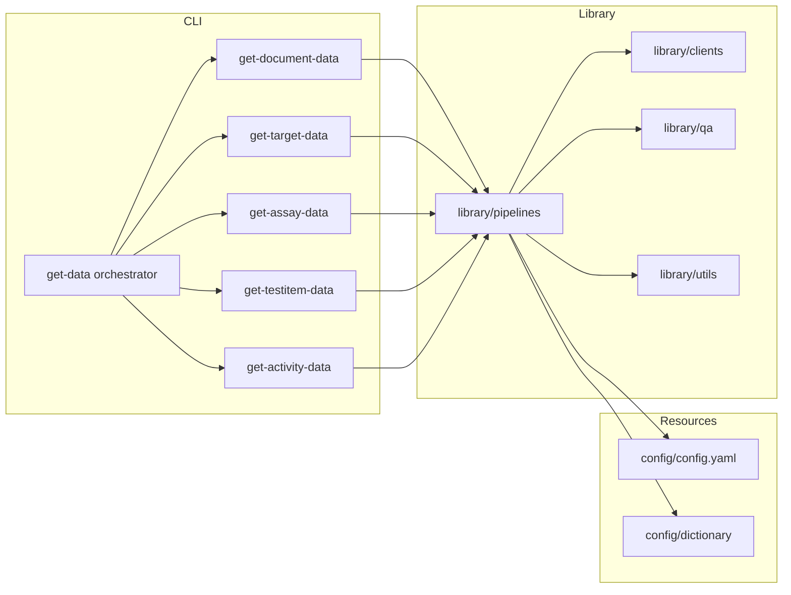

# Architecture overview

The orchestrator initialises shared configuration, logging and rate limiting,
then invokes each CLI module in order. Pipelines import reusable components from
`library/`:

- `library/clients` — HTTP clients with retry and throttling logic for ChEMBL,
  UniProt, PubMed, OpenAlex, CrossRef, PubChem.
- `library/pipelines` — Fetching, transformation and export logic for each
  entity. Subpackages (`document`, `target`, `assay`, `testitem`, `activity`)
  expose orchestration primitives reused by the scripts.
- `library/utils` — CLI helpers, deterministic CSV I/O, configuration loaders,
  logging bootstrap and file system utilities.
- `library/qa` & `library/table_quality.py` — Schema validation, quality
  profiling and metadata writers.

External services are accessed via token-bucket rate limiters configured by
`sources.*` blocks. All network calls are wrapped with retry logic defined in
`system.retry`.

## Component responsibilities

| Component | Responsibilities |
|-----------|-----------------|
| CLI scripts (`scripts/`) | Parse arguments, resolve paths, invoke pipeline orchestration functions. |
| Pipelines (`library/pipelines/*`) | Load inputs, perform API calls, merge results, validate schemas, produce exports. |
| QA (`library/qa`, `library/table_quality.py`) | Run Pandera validations, compute quality metrics, emit warnings. |
| Post-processing (`library/postprocessing`) | Column ordering, metadata generation, deterministic sorting. |
| Config (`library/config.py`) | Load YAML files, environment overrides, enforce types and defaults. |

## Execution model

1. CLI resolves configuration via `library.config.load_config` and prints
   provenance when `--print-config` is supplied.
2. Input CSV is read with deterministic options (encoding from config, fallback
   separators, explicit NA markers).
3. Pipelines fetch remote data via clients using shared rate limiters and retry
   policies.
4. Intermediate frames are validated, transformed and sorted before being written
   to disk.
5. Sidecars and quality reports are generated in the same directory as the CSV.

See [`ETL_PROCESS.md`](./ETL_PROCESS.md) for a detailed step-by-step breakdown and
[`DATA_MODEL.md`](./DATA_MODEL.md) for the analytical star schema.
