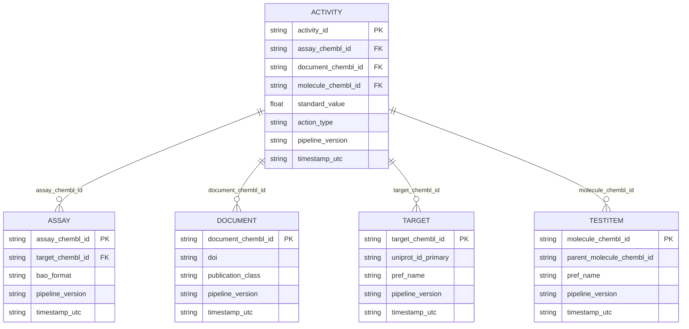

# Analytical data model

The exported CSV files form a star schema centred on the activity fact table.

## Dimensional usage

- **Document dimension** — bibliographic metadata used for evidence tracking and
  literature analysis.
- **Target dimension** — protein and gene annotations for downstream enrichment.
- **Assay dimension** — experimental context, BAO metadata and QA flags.
- **Test item dimension** — molecular identity, administration routes, PubChem
  enrichments and parent relationships.
- **Activity fact** — measurement values, action type classification, derived
  bounds and hash of auxiliary properties.

## Surrogate keys and timestamps

Each table records `pipeline_version` and `timestamp_utc`, enabling incremental
loading and provenance checks. Activity rows reference the other tables via
natural keys; surrogate keys can be introduced downstream if necessary.
