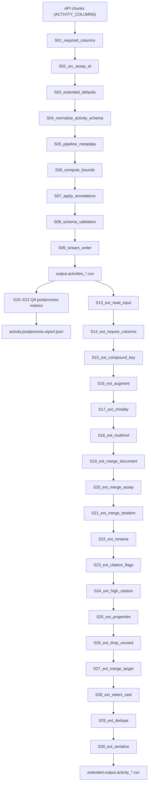

# Постобработка activity

## 1. Обзор и диаграмма пайплайна (Mermaid/Graphviz)

## 2. Контрольные точки (размеры, кардинальности, NaN)
| Контрольная точка | Метрика | Источник/описание |
|---|---|---|
| После chunk-валидации | `rows_total`, `rows_kept`, `rows_dropped` | Захватываются через `_capture_stats` и логируются сразу после завершения пайплайна chunked fetcher. 【F:scripts/get_activity_data.py†L1132-L1148】【F:scripts/get_activity_data.py†L1414-L1423】 |
| Потоковая статистика CSV | `rows`, `cells`, `null_fraction` | `_StreamingCSVStatistics.snapshot()` вызывается в `_capture_stats` и при завершении пайплайна; значения дополнительно фиксируются в `_emit_completion_message`. 【F:scripts/get_activity_data.py†L1089-L1107】【F:scripts/get_activity_data.py†L1120-L1134】【F:scripts/get_activity_data.py†L1412-L1444】【F:scripts/get_activity_data.py†L1494-L1499】 |
| Постпроцесс QA | `postprocess_rows`, `postprocess_columns`, `postprocess_duration_s`, `postprocess_steps`, `postprocess_schema` | Метрики возвращаются `collect_postprocess_metrics` и проксируются в итоговый лог `activity_pipeline_done`. 【F:scripts/get_activity_data.py†L1446-L1485】 |
| Extended экспорт | `rows`, `columns`, non-null counts по ключевым полям | Логи `activity_extended_dataframe_shape`, `activity_extended_columns`, `activity_extended_non_null_counts` перед дедупликацией. 【F:library/postprocessing/activity_extended.py†L1513-L1530】 |
| Extended дедупликация | `removed`, `remaining` | Сообщение `activity_extended_deduplicated` после Power Query сортировки/дедупликации. 【F:library/postprocessing/activity_extended.py†L1121-L1161】 |

Кардинальности контролируются через ключевые наборы `_DEDUPE_SUBSET_KEYS` (extended) и `key_columns=['activity_id']` в chunked пайплайне; нарушения приводят к `ActivityExtendedError` или фиксации ошибок валидации. 【F:library/postprocessing/activity_extended.py†L1121-L1159】【F:scripts/get_activity_data.py†L1089-L1148】【F:library/cli_utils.py†L206-L460】

## 3. Стадии S01..S30

### S01_required_columns
- **Функция/блок:** `_ensure_required_activity_columns`
- **Назначение:** заполнить обязательные поля из `ActivitiesSchema` пустыми сериальными столбцами, чтобы исключить сбои валидации при отсутствии колонок в API-ответе. Предотвращает `KeyError` и обеспечивает совместимость со Schema. 【F:scripts/get_activity_data.py†L1043-L1067】【F:scripts/get_activity_data.py†L138-L146】
- **Вход:** DataFrame с минимум `ACTIVITY_COLUMNS` (различные типы pandas, потенциально отсутствуют `activity_id`, `standard_value`, `standard_units` и т.д.).
- **Выход:** Тот же DataFrame с добавленными колонками из `_ACTIVITY_REQUIRED_COLUMNS`; типы подобраны (`Float64`, `string`, `object`).
- **Операция:**
  - *type: derive* — вычислить список недостающих колонок; для каждой создать `pd.Series(pd.NA, dtype=fill_dtype)` и присоединить к фрейму. Колонки: все из `_ACTIVITY_REQUIRED_COLUMNS`. Критерий: отсутствует в `frame.columns`. 【F:scripts/get_activity_data.py†L1043-L1067】
- **Зависимости:** `ActivitiesSchema` из `library.schemas.activities`. 【F:scripts/get_activity_data.py†L138-L146】
- **Псевдокод:**
  1. `missing = required_columns - frame.columns`
  2. `for column in missing: determine dtype -> fillers[column] = NA series`
  3. `return frame.assign(**fillers)`
- **Критерии успешности стадии:** `set(result.columns)` содержит все `_ACTIVITY_REQUIRED_COLUMNS`; типы совпадают с ожидаемыми (`result[column].dtype == fill_dtype`).

### S02_src_assay_id
- **Функция/блок:** `partial(_ensure_src_assay_id, lookup=assay_src_lookup)`
- **Назначение:** подтянуть `src_assay_id` из словаря `_assay/assay.csv` для строк без значения, чтобы downstream Power Query получал стабильные идентификаторы источника. 【F:scripts/get_activity_data.py†L1076-L1084】【F:scripts/get_activity_data.py†L626-L665】
- **Вход:** DataFrame после S01; `assay_chembl_id` тип string, `src_assay_id` string/NA.
- **Выход:** Обновлённый `src_assay_id` (string), заполненный по мэппингу; без изменений остальных колонок.
- **Операция:**
  - *type: normalize/join* — привести `src_assay_id` к string dtype; построить `missing_mask` и заменить значения из `lookup` словаря (`{assay_chembl_id -> src_assay_id}`). 【F:scripts/get_activity_data.py†L639-L663】
  - *Missing handling:* пустые/пробельные строки остаются NA. 【F:scripts/get_activity_data.py†L646-L662】
- **Зависимости:** `_load_assay_src_lookup` читает `config/dictionary/_assay/assay.csv`, требует столбцы `assay_chembl_id`, `src_assay_id`. 【F:scripts/get_activity_data.py†L543-L624】
- **Псевдокод:**
  1. `ensure src_assay_id column exists as string`
  2. `if lookup and assay_chembl_id present: missing = blank(src_assay_id)`
  3. `mapped = assay_chembl_id.map(lookup)`
  4. `result[missing] = mapped[missing]`
- **Критерии успешности:** Для всех строк, где `lookup` содержал ключ, после стадии `src_assay_id` не пустой; отсутствие KeyError (строки без совпадения остаются NA).

### S03_extended_defaults
- **Функция/блок:** `_ensure_extended_activity_columns`
- **Назначение:** приведение типов и заполнение колонок, необходимых расширенному экспорту (`_EXTENDED_ACTIVITY_DTYPES`), включая `log_value`, `multmol_assay` и т.д., сfallback на `pchembl_value`. 【F:scripts/get_activity_data.py†L226-L256】【F:scripts/get_activity_data.py†L802-L859】
- **Вход:** DataFrame после S02; возможно отсутствуют `activity_chembl_id`, `compound_name`, `salt_chembl_id`, `log_value`.
- **Выход:** Фрейм содержит все ключевые extended-колонки с целевыми dtype (`string`, `Float64`, `Int64`, `boolean`).
- **Операция:**
  - *type: derive* — синхронизировать `activity_id`/`activity_chembl_id`, `compound_name` из `molecule_pref_name`, `compound_key` из `parent_molecule_chembl_id`/`molecule_chembl_id`. 【F:scripts/get_activity_data.py†L812-L841】
  - *type: derive* — `log_value` получен из существующего столбца или `pchembl_value`. 【F:scripts/get_activity_data.py†L844-L859】
  - *Missing handling:* создаёт пустые Series нужного dtype для отсутствующих колонок, применяет `.mask` для аккуратного заполнения без смены dtype. 【F:scripts/get_activity_data.py†L827-L858】
- **Зависимости:** `_EXTENDED_ACTIVITY_DTYPES`, `_EXTENDED_ACTIVITY_FALLBACKS`. 【F:scripts/get_activity_data.py†L226-L251】【F:scripts/get_activity_data.py†L360-L410】
- **Псевдокод:**
  1. `result = frame.copy()`
  2. `synchronize ID columns`
  3. `for column in schema_dtypes: coerce -> fill via fallback -> ensure dtype`
  4. `return result`
- **Критерии успешности:** `result.dtypes[column]` соответствует `_EXTENDED_ACTIVITY_DTYPES[column]`; столбец присутствует.

### S04_normalize_activity_schema
- **Функция/блок:** `normalize_activities`
- **Назначение:** унификация регистра и пробелов в колоночных значениях (`standard_type`, `standard_relation`, `standard_units`) и очистка названий колонок. Предотвращает расхождения с Pandera-схемой. 【F:library/schemas/normalize.py†L14-L54】
- **Вход:** DataFrame из S03.
- **Выход:** Тот же набор колонок, но с нижним регистром заголовков и нормализованными строками (strip, relation-map `<`→`<=`, `μM`→`uM`).
- **Операция:**
  - *type: normalize* — применить `_normalize_common`: `str.strip()`, `.replace("μM","uM")`, map relation символов. Колонки: все string поля, особенно идентификаторы. 【F:library/schemas/normalize.py†L16-L47】
- **Зависимости:** `_RELATION_MAP` и Pandas string API.
- **Псевдокод:**
  1. `for col in df.columns: series = apply string cleanup`
  2. `lowercase column names`
  3. `return cleaned DataFrame`
- **Критерии успешности:** отсутствуют ведущие/завершающие пробелы; relation значения входят в `{<=, >=, =, ...}`.

### S05_pipeline_metadata
- **Функция/блок:** `add_pipeline_metadata`
- **Назначение:** вставить `pipeline_version` и `timestamp_utc` (UTC) для трассировки артефактов. 【F:library/pipelines/common/metadata.py†L73-L111】
- **Вход:** DataFrame из S04.
- **Выход:** Добавлены колонки `pipeline_version`, `timestamp_utc` (string, одинаковые для всех строк).
- **Операция:**
  - *type: derive* — получить версию пакета (`metadata.version`) и метку времени (`datetime.now(UTC)`), присвоить каждой строке. 【F:library/pipelines/common/metadata.py†L73-L107】
- **Зависимости:** `importlib.metadata`, `datetime.UTC`.
- **Псевдокод:**
  1. `meta = pipeline_metadata()`
  2. `result = df.copy(); for col,value in meta: result[col]=value`
- **Критерии успешности:** колонки присутствуют; `timestamp_utc` соответствует ISO-8601 UTC; значения идентичны для всех строк.

### S06_compute_bounds
- **Функция/блок:** `_compute_bounds` → `compute_activity_bounds`
- **Назначение:** вычислить `lower_value`/`upper_value` по `standard_*` столбцам, relations и опционально по измеренной неопределённости. 【F:scripts/get_activity_data.py†L1033-L1041】【F:library/processing/activity/bounds.py†L279-L360】
- **Вход:** DataFrame из S05, содержит `standard_value`, `standard_lower_value`, `standard_upper_value`, `relation` и `value`.
- **Выход:** Добавлены `lower_value`, `upper_value` (`float64`) с применением правил отношения, диапазона, неотрицательного clamp.
- **Операция:**
  - *type: derive* — объединение стандартных границ, логика `between/range`, log предупреждения о пропусках. Колонки: `standard_lower_value`, `standard_upper_value`, `standard_value`, `value`, `relation`. 【F:library/processing/activity/bounds.py†L279-L360】
  - *Missing handling:* предупреждения при отсутствии данных, заполнение NaN.
- **Зависимости:** `ActivityBoundsCfg` из конфигурации `cfg.activity_bounds`.
- **Псевдокод:**
  1. `lower/upper = NaN`
  2. `fill from standard_lower/upper`
  3. `if relation=between: compute min/max`
  4. `if clamp enabled: clamp >=0`
  5. `return df.assign(lower_value=lower, upper_value=upper)`
- **Критерии успешности:** `lower_value <= upper_value` (после `_swap_conflicts`); значения >=0 при включённом clamp; предупреждения зарегистрированы при пропусках.

### S07_apply_annotations
- **Функция/блок:** `_apply_annotations` → `apply_activity_annotations`
- **Назначение:** классифицировать строки по action type (PAM/NAM/etc.), сгенерировать JSON `activity_properties` и хэш, а также предупреждать о несопоставленных значениях. 【F:scripts/get_activity_data.py†L1036-L1041】【F:library/processing/activity/annotations.py†L376-L468】
- **Вход:** DataFrame из S06; содержит сырой `activity_properties`, `mechanism`, `metrics` и т.д.
- **Выход:** Добавлены/обновлены колонки `action_type.column` (по конфигу), `activity_properties`, `properties_hash`; логируются распределение и пропуски (если включено в конфиг).
- **Операция:**
  - *type: derive* — нормализация конфигов (`normalise_mapping`), вычисление action label, сбор JSON с triage/metrics, вычисление хэша. 【F:library/processing/activity/annotations.py†L376-L468】
  - *Missing handling:* предупреждения `activity_action_type_missing`, `activity_properties_missing` при незаполненных значениях.
- **Зависимости:** `cfg.activity_enrichment.action_type`, `cfg.activity_enrichment.activity_properties` (конфиг CLI/Config). 【F:scripts/get_activity_data.py†L1017-L1030】
- **Псевдокод:**
  1. `extract effect features per row`
  2. `infer action label via config mappings`
  3. `build JSON payload & hash`
  4. `assign columns / log warnings`
- **Критерии успешности:** при `action_cfg.enabled` столбец заполнен типами из allowlist; при `properties_cfg.enabled` JSON валиден (parsable) — контролируется downstream QA.

### S08_schema_validation
- **Функция/блок:** `validate_activities(return_result=True)` (validator в PipelineDefinition)
- **Назначение:** проверка Pandera-схемы `ActivitiesSchema`, сбор failure cases, сохранение CSV с ошибками. 【F:scripts/get_activity_data.py†L1086-L1088】【F:library/validation.py†L169-L194】【F:library/cli_utils.py†L360-L452】
- **Вход:** Каждая chunk-часть после S07.
- **Выход:** Валидированный chunk (`validated_chunk`), массив failure cases (при наличии) отправляется в `errors` sidecar.
- **Операция:**
  - *type: validate* — Pandera проверяет типы, ограничения; ошибки логируются `validation_failed`. 【F:library/cli_utils.py†L400-L452】
  - *Missing handling:* при отсутствии требуемых колонок pipeline прерывается `_AbortPipeline` с exit_code=1. 【F:library/cli_utils.py†L392-L418】
- **Зависимости:** Pandera, `ActivitiesSchema`.
- **Псевдокод:**
  1. `for validator in validators: result = validator(chunk)`
  2. `if failure_cases: log & accumulate`
  3. `yield validated_data`
- **Критерии успешности:** отсутствуют failure cases; иначе создаётся `failure_path` CSV и exit_code=1.

### S09_stream_writer
- **Функция/блок:** локальный `writer` + `write_csv_chunks_deterministic`
- **Назначение:** отфильтровать drop-колонки, зафиксировать порядок столбцов, отсортировать по ключам и сериализовать CSV детерминированно. 【F:scripts/get_activity_data.py†L1092-L1166】【F:scripts/get_activity_data.py†L240-L256】【F:library/common/csv_utils.py†L569-L640】
- **Вход:** Итератор валидированных chunkов; `col_order` и `key_cols` от `PipelineDefinition` (схема Activities).
- **Выход:** `output.activities_<stamp>.csv` в `cfg.io.output_dir` (кодировка `cfg.io.csv_encoding`, разделитель `cfg.io.csv_sep`).
- **Операция:**
  - *type: filter* — `_filter_activity_output_columns` удаляет `_OUTPUT_ACTIVITY_DROP_COLUMNS` (например, `standard_lower_value`).
  - *type: sort* — `write_csv_chunks_deterministic` сортирует chunkи по `key_cols` (fallback mergesort), мержит временные файлы, записывает финальный CSV.
  - *type: serialize* — запись в UTF-8/настроенную кодировку, без BOM если `cfg.io.csv_encoding`=utf-8, соблюдение порядка колонок из `whitelist_order`.
  - *Missing handling:* контроль дубликатов столбцов; исключение `ValueError` при повторяющихся названиях. 【F:library/common/csv_utils.py†L603-L640】
- **Зависимости:** `cfg.io.*`, `write_csv_chunks_deterministic`, sidecar writer (`io.write_csv`).
- **Псевдокод:**
  1. `for chunk in chunks: filtered = drop columns -> reindex -> stats.update`
  2. `write_csv_chunks_deterministic(filtered_chunks, destination, key_cols, col_order, encoding)`
  3. `return Path(output)`
- **Критерии успешности:** CSV существует; порядок колонок соответствует whitelist; лог отсутствия drop-колонок.

### S10_postprocess_normalize
- **Функция/блок:** `run_activity_postprocess` step `normalize_activity_records`
- **Назначение:** QA-постпроцесс — нормализация метаданных после записи (используется только для отчёта). 【F:scripts/get_activity_data.py†L1446-L1451】【F:library/postprocessing/activities/steps.py†L41-L72】
- **Вход:** `pd.read_csv(output.activities_*.csv)` (deterministic порядок/тип строк).
- **Выход:** Normalized DataFrame с приведёнными регистрами (аналог S04, но в отчёте). Метрики фиксируются в `PipelineRunMetrics`.
- **Операция:**
  - *type: normalize* — strip, collapse whitespace, uppercase `standard_type` и relation, units uppercase (по конфигу). 【F:library/postprocessing/activities/steps.py†L55-L70】
- **Зависимости:** `config/pipeline/activities.yaml` (параметры шага). 【F:config/pipeline/activities.yaml†L1-L21】
- **Псевдокод:**
  1. `normalised = df.copy(); normalised.columns = lower(strip)`
  2. `normalize selected columns`
- **Критерии успешности:** отсутствие предупреждений от `run_steps`; Schema diff отражает только ожидаемые преобразования.

### S11_postprocess_quality
- **Функция/блок:** `enrich_activity_quality`
- **Назначение:** определить `quality_flag` на основании `data_validity_comment` для отчётности QA. 【F:library/postprocessing/activities/steps.py†L88-L118】
- **Вход:** DataFrame после S10.
- **Выход:** Добавлена колонка `quality_flag` (bool); при отсутствии комментариев — базовое значение `default_quality_flag`.
- **Операция:**
  - *type: derive* — компиляция regex паттерна из `quality_terms` (по YAML), поиск (case-insensitive) в `data_validity_comment` -> bool.
  - *Missing handling:* при отсутствии колонки комментария флаг заполняется базовым значением. 【F:library/postprocessing/activities/steps.py†L96-L117】
- **Зависимости:** `config/pipeline/activities.yaml` (`quality_terms`, `default_quality_flag`).
- **Псевдокод:**
  1. `effective_terms = prepare_terms(config)`
  2. `if comment column absent -> fill default`
  3. `else -> contains(pattern)`
- **Критерии успешности:** `quality_flag` dtype boolean; отсутствие исключений при regex.

### S12_postprocess_finalize
- **Функция/блок:** `finalize_activity_records`
- **Назначение:** привести идентификаторы к `Int64`, валидировать Pandera `ACTIVITY_SCHEMA`, зафиксировать порядок колонок и pipeline_version в отчётных метриках. 【F:library/postprocessing/activities/steps.py†L121-L157】【F:library/postprocessing/activities/schema.py†L1-L45】
- **Вход:** DataFrame после S11.
- **Выход:** Валидация `ACTIVITY_SCHEMA`, упорядоченные колонки, bool/string типы согласованы.
- **Операция:**
  - *type: normalize/validate* — `activity_id` → nullable Int64; ключевые string колонки → `string`; Pandera валидация. 【F:library/postprocessing/activities/steps.py†L129-L156】
- **Зависимости:** `ACTIVITY_SCHEMA`, `validate_activities` (postprocess).
- **Псевдокод:**
  1. `prepared = df.copy()`
  2. `coerce activity_id, string columns`
  3. `if enforce_schema: validate_activities`
- **Критерии успешности:** Pandera валидация проходит; `PipelineRunMetrics.validation` заполнен. 【F:library/postprocessing/common/runner.py†L250-L286】

### S13_ext_read_input
- **Функция/блок:** `helpers.read_csv_strict`
- **Назначение:** загрузить основной CSV (`output.activity_*.csv`) с учётом исторических кодировок/разделителей, сохраняя типы (`_ACTIVITY_INPUT_SCHEMA`). 【F:library/postprocessing/activity_extended.py†L1501-L1508】【F:library/postprocessing/helpers.py†L272-L317】
- **Вход:** `output.activity_*.csv` из S09.
- **Выход:** DataFrame с dtype, нормализованным BOM, NA маркерами (`[#N/A]`).
- **Операция:**
  - *type: normalize* — перебор кодировок (`utf-8`, `cp1252`, `latin-1`) и разделителей, приведение типов к объявленным (Text→string, Logical→boolean, Int64→nullable Int64). 【F:library/postprocessing/helpers.py†L272-L317】
- **Зависимости:** `_ACTIVITY_INPUT_SCHEMA`, `_NA_MARKERS`. 【F:library/postprocessing/activity_extended.py†L57-L207】
- **Псевдокод:**
  1. `for encoding in fallbacks: for sep in separators: try pd.read_csv`
  2. `rename columns (strip BOM)`
  3. `coerce_types` according to schema
- **Критерии успешности:** успешное чтение; иначе `ActivityExtendedError` (прерывает CLI). 【F:library/postprocessing/activity_extended.py†L1491-L1505】

### S14_ext_require_columns
- **Функция/блок:** `_ensure_required_input_columns`
- **Назначение:** убедиться, что все `_REQUIRED_COLUMNS` (включая `activity_chembl_id`, `bao_endpoint`, `compound_name`) присутствуют и имеют корректные dtype; заполняет отсутствующие `pd.NA`. 【F:library/postprocessing/activity_extended.py†L667-L694】
- **Вход:** DataFrame из S13.
- **Выход:** Обновлённый DataFrame, все обязательные колонки присутствуют.
- **Операция:**
  - *type: derive* — попытка использовать fallbacks (`_REQUIRED_COLUMN_FALLBACKS`, напр. `activity_id`→`activity_chembl_id`), иначе создавать пустой столбец нужного dtype. 【F:library/postprocessing/activity_extended.py†L695-L735】
- **Зависимости:** `_REQUIRED_COLUMNS`, `_REQUIRED_COLUMN_DTYPES`, `_REQUIRED_COLUMN_FALLBACKS`. 【F:library/postprocessing/activity_extended.py†L36-L120】【F:library/postprocessing/activity_extended.py†L90-L110】
- **Псевдокод:**
  1. `for column in required:`
  2. `if missing -> try fallback -> else empty_series(dtype)`
- **Критерии успешности:** после стадии `missing` пуст; иначе выбрасывается `ActivityExtendedError` позже в `_transform_activity_frame`. 【F:library/postprocessing/activity_extended.py†L1352-L1358】

### S15_ext_compound_key
- **Функция/блок:** `_ensure_compound_key_sources`
- **Назначение:** заполнить `parent_molecule_chembl_id` по `molecule_hierarchy.csv` и обеспечить наличие `molecule_chembl_id`, что критично для дальнейшего формирования `compound_key`. 【F:library/postprocessing/activity_extended.py†L736-L806】
- **Вход:** DataFrame из S14.
- **Выход:** Дополненные столбцы `molecule_chembl_id`, `parent_molecule_chembl_id` (string), отсутствие строк с обоими пропущенными ID.
- **Операция:**
  - *type: derive/join* — при отсутствии `parent_molecule_chembl_id` подтягивает mapping из `_testitem/molecule_hierarchy.csv`; проверяет, что хотя бы одно из ID заполнено, иначе `ActivityExtendedError`. 【F:library/postprocessing/activity_extended.py†L755-L804】
- **Зависимости:** `_load_parent_lookup` (`config/dictionary/_testitem/molecule_hierarchy.csv`). 【F:library/postprocessing/activity_extended.py†L494-L557】
- **Псевдокод:**
  1. `ensure columns exist`
  2. `needs_parent = blank(parent) & !blank(molecule)`
  3. `lookup = molecule_hierarchy; fill parent`
  4. `if blank(parent) & blank(molecule): raise error`
- **Критерии успешности:** нет строк, где оба идентификатора пустые; предупреждения отсутствуют.

### S16_ext_augment
- **Функция/блок:** `_augment_activity_frame`
- **Назначение:** обогатить поля (`activity_chembl_id`, `compound_name`, `compound_key`, `log_value`, bool defaults), подготовить extended флаги по исторической логике. 【F:library/postprocessing/activity_extended.py†L1170-L1336】
- **Вход:** DataFrame из S15.
- **Выход:** Обновлённые строки с заполненными `compound_key`, `log_value`, `salt_chembl_id`, bool-столбцами (`approx_cited_activity`, `review_doc`, ...), `nstereo` гарантирован.
- **Операция:**
  - *type: derive* — заполнение `activity_chembl_id` из `activity_id`, `compound_name` из `molecule_pref_name`, `log_value` из `log_value`/`pchembl_value`/расчёт по `standard_value` и units (с переводом в molarity). 【F:library/postprocessing/activity_extended.py†L1182-L1241】
  - *type: normalize* — bool колонки приводятся к `boolean`, пропуски -> False. 【F:library/postprocessing/activity_extended.py†L1243-L1321】
- **Зависимости:** NumPy (`np.log10`), `_EXTENDED_ACTIVITY_DTYPES`.
- **Псевдокод:**
  1. `copy df`
  2. `fill ID/name columns`
  3. `compute log_value via existing column / pchembl / molarity`
  4. `ensure bool defaults`
- **Критерии успешности:** целевые столбцы не пустые (кроме опциональных); `log_value` dtype Float64.

### S17_ext_chirality
- **Функция/блок:** `_prepare_unknown_chirality`
- **Назначение:** вычислить `unknown_chirality` (bool) на основе `nstereo`, удалить исходную колонку. 【F:library/postprocessing/activity_extended.py†L600-L615】
- **Вход:** DataFrame из S16.
- **Выход:** Колонка `unknown_chirality` (`boolean`), `nstereo` удалён.
- **Операция:**
  - *type: derive* — `_safe_to_int(nstereo)` != 1 ⇒ True; заполняет True, если данных нет. 【F:library/postprocessing/activity_extended.py†L606-L615】
- **Зависимости:** `_safe_to_int` (приведение `Int64`).
- **Псевдокод:**
  1. `if nstereo exists: unknown = (nstereo != 1) or NA -> True`
  2. `drop nstereo`
- **Критерии успешности:** `unknown_chirality` присутствует без NA (по `.fillna(True)`).

### S18_ext_multimol
- **Функция/блок:** `_apply_multimol_logic`
- **Назначение:** выявление мульти-молекулярных ассев (обновление `multmol_assay`), используя группировку по `_GROUP_KEY_COLUMNS`. 【F:library/postprocessing/activity_extended.py†L616-L664】
- **Вход:** DataFrame с `multmol_assay`, `Count` отсутствует.
- **Выход:** `multmol_assay` boolean (True, если найден дубль с разной хиральностью); временные колонки удалены.
- **Операция:**
  - *type: groupby/derive* — группировка по `(salt_chembl_id, molecule_chembl_id, target_chembl_id, assay_chembl_id, standard_type)`, подсчёт размера, объединение с df, установка флага. 【F:library/postprocessing/activity_extended.py†L623-L660】
- **Зависимости:** `_GROUP_KEY_COLUMNS`. 【F:library/postprocessing/activity_extended.py†L214-L225】
- **Псевдокод:**
  1. `counts = df.groupby(keys).size()`
  2. `merge counts -> mask (unknown_chirality False & multmol is NA & Count > 1)`
  3. `set multmol_assay True`
- **Критерии успешности:** `multmol_assay` dtype boolean; нет незаполненных значений.

### S19_ext_merge_document
- **Функция/блок:** `_merge_document_metadata`
- **Назначение:** подключить `completed`, `review` из `_document/document.csv`, вставить рядом с `document_chembl_id`. 【F:library/postprocessing/activity_extended.py†L946-L968】
- **Вход:** DataFrame из S18.
- **Выход:** Добавлены `completed` (string), `review` (boolean), лог по join-индикатору.
- **Операция:**
  - *type: join* — left join по `document_chembl_id`, `indicator` → `_log_join_statistics`. 【F:library/postprocessing/activity_extended.py†L946-L954】
  - *type: normalize* — привести `completed` к string, `review` → bool. 【F:library/postprocessing/activity_extended.py†L957-L966】
- **Зависимости:** `_load_document_lookup` (читает `document.csv`, проверяет столбцы). 【F:library/postprocessing/activity_extended.py†L408-L441】
- **Псевдокод:**
  1. `lookup = document.csv[['document_chembl_id','completed','review']]`
  2. `merged = df.merge(lookup, how='left', indicator=True)`
  3. `coerce types; insert columns after document_chembl_id`
- **Критерии успешности:** `completed`, `review` присутствуют; join-индикатор логируется.

### S20_ext_merge_assay
- **Функция/блок:** `_merge_assay_metadata`
- **Назначение:** добавить `assay_with_same_target` (Int64) к `multmol_assay`. 【F:library/postprocessing/activity_extended.py†L971-L991】
- **Вход:** DataFrame из S19.
- **Выход:** Column `assay_with_same_target` (Int64) вставлен после `multmol_assay`.
- **Операция:**
  - *type: join* — left join `_assay/assay.csv` по `assay_chembl_id`; коэрс `assay_with_same_target` через `_safe_to_int`. 【F:library/postprocessing/activity_extended.py†L971-L990】
- **Зависимости:** `_load_assay_lookup`. 【F:library/postprocessing/activity_extended.py†L468-L488】
- **Псевдокод:**
  1. `lookup = assay.csv[['assay_chembl_id','assay_with_same_target']]`
  2. `merge -> convert to Int64`
  3. `insert after multmol_assay`
- **Критерии успешности:** `assay_with_same_target` dtype Int64; join-индикатор залогирован.

### S21_ext_merge_testitem
- **Функция/блок:** `_merge_testitem_metadata`
- **Назначение:** расширить `molecule_chembl_id.1` и `standard_inchi_skeleton` из `_testitem/testitem.csv`, сохранив исходные значения. 【F:library/postprocessing/activity_extended.py†L994-L1034】
- **Вход:** DataFrame из S20.
- **Выход:** Колонки `molecule_chembl_id.1`, `standard_inchi_skeleton` (string), вставлены рядом с исходными.
- **Операция:**
  - *type: join* — left join по `molecule_chembl_id`; перенос правого идентификатора/INCHI, приоритет тестового значения, fallback на левое. 【F:library/postprocessing/activity_extended.py†L1007-L1033】
- **Зависимости:** `_load_testitem_lookup`. 【F:library/postprocessing/activity_extended.py†L494-L518】
- **Псевдокод:**
  1. `lookup = testitem.csv[['molecule_chembl_id','standard_inchi_skeleton']]`
  2. `merge -> rename _molecule_chembl_id_expanded`
  3. `fill new columns -> insert into DataFrame`
- **Критерии успешности:** нет дубликатов колонок; новые столбцы string dtype.

### S22_ext_rename
- **Функция/блок:** `_rename_columns`
- **Назначение:** переименовать поля в исторические названия (`salt_chembl_id`→`saltform_id`, `log_value`→`pA_value`, etc.). 【F:library/postprocessing/activity_extended.py†L808-L823】
- **Вход:** DataFrame из S21.
- **Выход:** Переименованные столбцы, дубликаты удалены.
- **Операция:**
  - *type: normalize* — `df.rename(columns=mapping)`, удалить дубли `duplicated(keep='last')`. 【F:library/postprocessing/activity_extended.py†L808-L823】
- **Зависимости:** словарь внутри функции.
- **Псевдокод:**
  1. `mapping = {...}`
  2. `renamed = df.rename(mapping)`
  3. `return renamed.loc[:, ~duplicated]`
- **Критерии успешности:** ожидаемые названия колонок присутствуют (`saltform_id`, `pA_value`).

### S23_ext_citation_flags
- **Функция/блок:** `_compute_citation_flags`
- **Назначение:** агрегировать булевы флаги цитирования и вывести `is_citation`. 【F:library/postprocessing/activity_extended.py†L894-L911】
- **Вход:** DataFrame после S22.
- **Выход:** Добавлен `is_citation` (`boolean`).
- **Операция:**
  - *type: derive* — собрать `exact_data_citation`, `higly_correlated_assay`, `shuffled_assay`, `review`, `rounded_data_citation`; заполнить False, вычислить `any`. 【F:library/postprocessing/activity_extended.py†L894-L909】
- **Зависимости:** `_safe_to_bool` (приведение). 【F:library/postprocessing/activity_extended.py†L581-L598】
- **Псевдокод:**
  1. `prepared = {col: safe_to_bool(col).fillna(False)}`
  2. `mask = any(axis=1)`
  3. `df['is_citation'] = mask`
- **Критерии успешности:** `is_citation` bool dtype; пропусков нет.

### S24_ext_high_citation
- **Функция/блок:** `_annotate_high_citation`
- **Назначение:** определить `high_citation_rate` по документу, используя `citation_fraction.csv`. 【F:library/postprocessing/activity_extended.py†L914-L943】
- **Вход:** DataFrame из S23.
- **Выход:** Обновлена/добавлена колонка `high_citation_rate` (boolean), привязана к `document_chembl_id`.
- **Операция:**
  - *type: groupby/derive/join* — `groupby(document_chembl_id)` → counts, объединение с `citation_fraction` по `N`, вычисление `high_citation_rate` на основе `K_min_significant`. 【F:library/postprocessing/activity_extended.py†L914-L939】
- **Зависимости:** `_load_citation_fraction` (`_activity/citation_fraction.csv`). 【F:library/postprocessing/activity_extended.py†L317-L331】
- **Псевдокод:**
  1. `counts = df.groupby(document).agg(...)`
  2. `citation_fraction = read csv`
  3. `merged counts -> compute bool -> merge back`
- **Критерии успешности:** `high_citation_rate` bool dtype; заполнение False по умолчанию. 【F:library/postprocessing/activity_extended.py†L939-L943】

### S25_ext_properties
- **Функция/блок:** `_extract_activity_properties_flags`
- **Назначение:** распарсить JSON в `activity_properties` и вывести флаги `allosteric`, `nam`, `pam`. 【F:library/postprocessing/activity_extended.py†L842-L891】
- **Вход:** DataFrame из S24.
- **Выход:** Колонки `allosteric`, `nam`, `pam` (`boolean` с возможными NA), основанные на JSON-структуре.
- **Операция:**
  - *type: derive* — нормализация текста, попытка `json.loads`, поиск ключей `effect_features`. 【F:library/postprocessing/activity_extended.py†L842-L887】
  - *Missing handling:* если JSON отсутствует или некорректен, значение остаётся `pd.NA`.
- **Зависимости:** `json`, `_normalise_activity_properties_text` и `_coerce_activity_property_flag`. 【F:library/postprocessing/activity_extended.py†L772-L841】
- **Псевдокод:**
  1. `for row: payload = parse activity_properties`
  2. `flags[column] = coerce_flag(payload[keys])`
  3. `assign flags`
- **Критерии успешности:** корректный разбор JSON; исключения отлавливаются и игнорируются (флаг остаётся NA).

### S26_ext_drop_unused
- **Функция/блок:** `_drop_unused_columns`
- **Назначение:** удалить исторически ненужные промежуточные поля (`cited_document`, `step1`-`step6` и т.п.). 【F:library/postprocessing/activity_extended.py†L824-L840】
- **Вход:** DataFrame из S25.
- **Выход:** Колонки из списка удалены, DataFrame очищен от временных полей.
- **Операция:**
  - *type: filter* — `df.drop(columns=present)`. 【F:library/postprocessing/activity_extended.py†L824-L838】
- **Зависимости:** заранее определённый список.
- **Псевдокод:**
  1. `present = [col for col in drop_cols if col in df]`
  2. `return df.drop(present)`
- **Критерии успешности:** отсутствуют drop-колонки в `df.columns`.

### S27_ext_merge_target
- **Функция/блок:** `_merge_target_metadata`
- **Назначение:** обогащение целевыми метаданными (`IUPHAR_class`, `unicellular_organism`, `multifunctional_enzyme`, `gene_index`, `taxon_index`, `sortorder.target`). 【F:library/postprocessing/activity_extended.py†L1037-L1073】
- **Вход:** DataFrame из S26.
- **Выход:** Добавлены и расположены после `original_activity_exact` и т.д.; drop `genus`, `superkingdom`, `phylum`, `taxon_id`.
- **Операция:**
  - *type: join* — merge с `targets_type.csv` (cp1252). 【F:library/postprocessing/activity_extended.py†L318-L388】【F:library/postprocessing/activity_extended.py†L1037-L1071】
  - *type: normalize* — `helpers.coerce_types` по `_TARGET_METADATA_SCHEMA`, bool-приведение для `multifunctional_enzyme`, `unicellular_organism`. 【F:library/postprocessing/activity_extended.py†L1047-L1055】
  - *type: reorder* — `_insert_columns_after` согласно `reorder_plan`. 【F:library/postprocessing/activity_extended.py†L1056-L1064】
- **Зависимости:** `_resolve_targets_path`, `_load_target_metadata`, `_TARGET_METADATA_SCHEMA`. 【F:library/postprocessing/activity_extended.py†L332-L407】
- **Псевдокод:**
  1. `targets_path = resolve path`
  2. `targets = load_target_metadata`
  3. `merge on target_chembl_id -> coerce types -> reorder -> drop extras`
- **Критерии успешности:** все `_TARGET_COLUMNS` присутствуют; если нет, `ActivityExtendedError`. 【F:library/postprocessing/activity_extended.py†L369-L400】

### S28_ext_select_cast
- **Функция/блок:** `_select_and_cast`
- **Назначение:** привести DataFrame к `_FINAL_COLUMN_ORDER`, отформатировать числовые столбцы как строки и привести bool поля. 【F:library/postprocessing/activity_extended.py†L1076-L1118】【F:library/postprocessing/activity_extended.py†L201-L238】
- **Вход:** DataFrame из S27.
- **Выход:** Упорядоченные колонки в целевом порядке, `standard_value` и `pA_value` представлены строкой без лишних нулей, bool-столбцы приведены к nullable boolean.
- **Операция:**
  - *type: sort/normalize* — `df.loc[:, _FINAL_COLUMN_ORDER]`, `_safe_to_bool` для списка колонок, формат числовых значений функцией `_format_numeric`. 【F:library/postprocessing/activity_extended.py†L1076-L1118】
- **Зависимости:** `_FINAL_COLUMN_ORDER`, `_safe_to_bool`.
- **Псевдокод:**
  1. `if missing columns -> raise error`
  2. `result = df[final_order].copy()`
  3. `for bool_col: result[col] = safe_to_bool`
  4. `format numeric columns`
- **Критерии успешности:** отсутствуют пропущенные колонки; форматы строк корректные (нет висячих нулей).

### S29_ext_dedupe
- **Функция/блок:** `dedupe_final`
- **Назначение:** стабильная сортировка и удаление дублей по `_DEDUPE_SUBSET_KEYS` с приоритетом Power Query (mergesort). 【F:library/postprocessing/activity_extended.py†L1121-L1161】
- **Вход:** DataFrame из S28.
- **Выход:** Отсортированный и дедуплицированный DataFrame; лог количества удалённых строк.
- **Операция:**
  - *type: sort* — `helpers.sort_power_query` по `_DEDUPE_SORT_ORDER`.
  - *type: filter* — `drop_duplicates(subset=subset, keep='first')`. 【F:library/postprocessing/activity_extended.py†L1128-L1159】
- **Зависимости:** `_DEDUPE_SORT_ORDER`, `_DEDUPE_SUBSET_KEYS`. 【F:library/postprocessing/activity_extended.py†L170-L213】
- **Псевдокод:**
  1. `determine sort_candidates`
  2. `sorted_df = power_query_sort`
  3. `subset = first available keys`
  4. `deduped = drop_duplicates`
- **Критерии успешности:** отсутствуют пропущенные ключевые колонки; лог `activity_extended_deduplicated` сообщает `removed`>=0.

### S30_ext_serialize
- **Функция/блок:** `helpers.write_csv` (extended) + логика `_derive_output_path`
- **Назначение:** сформировать имя `extended.output.activity_<stamp>.csv`, сериализовать итоговый DataFrame в UTF-8 с фиксированным порядком колонок и ключей. 【F:library/postprocessing/activity_extended.py†L1409-L1539】【F:library/postprocessing/helpers.py†L346-L357】
- **Вход:** Дедуплицированный DataFrame из S29.
- **Выход:** Файл `extended.output.activity_<stamp>.csv` в той же директории, отчёты о сохранении.
- **Операция:**
  - *type: derive* — `_derive_output_path` очищает имя (убирает `extended.` префиксы). 【F:library/postprocessing/activity_extended.py†L1409-L1424】
  - *type: serialize* — `write_csv(frame, path, columns=_FINAL_COLUMN_ORDER)` → детерминированная запись (UTF-8, `,`), ключ `activity_chembl_id`. 【F:library/postprocessing/helpers.py†L346-L357】
- **Зависимости:** `helpers.normalise_export_basename`, `_FINAL_COLUMN_ORDER`.
- **Псевдокод:**
  1. `output_path = derive_output_path(input_path)`
  2. `log shape & columns`
  3. `deduped = dedupe_final(processed)`
  4. `write_csv(deduped, output_path, columns=final_order)`
- **Критерии успешности:** файл существует; лог `activity_extended_saved` содержит ожидаемое количество строк. 【F:library/postprocessing/activity_extended.py†L1513-L1539】

## 4. Используемые словари и схемы (таблицы)
| Словарь/схема | Ключи соединения | Тянем колонки | Назначение |
|---|---|---|---|
| `config/dictionary/_document/document.csv` | `document_chembl_id` | `completed`, `review` | Метаданные документов (QC). 【F:library/postprocessing/activity_extended.py†L408-L441】【F:library/postprocessing/activity_extended.py†L946-L968】 |
| `config/dictionary/_assay/assay.csv` | `assay_chembl_id` | `src_assay_id`, `assay_with_same_target` | Пополнение идентификаторов ассев и флагов дублирующих целей. 【F:scripts/get_activity_data.py†L543-L624】【F:library/postprocessing/activity_extended.py†L971-L990】 |
| `config/dictionary/_testitem/testitem.csv` | `molecule_chembl_id` | `standard_inchi_skeleton` | Расширение тестовых веществ. 【F:library/postprocessing/activity_extended.py†L494-L520】【F:library/postprocessing/activity_extended.py†L994-L1034】 |
| `config/dictionary/_testitem/molecule_hierarchy.csv` | `molecule_chembl_id` | `parent_molecule_chembl_id` | Восстановление родительских молекул для `compound_key`. 【F:library/postprocessing/activity_extended.py†L521-L559】【F:library/postprocessing/activity_extended.py†L736-L804】 |
| `config/dictionary/_activity/citation_fraction.csv` | `N` (число активностей) | `K_min_significant` | Выявление документов с высокой цитируемостью. 【F:library/postprocessing/activity_extended.py†L317-L333】【F:library/postprocessing/activity_extended.py†L914-L932】 |
| `config/dictionary/targets_type.csv` (или `_target/targets_type.csv`) | `target_chembl_id` | `IUPHAR_class`, `IUPHAR_subclass`, `multifunctional_enzyme`, `unicellular_organism`, `gene_index`, `taxon_index`, `sortorder.target` | Классификация целей и таксономия. 【F:library/postprocessing/activity_extended.py†L332-L407】【F:library/postprocessing/activity_extended.py†L1037-L1073】 |
| `library/schemas/ActivitiesSchema` | — | типы и обязательность колонок | Основная Pandera-схема пайплайна. 【F:library/schemas/activities.py†L12-L70】 |
| `library/postprocessing/activities/ACTIVITY_SCHEMA` | — | порядок, dtype, сортировка | QA-постпроцесс, определяет финальный порядок столбцов и сортировку. 【F:library/postprocessing/activities/schema.py†L1-L45】 |

## 5. Инварианты и проверки (чек-лист)
- Обязательные поля `ActivitiesSchema` присутствуют после S01; их отсутствие ведёт к предупреждению и заполнению NA. 【F:scripts/get_activity_data.py†L1043-L1067】
- `src_assay_id` заполняется только для строк с известным `assay_chembl_id`; другие остаются NA, чтобы избежать ложных значений. 【F:scripts/get_activity_data.py†L639-L663】
- `pipeline_version` и `timestamp_utc` фиксируются единообразно для всего запуска, обеспечивая идемпотентность аудита. 【F:library/pipelines/common/metadata.py†L73-L111】
- Сортировка и запись chunkов используют стабильный mergesort, что гарантирует одинаковый вывод при повторных запусках. 【F:library/common/csv_utils.py†L569-L640】
- Валидация Pandera останавливает пайплайн при отсутствии обязательных колонок или нарушении типов; failure cases записываются в `*_failure_cases.csv`. 【F:library/cli_utils.py†L392-L452】
- Extended пайплайн выбрасывает `ActivityExtendedError` при отсутствии критичных словарей или колонок (`_REQUIRED_COLUMNS`, `targets_type.csv`). 【F:library/postprocessing/activity_extended.py†L1352-L1359】【F:library/postprocessing/activity_extended.py†L369-L400】
- Дедупликация обеспечивает уникальность по `activity_id`/`activity_chembl_id`, `assay_chembl_id`, `document_chembl_id`, `standard_type`, `standard_value`. 【F:library/postprocessing/activity_extended.py†L1121-L1159】
- Сериализация extended CSV всегда в UTF-8 без BOM, колонка ключа первая (`activity_chembl_id`). 【F:library/postprocessing/helpers.py†L346-L357】

## 6. Известные углы и риски (с примерами входов/выходов)
- **Отсутствие словарей**: если `config/resources.dictionary_dir` не содержит `assay.csv`/`document.csv`, `_load_*` вызовет `ActivityExtendedError` → CLI завершится. Рекомендуется проверять наличие файлов перед запуском. 【F:library/postprocessing/activity_extended.py†L408-L487】
- **Нет `parent_molecule_chembl_id`**: строки без `molecule_chembl_id` и `parent_molecule_chembl_id` после S15 вызывают немедленную ошибку (нельзя сформировать `compound_key`). 【F:library/postprocessing/activity_extended.py†L795-L804】
- **Неоднозначные boolean значения**: `_safe_to_bool` возбуждает предупреждение и откатывается к string dtype при неожиданных значениях (например, "yes/no"). Это нарушит последующие ожидания Power Query. 【F:library/postprocessing/activity_extended.py†L581-L599】
- **Некорректный JSON в `activity_properties`**: `_extract_activity_properties_flags` игнорирует строки с невалижным JSON, оставляя `pd.NA`; downstream логика должна учитывать пропуски. 【F:library/postprocessing/activity_extended.py†L842-L887】
- **Разночтения `targets_type.csv`**: если файл не содержит `unicellular_organism`, модуль пытается вывести поле из альтернативных колонок (`organism_type`) и логирует unmapped значения — необходимо обновить словарь. 【F:library/postprocessing/activity_extended.py†L332-L388】

## 7. Приложения: таблицы колонок (имя, тип, домен, описание)
См. `docs/tables/activity_columns_20251008.csv` для детального описания финальных колонок extended экспорта.
