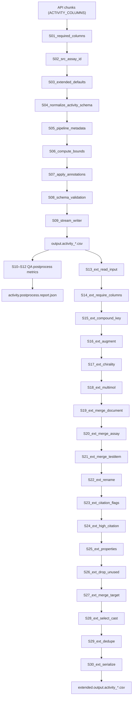

# Постобработка activity

## 1. Обзор и диаграмма пайплайна (Mermaid/Graphviz)

## 2. Контрольные точки (размеры, кардинальности, NaN)
| Контрольная точка | Метрика | Источник/описание |
|---|---|---|
| После chunk-валидации | `rows_total`, `rows_kept`, `rows_dropped` | `_capture_stats` сохраняет сводку из chunked runner и логирует `records_dropped` после завершения пайплайна. 【F:library/cli/entrypoints/activity.py†L1835-L1878】【F:library/cli/entrypoints/activity.py†L1987-L1996】 |
| Потоковая статистика CSV | `rows`, `cells`, `null_fraction` | `_StreamingCSVStatistics.update()` и `snapshot()` обновляются при каждом фильтрованном чанке перед сериализацией. Сводка проксируется в `activity_pipeline_completion`. 【F:library/cli/entrypoints/activity.py†L549-L594】【F:library/cli/entrypoints/activity.py†L1550-L1573】【F:library/cli/entrypoints/activity.py†L2066-L2081】 |
| Метрики постпроцесса | `postprocess_rows`, `postprocess_columns`, `postprocess_duration_s`, `postprocess_steps`, `postprocess_schema` | После `run_postprocessing_pipeline` значения из `PipelineRunMetrics.summary()` добавляются в payload события `activity_pipeline_done`. 【F:library/cli/entrypoints/activity.py†L1944-L2066】【F:library/postprocess/common.py†L254-L317】 |
| Extended экспорт | `rows`, `columns`, non-null counts по ключевым полям | Перед записью extended CSV логируются `activity_extended_dataframe_shape`, `activity_extended_columns` и non-null статистика. 【F:library/postprocessing/activity_extended.py†L1591-L1616】 |
| Extended дедупликация | `removed`, `remaining` | `dedupe_final` сообщает количество удалённых дублей после Power Query сортировки. 【F:library/postprocessing/activity_extended.py†L1170-L1222】 |

Кардинальности контролируются через `key_columns=["activity_id"]` в определении pipeline, а также `subset` в `dedupe_final` для extended экспорта; нарушения вызывают `ActivityExtendedError`. 【F:library/cli/entrypoints/activity.py†L1847-L1877】【F:library/postprocessing/activity_extended.py†L1170-L1212】

## 3. Стадии S01..S30

### S01_required_columns
- **Функция/блок:** `_ensure_required_activity_columns`
- **Назначение:** Добавить отсутствующие обязательные колонки схемы Pandera (`ActivitiesSchema`) с корректными dtypes, предотвращая падение валидации при неполных ответах API. 【F:library/cli/entrypoints/activity.py†L1468-L1496】【F:library/cli/entrypoints/activity.py†L264-L272】
- **Вход:** DataFrame после извлечения чанка; часть столбцов может отсутствовать.
- **Выход:** Все колонки из `_ACTIVITY_REQUIRED_COLUMNS` присутствуют с типами `Float64`, `string` или `object` в зависимости от схемы.
- **Операция:**
  - *type: derive* — определить недостающие имена и присвоить `pd.Series(pd.NA, dtype=fill_dtype)` на основе `ActivitiesSchema.columns[name].dtype`. 【F:library/cli/entrypoints/activity.py†L1468-L1496】
- **Инварианты:** После стадии `set(df.columns)` покрывает `_ACTIVITY_REQUIRED_COLUMNS`.

### S02_src_assay_id
- **Функция/блок:** `partial(_ensure_src_assay_id, lookup=assay_src_lookup)`
- **Назначение:** Заполнить `src_assay_id` по справочнику `_assay/assay.csv`, сохраняя тип `string` и оставляя пустыми строки без соответствия. 【F:library/cli/entrypoints/activity.py†L820-L924】
- **Вход:** Колонки `assay_chembl_id` и `src_assay_id` (возможны пропуски).
- **Выход:** Обновлённый `src_assay_id` с заполненными значениями и детерминированным dtype.
- **Операция:**
  - *type: join/normalize* — привести `src_assay_id` к `string`, определить `missing_mask`, замапить через lookup `{assay_chembl_id -> src_assay_id}` и заполнить только строки, где значение найдено. 【F:library/cli/entrypoints/activity.py†L893-L924】
- **Инварианты:** Пробельные строки остаются `NA`, не происходит ложных подстановок.

### S03_extended_defaults
- **Функция/блок:** `_ensure_extended_activity_columns`
- **Назначение:** Гарантировать наличие колонок расширенной витрины (ID, ключи соединений, логарифмические значения) с целевыми dtypes и fallback-логикой. 【F:library/cli/entrypoints/activity.py†L352-L369】【F:library/cli/entrypoints/activity.py†L1102-L1189】
- **Вход:** Фрейм после S02; некоторые поля (`activity_chembl_id`, `compound_name`, `log_value`, `salt_chembl_id`) могут отсутствовать либо иметь неверный dtype.
- **Выход:** Полный набор колонок `_EXTENDED_ACTIVITY_DTYPES` + синхронизированный `activity_id`/`activity_chembl_id`, вычисленный `log_value`, корректные boolean/nullable типы.
- **Операция:**
  - *type: derive* — синхронизировать идентификаторы (`activity_id ← activity_chembl_id`, `compound_key` из `parent_molecule_chembl_id`). 【F:library/cli/entrypoints/activity.py†L1102-L1159】
  - *type: derive* — применять fallback (`pchembl_value` → `log_value`, `molecule_pref_name` → `compound_name`) с сохранением extension dtypes. 【F:library/cli/entrypoints/activity.py†L1127-L1179】【F:library/cli/entrypoints/activity.py†L663-L669】
  - *Missing handling:* создавать пустые Series требуемого dtype для отсутствующих колонок. 【F:library/cli/entrypoints/activity.py†L1179-L1189】
- **Инварианты:** `result[column].dtype` соответствует `_EXTENDED_ACTIVITY_DTYPES[column]`.

### S04_normalize_activity_schema
- **Функция/блок:** `normalize_activities`
- **Назначение:** Очистка строковых значений (trim, `μM→uM`, нормализация relation-символов) и идентификаторов для совместимости с Pandera. 【F:library/schemas/normalize.py†L14-L54】
- **Операция:**
  - *type: normalize* — применять `_normalize_common` ко всем string-колонкам, приводя relation в allowlist и кастуя ID к `StringDtype` с `str.strip()`. 【F:library/schemas/normalize.py†L14-L49】
- **Инварианты:** `relation` ∈ `{<=, >=, =, ...}`, идентификаторы без пробелов.

### S05_pipeline_metadata
- **Функция/блок:** `add_pipeline_metadata`
- **Назначение:** Добавить `pipeline_version` и `timestamp_utc` (UTC ISO-8601) для трассировки выгрузки. 【F:library/pipelines/common/metadata.py†L1-L36】
- **Операция:**
  - *type: derive* — получить версию пакета и фиксированную временную метку из `pipeline_metadata()`; для пустых фреймов создать пустые Series нужного dtype. 【F:library/pipelines/common/metadata.py†L14-L34】
- **Инварианты:** Все строки имеют одинаковые значения, время в UTC.

### S06_compute_bounds
- **Функция/блок:** `_compute_bounds` → `compute_activity_bounds`
- **Назначение:** Рассчитать `lower_value`/`upper_value` используя стандартные границы, relation и конфигурацию clamp. 【F:library/cli/entrypoints/activity.py†L1458-L1465】【F:library/processing/activity/bounds.py†L282-L336】
- **Операция:**
  - *type: derive* — агрегировать `standard_lower_value`, `standard_upper_value`, `standard_value`, учитывать `relation` (`between`,`>=`,`<=`) и неопределённость. 【F:library/processing/activity/bounds.py†L282-L336】
  - *Missing handling:* логировать предупреждения при отсутствии `standard_value`. 【F:library/processing/activity/bounds.py†L308-L335】
- **Инварианты:** `lower_value ≤ upper_value` (при наличии), отрицательные значения обрезаются если включён clamp.

### S07_apply_annotations
- **Функция/блок:** `_apply_annotations` → `apply_activity_annotations`
- **Назначение:** Вычислить action type, собрать JSON `activity_properties` и `properties_hash` согласно конфигурации `activity_enrichment`. 【F:library/cli/entrypoints/activity.py†L1461-L1466】【F:library/processing/activity/annotations.py†L376-L521】
- **Операция:**
  - *type: derive* — нормализовать mapping, инференс action label (PAM/NAM/activation/inhibition/binding/triaged/unknown). 【F:library/processing/activity/annotations.py†L376-L459】
  - *type: derive* — построить JSON и хэш, логировать пропуски и распределения при включённых флагах. 【F:library/processing/activity/annotations.py†L459-L521】【F:config/config.yaml†L258-L320】
- **Инварианты:** `action_type` входит в allowlist `_ALLOWED_ACTION_TYPES`; `activity_properties` сериализуется в строку.

### S08_schema_validation
- **Функция/блок:** `validate_activities(return_result=True)`
- **Назначение:** Применить Pandera-схему `ActivitiesSchema` для каждого чанка, сохраняя скорректированные данные и фиксируя ошибки в sidecar. 【F:library/cli/entrypoints/activity.py†L1516-L1516】【F:library/validation.py†L171-L187】
- **Операция:**
  - *type: validate* — `_validate_with_schema` проверяет типы и ограничения; ошибки вызывают `ValueError` и прерывают пайплайн. 【F:library/validation.py†L171-L187】
- **Инварианты:** Отсутствие failure cases, иначе пайплайн завершится с ошибкой.

### S09_stream_writer
- **Функция/блок:** локальный `writer` + `write_csv_chunks_deterministic`
- **Назначение:** Удалить drop-колонки, зафиксировать порядок и ключи сортировки, записать CSV детерминированно. 【F:library/cli/entrypoints/activity.py†L1518-L1603】【F:library/cli/entrypoints/activity.py†L1193-L1210】【F:library/common/csv_utils.py†L572-L632】
- **Операция:**
  - *type: filter* — `_filter_activity_output_columns` удаляет `_OUTPUT_ACTIVITY_DROP_COLUMNS` и упорядочивает head/tail. 【F:library/cli/entrypoints/activity.py†L1193-L1210】【F:library/cli/entrypoints/activity.py†L373-L384】
  - *type: sort/serialize* — `write_csv_chunks_deterministic` использует `key_cols` (по умолчанию `activity_id`) и гарантирует стабильную сортировку и кодировку. 【F:library/common/csv_utils.py†L572-L632】
  - *type: monitor* — `_StreamingCSVStatistics` обновляется для каждого чанка. 【F:library/cli/entrypoints/activity.py†L549-L594】【F:library/cli/entrypoints/activity.py†L1550-L1573】
- **Инварианты:** Колонки в финальном CSV: сначала schema order, затем дополнительные (отсортированы). CSV UTF-8, повторная запись детерминирована.

### S10_table_quality_hook
- **Функция/блок:** `table_quality = build_table_quality_hook(...)`
- **Назначение:** При включённом `--emit-legacy-artifacts` сформировать отчёты качества (`*.meta.yaml`) согласно историческому поведению. 【F:library/cli/entrypoints/activity.py†L1605-L1613】
- **Операция:**
  - *type: derive* — инициализировать хук, который downstream runner вызывает после записи чанка.
- **Инварианты:** При отключённых legacy-артефактах хук заменяется на no-op.

### S11_standard_outputs
- **Функция/блок:** `_persist_standard_outputs`
- **Назначение:** Прочитать итоговый CSV, сгенерировать QC/корреляционные отчёты и стандартизованный набор файлов (`output.*`). 【F:library/cli/entrypoints/activity.py†L1615-L1665】【F:library/utils/data_correlation.py†L102-L119】【F:library/utils/qc_report.py†L220-L238】【F:library/io/output_writer.py†L47-L104】
- **Операция:**
  - *type: derive* — вычислить `table_name`/`date_tag`, построить отчёты, сохранить детерминированно, залогировать пути. 【F:library/cli/entrypoints/activity.py†L1615-L1665】
- **Инварианты:** Возвращаются пути к dataset/quality/correlation; ошибки генерации отчётов переводятся в WARN и не прерывают пайплайн.

### S12_completion_payload
- **Функция/блок:** `_emit_completion_message` + `activity_pipeline_done`
- **Назначение:** Зафиксировать итоговые метрики (`rows`, `null_fraction`, postprocess extras, extended путь) и вывести структуру результатов. 【F:library/cli/entrypoints/activity.py†L600-L660】【F:library/cli/entrypoints/activity.py†L2000-L2079】
- **Операция:**
  - *type: derive/log* — объединить `processed_ids`, stream snapshot и постпроцесс метрики в structured payload, вызвать `_emit_completion_message`. 【F:library/cli/entrypoints/activity.py†L2000-L2081】
- **Инварианты:** При `skip_existing` логируется отдельное событие; иначе фиксируется `mode="run"` и `duration_s`.

### S13_ext_read_input
- **Функция/блок:** `helpers.read_csv_strict` внутри `process_activity_extended`
- **Назначение:** Загрузить основной CSV (либо указанный, либо последний в каталоге), соблюдая Power Query параметры. 【F:library/postprocessing/activity_extended.py†L1503-L1595】
- **Операция:**
  - *type: I/O* — определить путь (`_derive_output_path`), читать CSV с жёсткой проверкой. 【F:library/postprocessing/activity_extended.py†L1485-L1595】

### S14_ext_require_columns
- **Функция/блок:** `_ensure_required_input_columns`
- **Назначение:** Обеспечить наличие обязательных полей extended workflow, используя fallback на `activity_id`, `pchembl_value` и пустые серии. 【F:library/postprocessing/activity_extended.py†L698-L726】【F:library/postprocessing/activity_extended.py†L324-L336】
- **Операция:**
  - *type: derive* — скопировать кадр, для отсутствующих колонок применить `_REQUIRED_COLUMN_FALLBACKS` или заполнить `NA` с нужным dtype. 【F:library/postprocessing/activity_extended.py†L698-L726】

### S15_ext_compound_key
- **Функция/блок:** `_ensure_compound_key_sources`
- **Назначение:** Гарантировать наличие `molecule_chembl_id`/`parent_molecule_chembl_id`, при необходимости подтягивая родителя из `molecule_hierarchy.csv`; формирует основу `compound_key`. 【F:library/postprocessing/activity_extended.py†L729-L768】【F:library/postprocessing/activity_extended.py†L542-L575】
- **Операция:**
  - *type: join* — через `_load_parent_lookup` находит родителей по `molecule_chembl_id`. 【F:library/postprocessing/activity_extended.py†L752-L758】【F:library/postprocessing/activity_extended.py†L543-L575】
  - *Validation:* отсутствие обоих идентификаторов вызывает `ActivityExtendedError`. 【F:library/postprocessing/activity_extended.py†L759-L766】

### S16_ext_augment
- **Функция/блок:** `_augment_activity_frame`
- **Назначение:** Синхронизировать `activity_chembl_id`, `compound_name`, `compound_key`, пересчитать `log_value` из pChEMBL/концентраций, нормализовать флаги цитирования. 【F:library/postprocessing/activity_extended.py†L1231-L1383】
- **Операция:**
  - *type: derive* — переносить ID, fallback на `pchembl_value`, пересчитывать pA значения, приводить boolean флаги. 【F:library/postprocessing/activity_extended.py†L1235-L1350】【F:library/postprocessing/activity_extended.py†L1351-L1383】

### S17_ext_chirality
- **Функция/блок:** `_prepare_unknown_chirality`
- **Назначение:** Перенести `nstereo` в логический флаг `unknown_chirality` и удалить исходную колонку. 【F:library/postprocessing/activity_extended.py†L642-L651】
- **Операция:**
  - *type: derive/drop* — приводить `nstereo` к `Int64`, флаг `True` если стереохимия неизвестна или отсутствует. 【F:library/postprocessing/activity_extended.py†L642-L651】

### S18_ext_multimol
- **Функция/блок:** `_apply_multimol_logic`
- **Назначение:** Определить мульти-молекулярные ассеи на основе группировки и флага `unknown_chirality`; проставить `multmol_assay`. 【F:library/postprocessing/activity_extended.py†L654-L685】
- **Операция:**
  - *type: groupby/derive* — считать количества комбинаций `_GROUP_KEY_COLUMNS`, помечать ассеи с множественными молекулами. 【F:library/postprocessing/activity_extended.py†L660-L684】

### S19_ext_merge_document
- **Функция/блок:** `_merge_document_metadata`
- **Назначение:** Присоединить `completed`, `review` из `_document/document.csv`, логируя статистику совпадений. 【F:library/postprocessing/activity_extended.py†L985-L1009】【F:library/postprocessing/activity_extended.py†L423-L487】
- **Операция:**
  - *type: join* — merge по `document_chembl_id`, нормализовать boolean поля. 【F:library/postprocessing/activity_extended.py†L985-L1005】

### S20_ext_merge_assay
- **Функция/блок:** `_merge_assay_metadata`
- **Назначение:** Добавить `assay_with_same_target` из `_assay/assay.csv`, конвертировать в `Int64`. 【F:library/postprocessing/activity_extended.py†L1012-L1034】【F:library/postprocessing/activity_extended.py†L490-L513】

### S21_ext_merge_testitem
- **Функция/блок:** `_merge_testitem_metadata`
- **Назначение:** Присоединить `standard_inchi_skeleton` из `_testitem/testitem.csv`, обеспечивая уникальность и логирование. 【F:library/postprocessing/activity_extended.py†L1037-L1083】【F:library/postprocessing/activity_extended.py†L516-L539】

### S22_ext_rename
- **Функция/блок:** `_rename_columns`
- **Назначение:** Привести имена к историческому Power Query формату (например, `salt_chembl_id`→`saltform_id`, `log_value`→`pA_value`). 【F:library/postprocessing/activity_extended.py†L771-L780】

### S23_ext_citation_flags
- **Функция/блок:** `_compute_citation_flags`
- **Назначение:** Аггрегировать флаги цитирования и вывести `is_citation`. 【F:library/postprocessing/activity_extended.py†L931-L948】

### S24_ext_high_citation
- **Функция/блок:** `_annotate_high_citation`
- **Назначение:** Использовать `citation_fraction.csv` для расчёта `high_citation_rate`. 【F:library/postprocessing/activity_extended.py†L951-L982】【F:library/postprocessing/activity_extended.py†L324-L336】

### S25_ext_properties
- **Функция/блок:** `_extract_activity_properties_flags`
- **Назначение:** Распарсить `activity_properties` JSON, выделить `allosteric`, `pam`, `nam` и другие флаги. 【F:library/postprocessing/activity_extended.py†L877-L929】

### S26_ext_drop_unused
- **Функция/блок:** `_drop_unused_columns`
- **Назначение:** Удалить временные/служебные колонки после объединений, сохранив только финальный набор. 【F:library/postprocessing/activity_extended.py†L786-L836】

### S27_ext_merge_target
- **Функция/блок:** `_merge_target_metadata`
- **Назначение:** Дополнить целевые аннотации (`IUPHAR_class`, `multifunctional_enzyme`, `unicellular_organism`) из `targets_type.csv`. 【F:library/postprocessing/activity_extended.py†L1086-L1122】【F:library/postprocessing/activity_extended.py†L339-L420】

### S28_ext_select_cast
- **Функция/блок:** `_select_and_cast`
- **Назначение:** Применить финальный порядок колонок `_FINAL_COLUMN_ORDER`, привести boolean и числовые поля к строковым представлениям, совместимым с Power Query. 【F:library/postprocessing/activity_extended.py†L1125-L1167】

### S29_ext_dedupe
- **Функция/блок:** `dedupe_final`
- **Назначение:** Отсортировать и удалить дубликаты по набору `_DEDUPE_SUBSET_KEYS`, имитируя Excel Power Query. 【F:library/postprocessing/activity_extended.py†L1170-L1222】

### S30_ext_serialize
- **Функция/блок:** `helpers.write_csv`
- **Назначение:** Сериализовать extended витрину с фиксированным порядком и логированием, возвращая путь `extended.output.activity_<stamp>.csv`. 【F:library/postprocessing/activity_extended.py†L1591-L1625】

## 4. Используемые словари и схемы

| Словарь/схема | Ключи соединения | Колонки | Назначение |
|---|---|---|---|
| `config/dictionary/_assay/assay.csv` | `assay_chembl_id` | `src_assay_id`, `assay_with_same_target` | Заполнение `src_assay_id` (основной CSV) и расширенных флагов мультитаргетных ассев. 【F:library/cli/entrypoints/activity.py†L820-L882】【F:library/postprocessing/activity_extended.py†L490-L513】 |
| `config/dictionary/_document/document.csv` | `document_chembl_id` | `completed`, `review` | Метаданные документов для extended экспорта. 【F:library/postprocessing/activity_extended.py†L423-L487】【F:library/postprocessing/activity_extended.py†L985-L1009】 |
| `config/dictionary/_testitem/testitem.csv` | `molecule_chembl_id` | `standard_inchi_skeleton` | Обогащение тестовых веществ (extended). 【F:library/postprocessing/activity_extended.py†L516-L539】【F:library/postprocessing/activity_extended.py†L1037-L1083】 |
| `config/dictionary/_testitem/molecule_hierarchy.csv` | `molecule_chembl_id` | `parent_molecule_chembl_id` | Определение родителя для `compound_key`. 【F:library/postprocessing/activity_extended.py†L542-L575】【F:library/postprocessing/activity_extended.py†L729-L758】 |
| `config/dictionary/_activity/citation_fraction.csv` | `N` | `K_min_significant` | Пороговые значения для `high_citation_rate`. 【F:library/postprocessing/activity_extended.py†L324-L336】【F:library/postprocessing/activity_extended.py†L951-L972】 |
| `config/dictionary/targets_type.csv` (и `_target` варианты) | `target_chembl_id` | `IUPHAR_class`, `IUPHAR_subclass`, `multifunctional_enzyme`, `unicellular_organism`, `sortorder.target`, `gene_index`, `taxon_index` | Добавление таксономических и функциональных атрибутов. 【F:library/postprocessing/activity_extended.py†L339-L361】【F:library/postprocessing/activity_extended.py†L1086-L1118】 |
| `ActivitiesSchema` | — | типы и обязательные поля | Валидация chunkов до сериализации. 【F:library/validation.py†L171-L187】 |
| `library.postprocessing.activities.ACTIVITY_SCHEMA` | — | столбцы extended постпроцесса | Валидация QA-пайплайна после `run_activity_postprocess`. 【F:library/cli/entrypoints/activity.py†L1233-L1253】 |

## 5. Инварианты и проверки (чек-лист)
- `activity_id` уникален на уровне чанка; глобальную уникальность обеспечивает сортировка+ключи при записи (`key_columns=['activity_id']`). 【F:library/cli/entrypoints/activity.py†L1847-L1857】【F:library/common/csv_utils.py†L572-L632】
- Все требуемые колонки присутствуют перед Pandera-валидацией (S01). 【F:library/cli/entrypoints/activity.py†L1468-L1496】
- `src_assay_id` заполняется только при наличии справочника; отсутствие lookup не приводит к ошибке. 【F:library/cli/entrypoints/activity.py†L820-L924】
- `lower_value`/`upper_value` совпадают с бизнес-правилами ChEMBL (отношения, диапазоны). 【F:library/processing/activity/bounds.py†L282-L336】
- `action_type` принадлежит allowlist из конфигурации; unmapped значения логируются. 【F:library/processing/activity/annotations.py†L376-L521】【F:config/config.yaml†L258-L320】
- Deterministic CSV writer: одинаковый порядок колонок и сортировка обеспечивают идемпотентность. 【F:library/cli/entrypoints/activity.py†L1521-L1587】【F:library/common/csv_utils.py†L572-L632】
- Extended пайплайн проверяет наличие всех колонок `_REQUIRED_COLUMNS` и выбрасывает `ActivityExtendedError`, если вход неконсистентен. 【F:library/postprocessing/activity_extended.py†L1231-L1435】
- Дедупликация extended экспорта строго повторяет Power Query порядок и набор ключей. 【F:library/postprocessing/activity_extended.py†L1170-L1222】

## 6. Известные углы и риски
- **Справочники отсутствуют или повреждены.** Все `_load_*` функции выбрасывают `ActivityExtendedError` с явным путём; без справочника extended пайплайн прерывается. 【F:library/postprocessing/activity_extended.py†L324-L575】
- **Неподдерживаемые кодировки CSV.** `_load_document_lookup` перебирает разделители и логирует подробности; при полном провале сообщает пользователю все варианты. 【F:library/postprocessing/activity_extended.py†L423-L480】
- **Неопределённая стереохимия.** `_prepare_unknown_chirality` помечает `unknown_chirality=True`, что влияет на `multmol_assay` и downstream отчёты. 【F:library/postprocessing/activity_extended.py†L642-L684】
- **Пустой вход.** Все ensure-функции создают пустые Series правильного dtype, чтобы Pandera/писатель корректно обработали zero-row кадры. 【F:library/cli/entrypoints/activity.py†L1105-L1110】【F:library/postprocessing/activity_extended.py†L702-L708】

## 7. Приложения: таблицы колонок
- Таблица колонок: [docs/tables/activity_columns_20251011.csv](tables/activity_columns_20251011.csv)
