# Обзор архитектуры

> **Languages:** [English](../en/ARCHITECTURE.md) · Русский

Этот документ предоставляет общий обзор архитектуры системы ChEMBL Data Acquisition. Для подробной технической документации см. [Справочник по архитектуре](./architecture/ARCHITECTURE.md).

## Быстрая навигация

- **[Контекст системы](#контекст-системы)** - Общий обзор системы
- **[Зависимости компонентов](#зависимости-компонентов)** - Как компоненты взаимодействуют
- **[Сотрудничество пайплайнов](#как-пайплайны-сотрудничают)** - Поток данных между пайплайнами
- **[Рекомендации для разработчиков](#рекомендации-для-разработчиков)** - Для разработчиков

## Подробная документация

Для всесторонних технических деталей обратитесь к:

- **[Справочник по архитектуре](./architecture/ARCHITECTURE.md)** - Подробная системная архитектура
- **[Поток данных ETL](./architecture/ETL_DATA_FLOW.md)** - Диаграммы потоков пайплайнов
- **[Процесс ETL](./architecture/ETL_PROCESS.md)** - Пошаговая документация процессов
- **[Модель данных](./architecture/DATA_MODEL.md)** - Схема базы данных и связи
- **[Улучшения архитектуры](./architecture/ARCHITECTURE_IMPROVEMENTS.md)** - Запланированные улучшения

## Контекст системы

```mermaid
flowchart LR
  subgraph Входы
    A[CSV/TSV с идентификаторами]
    B[Конфигурация\n(config.yaml, CLI-флаги)]
    C[Переменные окружения]
  end
  subgraph Оркестрация
    D[Консольные команды\n(get-*/pipeline CLI)]
    E[modules scripts.get_*]
  end
  subgraph Ядро пайплайна
    F[library.pipelines.*\n(оркестраторы)]
    G[library.io\n(потоковый ввод/вывод)]
    H[library.clients\n(HTTP-клиенты)]
    I[library.integration\n(локальные ресурсы)]
    J[library.postprocessing]
    K[library.validation\nи схемы]
    L[library.table_quality]
    M[library.metadata]
  end
  subgraph Выходы
    N[Детерминированные CSV]
    O[YAML с метаданными]
    P[Отчёты качества\n(.quality.json, CSV)]
    Q[Сырые снимки\n(опционально)]
  end
  Входы --> D
  D --> E --> F
  F --> G
  F --> H
  F --> I
  F --> J
  F --> K
  F --> L
  F --> M
  G --> F
  H -->|Запросы| External[(ChEMBL, PubMed, UniProt, PubChem, OpenAlex, Semantic Scholar, CrossRef)]
  I -->|Локальные чтения| Local[(CSV/Parquet словари)]
  F --> N
  F --> O
  F --> P
  F --> Q
```

Основные моменты:

- **Консольные точки входа** проксируют аргументы в соответствующие модули
  `scripts.get_*`, обеспечивая единый уровень логирования и загрузку
  конфигурации.
- **Оркестраторы пайплайнов** в `library.pipelines` объединяют чанковый ввод,
  HTTP-клиентов, пост-обработку, валидацию и экспорт.
- **Потоковые загрузчики** из `library.io` читают и записывают данные чанками,
  сохраняя детерминированный порядок строк и колонок.
- **Клиенты и интеграции** инкапсулируют ретраи, ограничение RPS и кеширование
  запросов ко внешним API и локальным словарям.
- **Пост-обработка** приводит доменные поля к целевому виду перед валидацией
  (классификация публикаций, вычисление счётчиков по таргетам, агрегация
  синонимов и т.д.).
- **Валидация и отчёты качества** гарантируют соответствие схемам и формируют
  артефакты для QA.

За подробностями о том, как пайплайн test item использует parent-molecule
словарь и выравнивает данные для последующих стадий, обратитесь к
[руководству по расширенным сценариям](./guides/ADVANCED_SCENARIOS.md).

## Зависимости компонентов

```mermaid
graph TD
  subgraph Общие хелперы
    IO[library.io]
    Clients[library.clients]
    Integrations[library.integration]
    Post[library.postprocessing]
    Validation[library.validation & schemas]
    Metadata[library.metadata]
    Quality[library.table_quality]
  end

  Activity[scripts.get_activity_data\n+ library.pipelines.activity] --> IO
  Activity --> Clients
  Activity --> Post
  Activity --> Validation
  Activity --> Metadata
  Activity --> Quality

  Assay[scripts.get_assay_data\n+ library.pipelines.assay] --> IO
  Assay --> Clients
  Assay --> Post
  Assay --> Validation
  Assay --> Metadata
  Assay --> Quality

  Document[scripts.get_document_data\n+ library.pipelines.document] --> IO
  Document --> Clients
  Document --> Integrations
  Document --> Post
  Document --> Validation
  Document --> Metadata
  Document --> Quality

  TestItem[scripts.get_testitem_data\n+ library.pipelines.testitem] --> IO
  TestItem --> Clients
  TestItem --> Integrations
  TestItem --> Post
  TestItem --> Validation
  TestItem --> Metadata
  TestItem --> Quality

  Target[scripts.get_target_data\n+ library.pipelines.target] --> IO
  Target --> Clients
  Target --> Integrations
  Target --> Post
  Target --> Validation
  Target --> Metadata
  Target --> Quality
```



Схема подчёркивает, что все пайплайны используют единый набор утилит, что
упрощает сопровождение и синхронизацию изменений.

## Слои и ответственность

| Слой | Модули | Роль |
|------|--------|------|
| Конфигурация | `config/config.yaml`, `config.schema.json`, пакет `library/config/` | Определяют хосты API, лимиты, пути, опции нормализации и правила загрузки `.env`. |
| Точки входа | `scripts/*.py`, `library/cli/commands/*`, `library/utils/cli_tools/*` | Парсят CLI, подготавливают пути, запускают пайплайны, оркестратор `get-data` и вспомогательные утилиты. |
| Клиенты | `library/clients/*`, `library/utils/http.py` | Устанавливают HTTP-сессии, ретраи, rate limiting и потоковую пагинацию. |
| Нормализация и схемы | `library/schemas/*`, `library/normalization/*` | Приводят типы данных к стандарту, выравнивают операторы и применяют Pandera-схемы. |
| Пост-обработка | `library/postprocessing/*`, `library/processing/*` | Вычисляют производные поля, объединяют словари, готовят порядок колонок. |
| Экспорт и метаданные | `library/io/*`, `library/metadata.py`, `library/table_quality.py` | Записывают CSV/Parquet, создают YAML с контрольными суммами, формируют отчёты качества. |
| QA и наблюдаемость | `logs/` (или `<base>/logs`), `library/common/log.py`, `library/utils/cli_tools/table_quality_main.py` | Структурированное логирование, профилирование таблиц, диагностика ошибок. |

Диаграммы помогают быстро определить, в каком слое вносить изменения при
добавлении новой сущности или адаптации правил очистки данных.

## Взаимодействие пайплайнов

За целостным описанием идентификаторов и потребителей на стыке пайплайнов
обратитесь к разделу [`Cross-pipeline relationships`](./architecture/ETL_DATA_FLOW.md#cross-pipeline-relationships).
В нём показано, как экспорты документов, таргетов, ассайев, тестовых объектов и
активностей опираются друг на друга через общие ключи.

## Рекомендации для контрибьюторов

- Собирайте новые пайплайны из существующих слоёв вместо написания
  отдельных скриптов. Это гарантирует детерминированные выгрузки, согласованные
  метаданные и предсказуемые QA-артефакты.
- При изменении зависимостей (например, добавлении клиента или post-processing
  хелпера) обязательно обновляйте диаграмму, чтобы ревьюеры видели потенциальный
  радиус влияния.
- Расширяйте функциональность через существующие точки: HTTP-адаптеры храните в
  `library.clients`, локальные мапперы — в `library.integration`, валидаторы — в
  `library.validation`, чтобы оркестраторы оставались лаконичными.

## См. также

- **[Справочник по архитектуре](./architecture/ARCHITECTURE.md)** - Подробная техническая архитектура
- **[Поток данных ETL](./architecture/ETL_DATA_FLOW.md)** - Диаграммы потоков и последовательностей
- **[Процесс ETL](./architecture/ETL_PROCESS.md)** - Пошаговые детали выполнения
- **[Модель данных](./architecture/DATA_MODEL.md)** - Схема и связи данных
- **[Расширенные сценарии](./guides/ADVANCED_SCENARIOS.md)** - Сложные паттерны использования
- **[Руководство по конфигурации](./CONFIG.md)** - Опции конфигурации системы
