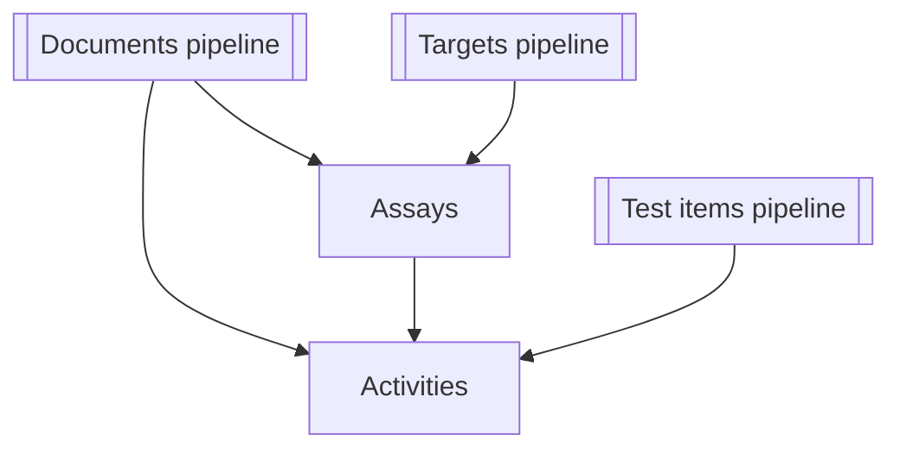

# Поток данных ETL для `get_*_data.py`

Этот документ суммирует источники входных данных, внешние сервисы, этапы обработки и конечные артефакты для каждой утилиты командной строки `get_*_data.py`. Используйте его как карту при онбординге в конвейеры получения данных ChEMBL.

## `scripts/get_activity_data.py`

### 1. Общая структура процесса

- **Источник:** REST API ChEMBL (`/chembl/api/data/activity`).
- **Назначение:** формирование унифицированной таблицы активности соединений.
- **Конечный артефакт:** `raw.activity_{YYYYMMDD}.csv` в каталоге выгрузки.

### 2. Ключевые функции

| Функция | Назначение |
| --- | --- |
| `_init_request_params` | Собирает параметры запроса (limit, offset, fields, expand, timeout) из `config/acquisition.yaml` с дефолтами пайплайна. |
| `_fetch_page` | Выполняет одиночный REST-запрос к ChEMBL и возвращает страницу данных. |
| `_collect_all_batches` | Проходит по пагинации API, собирая все страницы в общий набор. |
| `_validate_response` | Проверяет структуру ответа, приводит JSON к DataFrame и фильтрует некорректные записи. |
| `_save_raw_activity` | Сохраняет итоговый DataFrame в CSV с фиксированным порядком колонок. |

### 3. Последовательность шагов извлечения

| Шаг | Функция | Назначение | Тип операции | Вход | Выход | Контрольные проверки |
| --- | --- | --- | --- | --- | --- | --- |
| **S01: Инициализация параметров** | `_init_request_params` | Формирование параметров REST-запросов. | Конфигурация | `config/acquisition.yaml` | Словарь, например: `{"limit": 1000, "offset": 0, "fields": "activity_id,assay_chembl_id,document_chembl_id,molecule_chembl_id,standard_type,standard_value,standard_units,pchembl_value", "expand": True, "timeout": 30}` | Проверка обязательных ключей (`limit`, `fields`, `timeout`); логирование параметров в `logs/get_activity_data_{YYYYMMDD}.log`. |
| **S02: Отправка запросов** | `_fetch_page` | Получение страниц данных из ChEMBL. | REST-запрос | Endpoint `/chembl/api/data/activity`; параметры limit/offset/fields/expand; заголовок `Content-Type: application/json`. | JSON-страница с блоками `page_meta` и `activities`. | Статус HTTP 200; наличие `page_meta` и `activities`; повтор при `HTTP 429`, `ReadTimeout`, `ChunkedEncodingError`. |
| **S03: Обработка ответов** | `_validate_response` | Проверка и нормализация данных страницы. | Фильтрация и валидация | JSON-ответ | DataFrame валидных записей | Проверка обязательных полей (`activity_id`, `assay_chembl_id`, `standard_value`); устранение дубликатов по `activity_id`. |
| **S04: Агрегация и проверка полноты** | `_collect_all_batches` | Итерация по пагинации до полного набора. | Пагинация и объединение | Параметры запроса + функция `_fetch_page` | Единый DataFrame | Сопоставление `total_count` из API с числом строк; контроль уникальности `activity_id`. |
| **S05: Сохранение результатов** | `_save_raw_activity` | Запись итогового CSV. | Запись файла | DataFrame активности | `raw.activity_{YYYYMMDD}.csv` | Фиксированный порядок колонок; кодировка UTF-8; логирование размера файла и числа строк. |

### 4. Обработка ошибок и ретраи

- Повторные попытки при `HTTP 429`, `ReadTimeout`, `ChunkedEncodingError` с экспоненциальной задержкой `1/2/4/8/16` секунд (максимум 5 попыток).
- При превышении лимита попыток ошибка логируется на уровне `ERROR`, пайплайн продолжает обработку следующих страниц.

### 5. Контрольные точки качества

- Сравнение количества загруженных записей с `total_count` из API.
- Проверка уникальности ключа `activity_id` в финальном DataFrame.
- Мониторинг средней длительности обработки 1000 записей по логам производительности.

### 6. Конфигурации и зависимости

- `config/acquisition.yaml` — параметры API-запросов (`limit`, `timeout`, `fields`).
- `config/chembl_endpoints.yaml` — базовые пути для REST-вызовов.
- Модули: `library/clients/chembl_api.py`, `utils/network.py`, `library/io/chembl_cache.py`.

### 7. Логирование и кэширование

- Логи: `logs/get_activity_data_{YYYYMMDD}.log` с уровнями `INFO`, `WARNING`, `ERROR`.
- Кэш страниц: `cache/chembl_activity_{offset}.pkl`, срок хранения 7 дней.

### 8. Возможные узкие места и рекомендации

- Сетевые задержки — рассмотреть асинхронный клиент для снижения времени ожидания.
- Ограничения API — согласовать повышение `limit` с командой ChEMBL.
- Надёжность — сохранять промежуточные результаты, чтобы избежать потери данных при сбоях.

### 9. Схема выходных данных

| name | type | nullable | domain | source_stage | description | source |
| --- | --- | --- | --- | --- | --- | --- |
| `activity_id` | int64 | False | уникальный идентификатор активности | `S04_merge_batches` | Уникальный идентификатор записи активности в ChEMBL | `ChEMBL /api/data/activity/activity_id` |
| `assay_chembl_id` | string | False | `CHxxxxxx` | `S02_fetch_page` | Идентификатор биологического теста, связанного с активностью | `ChEMBL /api/data/activity/assay_chembl_id` |
| `document_chembl_id` | string | True | `CHEMBL_DOC_xxx` | `S02_fetch_page` | Идентификатор публикации или источника данных | `ChEMBL /api/data/activity/document_chembl_id` |
| `molecule_chembl_id` | string | True | `CHEMBLxxxx` | `S02_fetch_page` | Идентификатор исследуемого соединения | `ChEMBL /api/data/activity/molecule_chembl_id` |
| `standard_type` | string | True | `pIC50 / IC50 / Ki / EC50` | `S03_normalize_fields` | Тип измеряемой активности | `ChEMBL /api/data/activity/standard_type` |
| `standard_value` | float64 | True | ≥0 | `S03_normalize_fields` | Числовое значение активности | `ChEMBL /api/data/activity/standard_value` |
| `standard_units` | string | True | `nM / µM` | `S03_normalize_fields` | Единицы измерения активности | `ChEMBL /api/data/activity/standard_units` |
| `pchembl_value` | float64 | True | 0–14 | `S04_compute_pchembl` | Приведённое значение активности по шкале pChEMBL | `ChEMBL /api/data/activity/pchembl_value` |
| `pipeline_version` | string | False | `vYYYYMMDD` | `S05_finalize` | Версия пайплайна, использованная при формировании данных | internal (derived) |
| `timestamp_utc` | datetime | False | UTC | `S05_finalize` | Время формирования записи в UTC | internal (derived) |

## `scripts/get_assay_data.py`

| Аспект | Детали |
| --- | --- |
| **Источники и формат входа** | CSV с идентификаторами ассаев (по умолчанию `assay_chembl_id`), потоковое чтение с опциональным ограничением строк. |
| **Внешние сервисы / файлы** | API ChEMBL через `ChemblClient`; постобработку для ассаев выполняет `library.pipelines.assay.postprocessing`. |
| **Ключевые преобразования** | Постобработка сырых данных, нормализация значений, добавление метаданных запуска, упорядочивание колонок по `AssaysSchema`, валидация с записью ошибок во вспомогательные файлы. |
| **Выход и хранение** | CSV с детерминированным порядком строк, YAML с метаданными запуска и артефакты анализа качества таблицы. |
| **Связи** | Записи ассаев содержат `document_chembl_id` (документы) и `target_chembl_id` (мишени), формируя связи для конвейеров активности и таргетов. |

## `scripts/get_document_data.py`

Утилита поддерживает подкоманды `pubmed`, `chembl` и `all`.

| Подкоманда | Вход и источники | Внешние сервисы | Преобразования | Выход |
| --- | --- | --- | --- | --- |
| `pubmed` | CSV с колонкой PMIDs (по умолчанию `PMID`), опционально дополнительный CSV с DOI для переопределения значений. | Пакетные запросы к Entrez PubMed, а также API Semantic Scholar, OpenAlex и CrossRef с индивидуальными лимитами скорости. | Параллельное получение метаданных, объединение ответов, нормализация и передача в общую процедуру экспорта. | Нормализованный CSV, YAML с метаданными, отчёт `.quality.json` и диагностические метрики качества таблицы рядом с CSV. |
| `chembl` | CSV с идентификаторами документов ChEMBL (по умолчанию `document_chembl_id`). | API ChEMBL (endpoint документов). | Опциональная нормализация DOI, выравнивание колонок и экспорт через `_finalise_export`. | Тот же набор артефактов, что и выше. |
| `all` | CSV с идентификаторами документов для запуска последовательных запросов ChEMBL и PubMed; дополнительные параметры ограничения и размера пакета. | Комбинирует вызовы ChEMBL, PubMed, Semantic Scholar, OpenAlex и CrossRef; повторно использует DOI при отсутствии данных PubMed. | Объединяет метаданные ChEMBL и литературы, постобрабатывает поля и вызывает общую процедуру экспорта. | CSV + YAML с метаданными + `.quality.json` + диагностические файлы качества таблицы. |

**Связи:** Выгрузка документов содержит `document_chembl_id` и унифицированные библиографические атрибуты, используемые в таблицах ассая и активности, что обеспечивает трассируемость экспериментальных записей до публикаций.

## `scripts/get_target_data.py`

Конвейер таргетов предоставляет сценарии `uniprot`, `chembl`, `iuphar` и `all`.

| Подкоманда | Вход и источники | Внешние сервисы / файлы | Преобразования | Выход |
| --- | --- | --- | --- | --- |
| `uniprot` | CSV с идентификаторами UniProt (по умолчанию `uniprot_id`), сформированный на предыдущих шагах. | REST/flat-file сервисы UniProt через `library.integration.uniprot_library` с опциональным локальным кэшем. | Подготовка временного списка, запуск обработки UniProt и объединение соответствий перед экспортом. | CSV, YAML с метаданными и анализ качества для обогащения UniProt. |
| `chembl` | CSV с идентификаторами таргетов ChEMBL (по умолчанию `target_chembl_id`). | API ChEMBL и сервис сопоставления UniProt для протеиновых акцессий. | Нормализация, добавление метаданных запуска, согласование со схемой, валидация и сохранение со статистикой. | CSV таргетов, YAML с метаданными, отчёты качества таблицы. |
| `iuphar` | CSV (обычно объединённый вывод ChEMBL/UniProt) с опциональным ограничением для тестов. | Локальные CSV IUPHAR (`target_csv`, `family_csv`). | Сопоставление UniProt-ID с классификациями IUPHAR и экспорт таблицы соответствий. | CSV классификаций с метаданными и анализом качества. |
| `all` | Итоговый CSV идентификаторов таргетов, запускающий цепочку запросов; пути промежуточных файлов настраиваются. | Последовательно вызывает три конвейера выше (API ChEMBL, сервисы UniProt, файлы IUPHAR). | Объединяет промежуточные результаты, выполняет постобработку и валидацию итоговой схемы перед записью. | Консолидированный CSV таргетов плюс промежуточные артефакты каждого шага с метаданными и проверками качества. |

**Связи:** Выгрузка таргетов используется в ассаях через `target_chembl_id` и унипротовские атрибуты, что поддерживает анализ активности и фильтры по классам таргетов.

## `scripts/get_testitem_data.py`

| Аспект | Детали |
| --- | --- |
| **Источники и формат входа** | CSV со списком идентификаторов молекул ChEMBL (по умолчанию `molecule_chembl_id`), потоковое чтение с опциональными ограничениями. |
| **Внешние сервисы / файлы** | API ChEMBL для базовых данных соединений и API PubChem для обогащения по SMILES. |
| **Ключевые преобразования** | Обогащение результатов ChEMBL идентификаторами/свойствами PubChem, нормализация, объединение с кэшированным каталогом родителей, добавление метаданных запуска и валидация схемой `TestitemsSchema` с вынесением ошибок в отдельные файлы. |
| **Выход и хранение** | CSV с объединёнными полями ChEMBL/PubChem, YAML с метаданными и диагностикой качества рядом с экспортом. |
| **Связи** | Таблица активностей использует `molecule_chembl_id`, что позволяет связывать показатели активности с обогащёнными свойствами соединений. |

## Взаимосвязи конвейеров

*Документный конвейер* агрегирует метаданные PubMed, Semantic Scholar, OpenAlex, CrossRef и ChEMBL в записи вокруг `document_chembl_id`, которые используются ассаями и активностями.

*Конвейер таргетов* объединяет атрибуты ChEMBL, UniProt и IUPHAR, формируя идентификаторы, на которые ссылаются ассаи и аналитика активностей.

*Конвейер тест-айтемов* обогащает молекулы свойствами PubChem и добавляет связи родитель→потомок из локального каталога, что позволяет использовать как `molecule_chembl_id`, так и `parent_molecule_chembl_id` при объединении с активностями.
