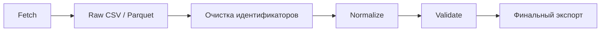

# Обзор процесса ETL

> **Languages:** [English](../en/ETL_PROCESS.md) · Русский

Этот документ предоставляет общий обзор процесса ETL для ChEMBL Data Acquisition. Для подробной пошаговой документации процессов см. [Справочник по процессу ETL](./architecture/ETL_PROCESS.md).

## Быстрая навигация

- **[Обзор ETL](#обзор-etl-процесса)** - Общая сводка процесса
- **[Источники данных](#источники-данных)** - Внешние сервисы и API
- **[Преобразование данных](#преобразование-данных)** - Этапы обработки
- **[Детали пайплайнов](#детали-пайплайнов)** - Процессы по сущностям

## Подробная документация

Для всесторонней документации процессов обратитесь к:

- **[Справочник по процессу ETL](./architecture/ETL_PROCESS.md)** - Подробные пошаговые процессы
- **[Справочник по потоку данных ETL](./architecture/ETL_DATA_FLOW.md)** - Диаграммы потоков и последовательностей
- **[Обзор архитектуры](./ARCHITECTURE.md)** - Обзор системной архитектуры

## Обзор ETL-процесса

Пайплайн управляется единым конфигурационным файлом `config/config.yaml`, где описаны базовые URL внешних API, параметры ретраев, ограничения по RPS, настройки логирования и директории для входных/выходных данных. Командные скрипты в `scripts/` организованы по сущностям и опираются на общие утилиты ввода/вывода, нормализации, валидации и логирования из пакета `library/`, а вспомогательные инструменты теперь живут в `library.utils.cli_tools`, что обеспечивает повторяемое выполнение для документов, ассайев, активностей, тестовых веществ и таргетов.

## Источники данных

| Источник | Подключение | Извлекаемые данные |
| --- | --- | --- |
| **ChEMBL API** | HTTP-клиент `ChemblClient` управляет заголовками и ретраями, а тематические функции `get_documents`, `get_assays`, `get_activities`, `get_testitem`, `get_targets` принимают параметры chunk-size/timeout из конфигурации и батчат запросы к API. | Метаданные публикаций, ассайев, активностей, тестовых веществ и таргетов с ключевыми идентификаторами (`document_chembl_id`, `assay_chembl_id`, `target_chembl_id`, `molecule_chembl_id`, `pubmed_id`). |
| **PubMed / Semantic Scholar / OpenAlex / CrossRef** | Модуль `fetch_pubmed_records` и фасад `library.clients` используют настройки задержек, лимитов и параллельности из секций `document.pubmed` и `document.all`, объединяя ответы в единый датафрейм. | XML-метаданные PubMed, типы публикаций, DOI, идентификаторы и кросс-ссылки из Scholar, OpenAlex и CrossRef. |
| **UniProt REST API** | `uniprot_library.process` получает JSON-записи с соблюдением RPS, повторно используя подготовленные CSV акцессии; режим `target all` оборачивает вызовы и кэширует результаты. Низкоуровневый клиент поддерживает общую потокобезопасную сессию, поэтому рабочие потоки могут обращаться параллельно. | Полные карточки UniProt: названия, таксономия, последовательности, вторичные акцессии и связанные кросс-ссылки. |
| **IUPHAR и локальные CSV** | `fetch_iuphar` читает локальные классификаторы и, при необходимости, вызывает REST сервисы; далее `target_postprocessing` объединяет справочники с ChEMBL/UniProt. | Классификации IUPHAR, семейства, HGNC-идентификаторы и прогнозы классов белков. |
| **PubChem PUG REST** | Функция `add_pubchem_data` инициализирует сессию PubChem, затем делает запросы по уникальным SMILES с задержками из конфигурации `pubchem`. | CID, IUPAC-имена, формулы, InChI и SMILES для обогащения тестовых веществ. |
| **Локальные словари и подготовленные CSV/Excel** | `io.read_ids` и отдельные модули используют файлы из `config/dictionary/` и `data/` в качестве входных списков идентификаторов или справочников, сокращая количество внешних запросов. | Ограничительные списки ID, словари типов таргетов и Excel-книги инициализации. |

## Преобразование данных

### Унифицированный конвейер стадий

Каждый пайплайн теперь следует единому сценарию, что упрощает мониторинг и согласует артефакты:

* **Fetch** — чтение идентификаторов (включая составные через `--id-cols`) и обращения к внешним сервисам или локальным кешам.
* **Raw CSV / Parquet** — при наличии соответствующих флагов сохранение необработанного ответа в `--raw-out` (поддерживается `--raw-format parquet`). По умолчанию столбцы сортируются по алфавиту для воспроизводимой структуры; `--no-reindex-raw` сохраняет исходный порядок из API для отладки.
* **Очистка идентификаторов** — обрезка пробелов, дедупликация и отделение временных идентификаторов при сохранении их в «сыром» снимке.
* **Normalize** — унификация типов данных, операторов и регистра для детерминированной валидации. Управляется парой `--normalize-at-export` / `--no-normalize-at-export` в таргет-пайплайне.
* **Validate** — запуск схем `pandera` с выводом некорректных строк в sidecar CSV, ссылка на который попадает в YAML метаданных.
* **Финальный экспорт** — запись очищенной таблицы в `--final-out`, добавление метаданных и отчётов качества. Для обратной совместимости остаётся скрытый алиас `--out`, который выводит предупреждение и не документируется. Пара `--normalize-at-export` / `--no-normalize-at-export` регулирует, выполняется ли нормализация на этом этапе (по умолчанию включена) или финальный CSV копируется байт-в-байт из «сырого» снимка.

> **Примечание.** Флаги `--raw-out`, `--final-out`, `--raw-format`, `--id-cols`, `--no-reindex-raw`, а также пара `--normalize-at-export` / `--no-normalize-at-export` по-прежнему уникальны для `get-target-data` и `library.utils.cli_tools.pipeline_targets_main`, но `--final-out` является единым стандартом во всех CLI. Сохраняется только скрытый алиас `--out` для старых сценариев; при использовании он пишет предупреждение.

Такие заглушки, как временные ID ChEMBL или PubMed, на этапе очистки превращаются в явные строки с подсчётом в метаданных (`error_placeholder_counts`). «Сырой» экспорт сохраняет их для аудита, а финальная таблица содержит только проверенные значения.

### Общие шаги нормализации и контроля качества

Все сущности проходят через единый слой нормализации `schemas.normalize`, который заменяет нестандартные знаки «μ» на «u», выравнивает операторы сравнения (`<` → `<=`, `>` → `>=`) и подрезает идентификаторы по всему датафрейму, тем самым устраняя расхождения между источниками до начала валидации. После нормализации каждый скрипт добавляет технические столбцы `pipeline_version` и `timestamp_utc` с помощью `add_pipeline_metadata`, извлекая версию из `pyproject.toml` или установленного пакета для трассируемости выгрузки.

Валидация осуществляется через `pandera`: при несоответствиях ошибки аккумулируются классом `SidecarErrors`, который собирает нарушения по строкам и сохраняет их в отдельный CSV с метаданными, не прерывая основную выгрузку. Экспорт выполняет `io.write_csv`, обеспечивая детерминированное упорядочивание строк и колонок, создание каталогов и генерацию YAML sidecar с командой запуска, конфигурацией и хешем файла. После записи каждая таблица дополнительно оценивается функцией `analyze_table_quality`, формируя числовые профили и распределения типов.

### Пайплайн документов

1. **Сбор и объединение** — режим `all` сначала вытягивает метаданные документов ChEMBL, нормализует DOI локально, затем при необходимости извлекает PubMed-идентификаторы и обращается к PubMed, Semantic Scholar, OpenAlex и CrossRef, сохраняя карту DOI для повторного использования. Функция `merge_with_chembl` выравнивает типы `pubmed_id` и соединяет внешние метаданные с выгрузкой ChEMBL, исключая дублирующиеся поля. Журналирование прогресса теперь выдаёт сообщения INFO каждые 100 завершённых пакетов, оставляя промежуточные обновления в DEBUG и тем самым снижая шум при длительных запусках.
2. **Нормализация источников** — `merge_metadata` выравнивает DOI между источниками, собирает уникальные типы публикаций, рассчитывает взвешенные скоринги (review/experimental/unknown) и формирует итоговую классификацию, что позволяет унифицировать терминологию перед экспортом.
3. **Постобработка** — `postprocess_documents` приводит текстовые и числовые столбцы к единым типам, рассчитывает поле `date_code`, сортирует строки по дате, добавляет сквозной индекс, извлекает флаги обзоров из текстов и формирует финальный порядок колонок, повторяющий Power Query конвейер.
4. **Экспорт** — `_finalise_export` добавляет метаданные пайплайна, перестраивает датафрейм в соответствии со схемой, приводит нечисловые поля к строкам, маппит ключевые колонки на экспортные имена и пишет CSV вместе с YAML и JSON-отчётом о покрытии DOI, классах публикаций и ошибках источников.

### Пайплайн ассайев

1. **Извлечение и агрегация** — скрипт `get_assay_data` получает идентификаторы из CSV, запрашивает данные ChEMBL и перед передачей валидации прогоняет их через `postprocess_assays`, который проверяет схему и добавляет счётчик `assay_with_same_target` по комбинации документа и таргета для аналитики загрузки.
2. **Нормализация и метаданные** — после объединения столбцов датафрейм нормализуется (`normalize_assays`), обогащается техническими полями, затем схема `AssaysSchema` проверяет обязательные колонки; любые отклонения отправляются в sidecar-файл, но очищенные строки продолжают движение.
3. **Экспорт** — столбцы располагаются: сначала поля из схемы, затем дополнительные — по алфавиту; запись CSV сопровождается метаинформацией и отчётом качества, что делает выгрузку воспроизводимой и самодокументируемой.

### Пайплайн активностей

1. **Получение данных** — `get_activity_data` читает список активностей, запрашивает строки из ChEMBL батчами и применяет `normalize_activities`, выравнивая операторы и идентификаторы до валидации.
2. **Валидация и ошибки** — `validate_activities` с `return_result=True` возвращает как очищенный датафрейм, так и возможные ошибки. Непрошедшие строки попадают в sidecar вместе с контекстом, а лог фиксирует предупреждения о пропущенных необязательных колонках.
3. **Экспорт** — колонки выравниваются по схеме, CSV пишется с ключами сортировки, генерируется YAML sidecar и quality report. Этот же шаблон используется и для остальных сущностей, обеспечивая единый формат артефактов.

### Пайплайн тестовых веществ

1. **Агрегация ChEMBL + PubChem** — после загрузки данных ChEMBL `add_pubchem_data` проходит по уникальным каноническим SMILES, запрашивает CID и свойства, возвращает конкатенированный датафрейм; для отсутствующих совпадений заполняются пустые строки, сохраняя структуру таблицы.
2. **Нормализация и валидация** — `normalize_testitems` унифицирует строковые поля, `add_pipeline_metadata` добавляет техполя, `validate_testitems` с lazy-режимом фиксирует ошибки и сохраняет их через `SidecarErrors`, не обрывая основной поток.
3. **Экспорт** — как и в других пайплайнах, колонки располагаются: схема → доп. поля (алфавит), записываются CSV+YAML, считается SHA-256, формируется quality report с проверкой детерминизма и логированием результата.

### Пайплайн таргетов

1. **Режимы выборки** — `get_target_data` поддерживает независимые сценарии (`chembl`, `uniprot`, `iuphar`, `all`). В режиме `chembl` данные нормализуются (`normalize_targets`), снабжаются метаданными и проверяются схемой с формированием sidecar при ошибках; выгрузка сопровождается YAML и анализом качества.
2. **Композитный режим `all`** — последовательные функции `fetch_chembl`, `fetch_uniprot`, `fetch_iuphar` собирают данные, объединяют UniProt/IUPHAR с ChEMBL, после чего `merge_results` добавляет прогнозы белковых классов и передаёт таблицу в пост- и финальную обработку.
3. **Постобработка таргетов** — `postprocess_targets` нормализует UniProt-идентификаторы, приводит генные синонимы к верхнему регистру, объединяет список синонимов и EC-номеров, заполняет опциональные поля дефолтами и перестраивает набор колонок по `TARGETS_COLUMN_ORDER`, сохраняя происхождение `target_chembl_id`, списки акцессий и агрегаты изоформ для последующей развёртки.
4. **Финализация** — `finalise_targets` отбрасывает дубликаты и записи без UniProt, вызывает встроенный таксономический классификатор для расчёта `type` и производных флагов на основе родословной UniProt и флагов ChEMBL, приводит выбранные поля к нижнему регистру, а затем `validate_and_write` выполняет нормализацию, добавляет метаданные, проверяет `TargetsSchema`, заменяет пропуски на «-», детерминированно сортирует CSV и формирует канонический набор артефактов (`targets.csv`, `targets.meta.yaml`, `targets_quality_report_table.csv`). CLI по умолчанию выводит имя `output.targets_<YYYYMMDD>.csv`, что обеспечивает повторяемость соглашений именования согласно [`OUTPUT_TARGETS`](../en/OUTPUT.md#target-export-targets).
5. **Справочник организмов, изоформ и имён** — `library.pipelines.target.postprocessing.finalise_file` формирует вспомогательный `organism.output.target_<stamp>.csv` с клеточностью и флагами `multifunctional_enzyme`. `library.postprocessing.target.process_targets` повторяет Power Query-скрипт развёртки изоформ и записывает `isoform.output.target_<stamp>.csv` (например, `isoform.output.target_20250101.csv`), а также уплощает номенклатуру компонентов в `names.output.target_<stamp>.csv`. Все справочники описаны в [`OUTPUT_TARGETS_RU.md`](../OUTPUT_TARGETS_RU.md) и используются при QA и обогащении активностей.

## Экспорт данных

Каждый скрипт генерирует набор артефактов: основной CSV с детерминированным порядком строк/колонок, YAML sidecar (`*.meta.yaml`) с конфигурацией, командой запуска, статистикой строк и контрольной суммой, а также дополнительные отчёты — CSV с ошибками валидации и JSON/текстовые отчёты качества (например, покрытие DOI и распределение классов публикаций). Для таргетов дополнительно создаются промежуточные файлы (`*_chembl.csv`, `*_uniprot.csv`, `*_iuphar.csv`) в режиме `all`, что помогает диагностировать отдельные шаги.

## Взаимосвязь сущностей

* Ассайи ссылаются на документы (`document_chembl_id`) и таргеты (`target_chembl_id`), а при постобработке получают счётчик параллельных таргетов, что облегчает поиск наиболее изученных комбинаций.
* Активности соединяют ассайи, молекулы и документы через соответствующие идентификаторы, и, благодаря нормализации операторов, корректно сопоставляются с downstream-аналитикой.
* Тестовые вещества связывают ChEMBL и PubChem через SMILES и CID, дополняя химические свойства для дальнейших слияний с внешними библиотеками.
* Таргеты агрегируют UniProt, IUPHAR и встроенный таксономический классификатор в единую таблицу с прогнозами классов белков и списками синонимов, готовую для присоединения к активностям и ассайям по `target_chembl_id`/`uniprot_id`.
* Документы обогащены нормализованными DOI, типами публикаций и флагами обзоров, что позволяет сопоставлять результаты ассайев/активностей с качеством источника.

## Структура проекта

* **`config/config.yaml`** — централизованная конфигурация API, лимитов, путей, справочников и параметров каждой подсистемы.
* **`scripts/`** — CLI-обвязки, посвящённые загрузке сущностей (документы, ассайи, активности, тестовые вещества, таргеты), реализующие чтение входа, вызовы клиентов, нормализацию, валидацию и экспорт; утилиты для отчётов качества и обслуживания справочников вынесены в `library/utils/cli_tools`.
* **`library/`** — основная бизнес-логика: клиенты API, постобработка (документы, таргеты, ассайи), нормализация, валидация, логирование, работа с CSV и sidecar-файлами.
* **`library/schemas/`** — определения `pandera`-схем и функции нормализации для каждой сущности.
* **`config/dictionary/` и `data/`** — локальные словари, кеши UniProt/IUPHAR и входные CSV/Excel для запуска пайплайнов.
* **`docs/`** — документация по конфигурации, запуску и результатам; текущий отчёт дополняет её описанием полного ETL.

Отчёт охватывает весь цикл: от источников данных до нормализации, постобработки и экспорта, подчёркивая механизмы контроля качества и взаимосвязь сущностей. Это позволяет новому участнику быстро войти в контекст и безопасно расширять или диагностировать существующие пайплайны.

## См. также

- **[Справочник по процессу ETL](./architecture/ETL_PROCESS.md)** - Подробные пошаговые процессы
- **[Справочник по потоку данных ETL](./architecture/ETL_DATA_FLOW.md)** - Диаграммы потоков и последовательностей
- **[Обзор архитектуры](./ARCHITECTURE.md)** - Обзор системной архитектуры
- **[Руководство по использованию](./guides/USAGE.md)** - Как запускать пайплайны
- **[Руководство по конфигурации](./CONFIG.md)** - Опции конфигурации пайплайнов
