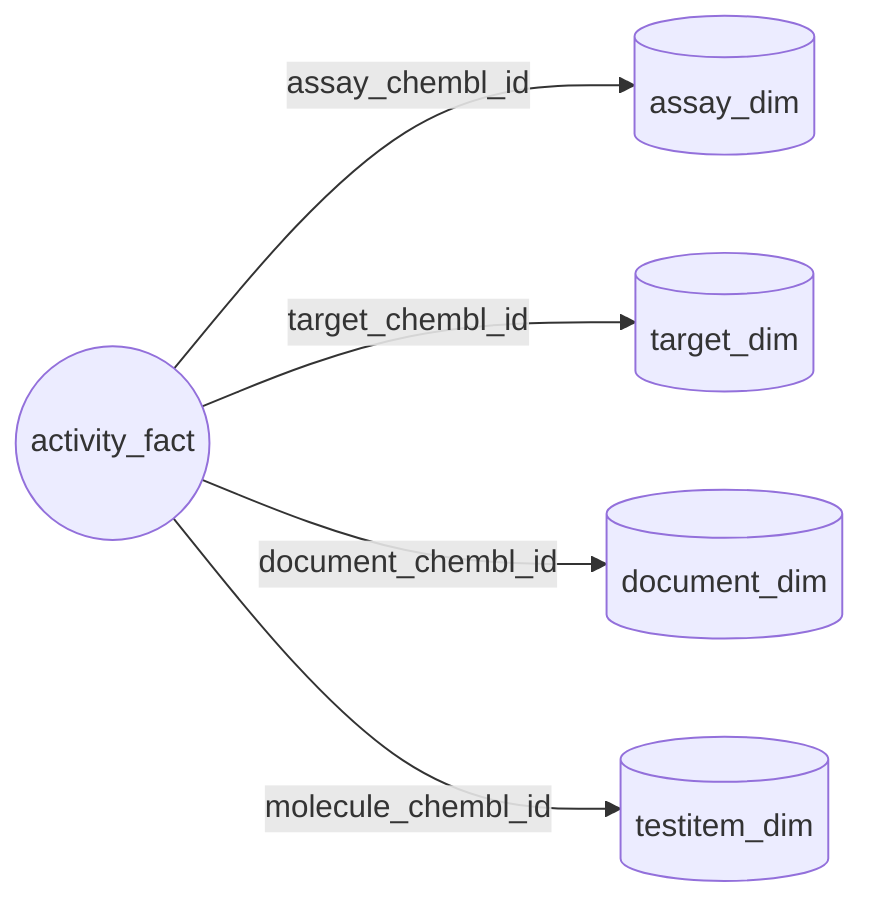

# Протокол сбора данных ChEMBL v2.1

*Версия:* 2.1 (октябрь 2025)
*Репозиторий:* `SatoryKono/ChEMBL_data_acquisition`
*Область применения:* сквозной ETL для документов, целей, биохимических анализов, тестовых объектов и активностей ChEMBL с детерминированными QA-сайдкарами.
*Статус:* утверждён для тестового контура (см. §7).

> **Контроль изменений — CHEMBL-DM01**
>
> | Этап | Ответственный | Дата | Подпись |
> |------|---------------|------|---------|
> | Подготовил | Документационный координатор, DocsOps | 2025-10-15 | `CHEMBL-DM01` |
> | Проверил | Руководитель QA, DataOps | 2025-10-15 | `CHEMBL-DM01` |
> | Утвердил | Руководитель управления данными | 2025-10-15 | `CHEMBL-DM01` |

---

## 1. Исполняемая среда и зависимости

| Компонент | Конфигурация | Источник |
|-----------|--------------|----------|
| Python | `>=3.11,<3.13` | Классификаторы `pyproject.toml` и окружения `tox`. |
| Основные библиотеки | `numpy>=2.3.3`, `pandas>=2.3.3`, `requests>=2.32.3`, `pyyaml>=6.0.2`, `pandera>=0.26.1`, `pyarrow>=17.0.0` | `pyproject.toml` и `requirements-lock.txt`. |
| QA / Dev инструменты | `pytest>=8.4.2`, `pytest-json-report>=1.5.0`, `pytest-cov>=6.0.0`, `responses>=0.25.8`, `ruff>=0.13.1`, `mypy>=1.17.1`, `pre-commit>=3.7.1` | Дополнение `dev` в `pyproject.toml`. |
| Консольные точки входа | `get-data`, `get-document-data`, `get-target-data`, `get-assay-data`, `get-testitem-data`, `get-tissue-data`, `get-cellline-data`, `get-activity-data`, `get-activities`, `check-determinism`, `table-quality`, `mapper`, `chunk-io` | Раздел `[project.scripts]`. |

Структура библиотек:

- `library/clients/*` — HTTP-клиенты с ретраями, бэкоффом и телеметрией.【F:library/clients/chembl.py†L1-L120】【F:library/clients/uniprot.py†L1-L150】
- `library/cli/commands/*` — тонкие адаптеры для `scripts/get_*.py`.【F:library/cli/commands/get_data.py†L97-L160】
- `library/pipelines/*` — доменные пайплайны, управляющие выгрузкой, обогащением и сохранением.【F:library/pipelines/registry.py†L80-L128】
- `library/postprocessing/*` — модульные трансформации постобработки.【F:library/postprocessing/common/runner.py†L178-L286】
- `library/schemas/*` — Pandera-схемы для итоговых экспортов.【F:library/schemas/activities.py†L31-L83】
- `library/qa/*` — хуки качества и профилировщики таблиц.【F:library/qa/table_quality.py†L1-L210】

---

## 2. Источники данных и обогащения

| Источник | Модули | Назначение |
|----------|--------|------------|
| ChEMBL REST | `library/clients/chembl.py`, `library/pipelines/{activity,assay,document,target}` | Первичные факты для всех сущностей. |
| PubMed и Semantic Scholar | `library/clients/pubmed.py`, `library/clients/semanticscholar.py` | Обогащение публикаций для документов. |
| CrossRef и OpenAlex | `library/clients/crossref.py`, `library/clients/openalex.py` | DOI и библиометрия. |
| UniProt | `library/clients/uniprot.py`, `library/pipelines/target/uniprot.py` | Таксономия и признаки белков. |
| Guide to Pharmacology (IUPHAR) | `library/clients/iuphar.py`, `library/pipelines/target/iuphar.py` | Классификация целей. |
| PubChem | `library/clients/pubchem.py`, `library/pipelines/testitem/pubchem.py` | Структурное обогащение тестовых объектов. |
| Локальные словари | `config/dictionary/**`, `config/pipeline/*.yaml` | Детерминированные соответствия для BAO, тканей и флагов качества активностей. |

---

## 3. Модель данных

ETL строит звёздную схему: факт `activity` ссылается на измерения документов, целей, анализов и тестовых объектов.

Основные схемы описаны Pandera-моделями:

- `library/schemas/activities.py` — экспорт активностей.【F:library/schemas/activities.py†L31-L83】
- `library/schemas/assays.py` — экспорт анализов.【F:library/schemas/assays.py†L33-L59】
- `library/schemas/targets.py` — экспорт целей с порядком для Power Query.【F:library/schemas/targets.py†L18-L124】
- `library/schemas/testitems.py` — экспорт молекул/тестовых объектов.【F:library/schemas/testitems.py†L12-L44】
- `config/schema/document.yaml` — декларативная схема документов для `DocumentsSchema`.【F:library/schemas/document_spec.py†L13-L118】

---

## 4. Процесс извлечения

### 4.1 Оркестратор `scripts/get_data.py`

- Загружает стандартный реестр (`library/pipelines/registry.load_pipeline_registry`) в порядке document → target → assay → testitem → activity.【F:library/pipelines/registry.py†L80-L128】
- Базовые флаги позволяют настроить пути, логирование и перезапуски без изменения канонического плана:

  | Опция | Назначение | Когда использовать |
  |-------|------------|--------------------|
  | `--base-path`, `--input-dir`, `--output-dir` | Общие директории входа/выхода для всех этапов. | Унифицировать площадки для смоук-ранов, QA и продакшн-экспортов. |
  | `--config` | Альтернативный YAML. | Подключить окружения с другими кредами или словарями. |
  | `--date` | Переопределение префикса файлов. | Совместить артефакты с отчётной датой или воспроизвести исторический дроп. |
  | `--log-level`, `--verbose` | Управление логированием оркестратора и пайплайнов (`--verbose` принудительно включает `DEBUG`). | Поднять подробность без правки конфигов. |
  | `--limit` | Ограничение идентификаторов (`0` пропускает этап). | Запустить детерминированные смоук-сборки. |
  | `--force`, `--skip-existing` | Перезапись или пропуск при существующих файлах. | Восстановить частичный прогон без ручной очистки директорий. |
  | `--rerun-postprocess` | Пересобрать экспорт при наличии промежуточных артефактов. | Обновить таблицы после изменения правил постобработки. |
  | `--dry-run` | Рассчитать план без записи файлов. | Проверить конфигурацию в CI и ноутбуках. |
  | `--debug`, `--keep-intermediate` | Сохранить промежуточные файлы и включить расширенную диагностику. | Исследовать данные или локально повторить сбой. |
  | `--disable-pubchem` | Пропустить обогащение PubChem на этапе test item. | Воспроизвести легаси-поведение или изолировать источники дрейфа. |
  | `--print-config` | Вывести итоговую конфигурацию и завершиться. | Зафиксировать настройки для аудита. |
  | `--run-id` | Детерминированный идентификатор вместо вычисленного хэша. | Связать логи с внешними планировщиками. |

  Флаги разбираются `_parse_args` и нормализуются в `PipelineRunConfig`, сохраняя порядок шагов и валидацию.【F:library/cli/commands/get_data.py†L949-L1108】
- Расширенные переопределения меняют граф исполнения и используются точечно:

  | Опция | Использовать, когда… |
  |-------|---------------------|
  | `--pipeline-registry <path>` | Нужен альтернативный YAML-реестр для добавления/удаления шагов или изменения порядка (интеграционные тесты). |
  | `--override-input STEP=FILENAME` | Подменить входной файл отдельного этапа без правки реестра. |
  | `--override-output-stem STEP=STEM` | Перенаправить имя итоговых файлов и sidecar-артефактов для одного шага. |
  | `--override-subcommand STEP=SUBCOMMAND` | Выполнить нестандартную подкоманду (например, `target=chembl`) внутри общего сценария. |

  Переопределения опциональны и проходят через `PipelineRunConfig`, поэтому ad-hoc планы ведут себя как вызов CLI.【F:library/cli/commands/get_data.py†L1048-L1108】

### 4.2 Пайплайн документов `scripts/get_document_data.py`

- Режимы: `chembl`, `pubmed`, `all`; по умолчанию `--mode all`.【F:library/cli/commands/get_document_data.py†L1737-L1975】
- Общие флаги: `--input`, `--final-out`, `--column`, `--limit`, `--offset`, `--config`.【F:library/cli/parser.py†L126-L204】
- Специфические параметры: `--batch-size`, `--sleep`, `--workers` для PubMed; `--chunk-size`, `--chembl-timeout` для ChEMBL; блок резервного DOI (`--fallback-doi-*`).【F:library/cli/commands/get_document_data.py†L1216-L1718】
- Постобработка: `library/postprocessing/documents/steps`.【F:library/postprocessing/documents/steps.py†L1-L82】

### 4.3 Пайплайн целей `scripts/get_target_data.py`

- Подкоманды: `uniprot`, `chembl`, `iuphar`, `all`.【F:library/cli/commands/get_target_data.py†L1506-L4337】
- Общие флаги: `--input`, `--final-out`, `--raw-out`, `--raw-format`, `--id-cols`, `--normalize-at-export/--no-normalize-at-export`.【F:library/cli/commands/get_target_data.py†L1524-L1609】
- `all` объединяет три загрузчика и учитывает префиксные переопределения (`--chembl-*`, `--uniprot-*`, `--iuphar-*`).【F:library/cli/commands/get_target_data.py†L3968-L4175】
- Постобработка: `library/postprocessing/targets/steps`.【F:library/postprocessing/targets/steps.py†L1-L80】

### 4.4 Пайплайн анализов `scripts/get_assay_data.py`

- Флаги: `--input`, `--final-out`, `--chunk-size`, `--timeout`, `--limit`, `--offset`, `--config`.【F:library/cli/commands/get_assay_data.py†L629-L721】
- Требуются словари таксономии и целей из `config/dictionary`.【F:library/cli/commands/get_assay_data.py†L484-L602】
- Постобработка: `library/postprocessing/assays/steps`.【F:library/postprocessing/assays/steps.py†L1-L76】

### 4.5 Пайплайн тестовых объектов `scripts/get_testitem_data.py`

- Этапы загрузки определены в `library/pipelines/testitem/cli.py` (чтение идентификаторов, обогащение ChEMBL, обогащение PubChem, финальный экспорт).【F:library/pipelines/testitem/cli.py†L651-L1136】
- Флаги: `--input`, `--final-out`, `--batch-size`, `--timeout`, `--limit`, `--offset`, `--request-limit`, `--config`.【F:library/cli/commands/get_testitem_data.py†L646-L714】
- По умолчанию формируются детерминированный CSV и отчёты по качеству/корреляциям. `--emit-legacy-artifacts` возвращает легаси-набор (`<stem>_failure_cases.csv`, `.meta.yaml`, манифесты постобработки) для диагностики.【F:library/pipelines/testitem/cli.py†L864-L1186】【F:library/cli/commands/get_testitem_data.py†L564-L738】

### 4.6 Пайплайн активностей `scripts/get_activity_data.py`

- Делегирует в `library.cli.entrypoints.activity.ActivityPipelineCLI`.【F:library/cli/entrypoints/activity.py†L1879-L1966】
- Флаги: `--input`, `--final-out`, `--batch-size`, `--timeout`, `--limit`, `--offset`, `--workers`, `--dry-run`.【F:library/cli/entrypoints/activity.py†L1888-L1934】
- Применяет обогащение (`apply_activity_annotations`), расчёт границ (`compute_activity_bounds`), Pandera-валидацию (`validate_activities`) и создаёт QA-сайдкары.【F:library/cli/entrypoints/activity.py†L1216-L1448】

### 4.7 Дополнительные справочники

- `scripts/get_tissue_data.py` — обновление таблиц тканей для расширенного экспорта активностей.【F:scripts/get_tissue_data.py†L1-L220】
- `scripts/get_cellline_data.py` — детерминированная выгрузка клеточных линий.【F:scripts/get_cellline_data.py†L1-L210】

---

## 5. Валидация и QA

| Компонент | Артефакты | Реализация |
|-----------|-----------|------------|
| Pandera-валидация | Проверка обязательных колонок, приведение типов, nullability. | `library/schemas/*.py`, `library/pipelines/*/validation.py`. |
| Профилировщик таблиц | `<stem>_quality_report_table.csv`, `<stem>.quality.json`. | `library/qa/table_quality.py`, вызывается из CLI-хуков.【F:library/cli/entrypoints/activity.py†L1450-L1539】 |
| Метрики постобработки | `<stem>.postprocess.report.json` с числом строк, длительностью, статусом валидации. | `library/postprocessing/common/utils.py`.【F:library/postprocessing/common/utils.py†L180-L258】 |
| Логирование | Структурированные JSON-события (`*_pipeline_done`, `quality_report_generated`). | `library/common/logging_setup.py`.【F:library/common/logging_setup.py†L1-L160】 |
| Тестовый стенд | `reports/test_report.json`, `reports/test_summary.md`; успешность ≥95 %. | `scripts/run_tests.py`.【F:scripts/run_tests.py†L40-L160】 |

---

## 6. Потоки постобработки

Постобработка описана в YAML `config/pipeline/*.yaml` и исполняется через `library.postprocessing.common.run_steps`.【F:library/postprocessing/common/runner.py†L178-L286】

| Таблица | Шаги | Схема | Примечания |
|---------|------|-------|------------|
| Activity | `normalize_activity_records` → `enrich_activity_quality` → `finalize_activity_records` | `library/postprocessing/activities/schema.py` | Перед записью удаляются `standard_lower_value`, `standard_upper_value`.【F:library/cli/entrypoints/activity.py†L1239-L1360】 |
| Assay | `normalize_assay_metadata` → `enrich_assay_flags` → `finalize_assay_records` | `library/postprocessing/assays/schema.py` | BAO-категории подставляются из словарей.【F:library/postprocessing/assays/steps.py†L20-L73】 |
| Document | `normalize_document_fields` → `enrich_document_publication_year` → `finalize_document_records` | `config/schema/document.yaml` | Группы полей поддерживаются в YAML, чтобы исключить дрейф.【F:config/schema/document.yaml†L1-L200】 |
| Target | `normalize_target_fields` → `enrich_target_synonyms` → `finalize_target_records` | `library/postprocessing/targets/schema.py` | Поле `AddCellularitySmart` сохраняется для обратной совместимости.【F:library/postprocessing/targets/steps.py†L24-L76】 |
| Test item | `prepare_parent_enrichment` → `run_parent_enrichment` → `finalize_output` | `library/schemas/testitems.py` | Формируется набор данных и QA/корреляционные отчёты; легаси-артефакты доступны через `--emit-legacy-artifacts`.【F:library/pipelines/testitem/cli.py†L864-L1186】【F:library/cli/commands/get_testitem_data.py†L564-L738】 |

---

## 7. Политика качества и тестирования

1. Детерминированный pytest ≥95 % успешности. `python scripts/run_tests.py` формирует отчёты в JSON/Markdown.【F:scripts/run_tests.py†L40-L160】
2. Проверка детерминизма: `python scripts/check_determinism.py --no-dry-run` сравнивает экспорты пайплайнов.【F:scripts/check_determinism.py†L34-L114】
3. CI выполняет `ruff check` и `mypy --strict library`.【F:pyproject.toml†L67-L118】
4. Падающие или флейковые тесты изолируются через `xfail(strict=True)` с заводом задачи.【F:tests/README.md†L45-L120】

---

## 8. Журнал изменений

| Версия | Дата | Автор | Ключевые правки |
|--------|------|-------|-----------------|
| 2.1 | 2025-10-15 | Совет DocsOps | Восстановлена утверждённая база, синхронизированы метаданные релиза с октябрём 2025, добавлен блок контроля изменений по CHEMBL-DM01. |
| 2.0 | 2025-02-28 | Документационный аудит | Обновлены флаги CLI (`--input`, `--final-out`), добавлены ссылки на пайплайны тканей/клеточных линий, синхронизированы описания схем с моделями Pandera и обновлена QA-политика. |
