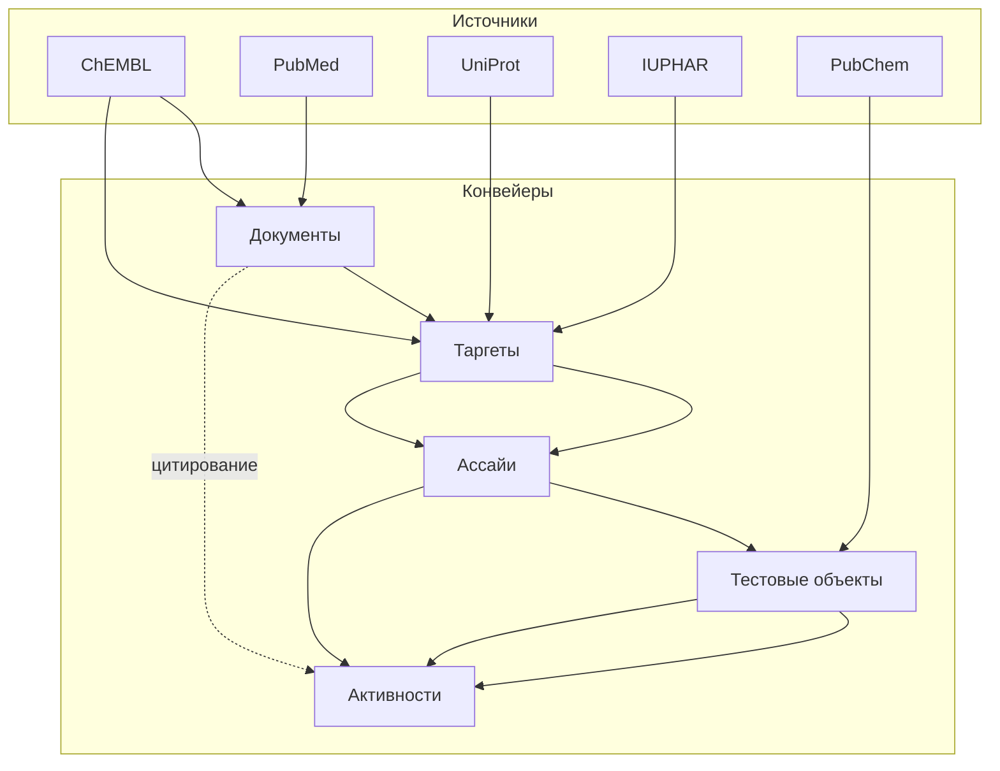

# Набор утилит ChEMBL Data Acquisition

Документ описывает назначение проекта, структуру конвейеров и карту документации.
Используйте его как стартовую точку перед переходом к специализированным
руководствам.

## Что входит в набор

- **Конвейеры сущностей** для документов, таргетов, ассайев, активностей и тестовых
  объектов. Каждый конвейер читает идентификаторы из CSV, обращается к внешним
  сервисам, выполняет детерминированную валидацию и формирует воспроизводимые
  выгрузки вместе с метаданными.
- **Единый CLI-слой** с общими флагами и пространственными переопределениями для
  сложных сценариев.
- **Конфигурируемый оркестратор** через консольную команду `get-data`
  (`library.cli.entrypoints:get_data_main`). Она один раз разрешает пути,
  конфигурацию, параметры логирования и повторов, после чего выполняет полный
  ETL-цикл воспроизводимо. Совместимая обёртка `python scripts/get_data.py`
  оставлена для исторической автоматизации, но прокидывает только общие флаги
  этапов и не поддерживает расширенные оркестраторские опции.
- **Контроль качества**: валидация Pandera, детерминированный порядок строк,
  мета-файлы, сравнение хэшей и профили качества таблиц.
- **Инструменты разработчика**: статический анализ (`ruff`, `mypy`), форматирование
  (`black`), детерминированные тесты (`pytest`) и автоматизация CI/CD.

## Обзор конвейера

Ключевые свойства:

- Конвейеры принимают CSV с идентификаторами через `--input` или каталог, который
  подставляет `get-data`.
- Каждый конвейер сохраняет детерминированный CSV, файл метаданных `<name>.meta.yaml`,
  отчёт `<name>_quality_report_table.csv` и JSON-сводку качества. Таргет-пайплайн
  дополнительно формирует справочники `organism.output.target_<stamp>.csv`,
  `isoform.output.target_<stamp>.csv` и `names.output.target_<stamp>.csv`,
  описанные в [`OUTPUT_TARGETS.md`](./OUTPUT_TARGETS.md).
- Валидация схем выполняется до и после обогащения; ошибки логируются в
  структурированном формате и, при необходимости, приводят к фатальному завершению
  согласно конфигурации.

## Навигация по документации

Дерево документации симметрично в английской и русской версиях. Таблица ниже
указывает на каноничные документы:

| Раздел | Английская версия | Русская версия |
|--------|-------------------|----------------|
| Сводка и оглавление | [`SUMMARY.md`](../en/SUMMARY.md) | [`SUMMARY.md`](./SUMMARY.md) |
| Быстрый старт | [`../en/guides/QUICK_START.md`](../en/guides/QUICK_START.md) | [`guides/QUICK_START.md`](./guides/QUICK_START.md) |
| Руководства и FAQ | [`../en/guides/USAGE.md`](../en/guides/USAGE.md), [`../en/guides/ADVANCED_SCENARIOS.md`](../en/guides/ADVANCED_SCENARIOS.md), [`../en/guides/FAQ.md`](../en/guides/FAQ.md), [`../en/guides/DEBUGGING.md`](../en/guides/DEBUGGING.md) | [`guides/USAGE.md`](./guides/USAGE.md), [`guides/ADVANCED_SCENARIOS.md`](./guides/ADVANCED_SCENARIOS.md), [`guides/FAQ.md`](./guides/FAQ.md), [`guides/DEBUGGING.md`](./guides/DEBUGGING.md) |
| Использование CLI | [`../en/USAGE.md`](../en/USAGE.md) | [`USAGE.md`](./USAGE.md) |
| Конфигурация | [`../en/CONFIG.md`](../en/CONFIG.md) | [`CONFIG.md`](./CONFIG.md) |
| Выходные данные и валидация | [`../en/OUTPUT.md`](../en/OUTPUT.md) | [`OUTPUT.md`](./OUTPUT.md) |
| Вспомогательные выгрузки таргетов | [`../en/OUTPUT_TARGETS.md`](../en/OUTPUT_TARGETS.md) | [`OUTPUT_TARGETS.md`](./OUTPUT_TARGETS.md) |
| Контроль качества | [`../en/QA_PROCESS.md`](../en/QA_PROCESS.md) | [`QA_PROCESS.md`](./QA_PROCESS.md) |
| Архитектура | [`../en/architecture/ARCHITECTURE.md`](../en/architecture/ARCHITECTURE.md) | [`architecture/ARCHITECTURE.md`](./architecture/ARCHITECTURE.md) |
| Архитектурные улучшения | [`../en/architecture/ARCHITECTURE_IMPROVEMENTS.md`](../en/architecture/ARCHITECTURE_IMPROVEMENTS.md) | [`architecture/ARCHITECTURE_IMPROVEMENTS.md`](./architecture/ARCHITECTURE_IMPROVEMENTS.md) |
| Модель данных | [`../en/architecture/DATA_MODEL.md`](../en/architecture/DATA_MODEL.md) | [`architecture/DATA_MODEL.md`](./architecture/DATA_MODEL.md) |
| Разработка | [`../en/development/README.md`](../en/development/README.md) | [`development/README.md`](./development/README.md) |
| Справочники и глоссарий | [`../en/reference/DICTIONARIES.md`](../en/reference/DICTIONARIES.md) | [`reference/DICTIONARIES.md`](./reference/DICTIONARIES.md) |
| Руководство по постобработке | [`../en/guides/POSTPROCESSING_RUNBOOK.md`](../en/guides/POSTPROCESSING_RUNBOOK.md) | [`guides/POSTPROCESSING_RUNBOOK.md`](./guides/POSTPROCESSING_RUNBOOK.md) |
| Статус качества | [`../en/reference/QUALITY_STATUS.md`](../en/reference/QUALITY_STATUS.md) | [`reference/QUALITY_STATUS.md`](./reference/QUALITY_STATUS.md) |
| Схема конфигурации пайплайнов | [`../en/architecture/PIPELINE_CONFIG_SCHEMA.md`](../en/architecture/PIPELINE_CONFIG_SCHEMA.md) | [`architecture/PIPELINE_CONFIG_SCHEMA.md`](./architecture/PIPELINE_CONFIG_SCHEMA.md) |

Текущее описание модульной постобработки (вариант 1) доступно в
[`../postprocessing_variant1_tasks.md`](../postprocessing_variant1_tasks.md).

У английских и русских файлов совпадают структура и заголовки, что облегчает
сопоставление версий.

## Структура проекта

| Каталог | Назначение |
|---------|------------|
| `library/clients` | HTTP-клиенты для ChEMBL, PubMed, UniProt, OpenAlex, CrossRef, PubChem. |
| `library/pipelines` | Этапы ETL по сущностям: получение, нормализация, экспорт. |
| `library/qa` и `library/table_quality.py` | Проверки качества, утилиты профилирования и записи отчётов. |
| `library/utils` | Разрешение путей, логирование, bootstrap CLI и детерминированные CSV-хелперы. |
| `config/` | Базовая YAML-конфигурация и словари для обогащения. |
| `tests/` | Юнит-, интеграционные и сквозные тесты pytest с детерминированными фикстурами. |

Дополнительные сведения о процессе разработки, ветвлении и CI описаны в
[`development/README.md`](./development/README.md).
