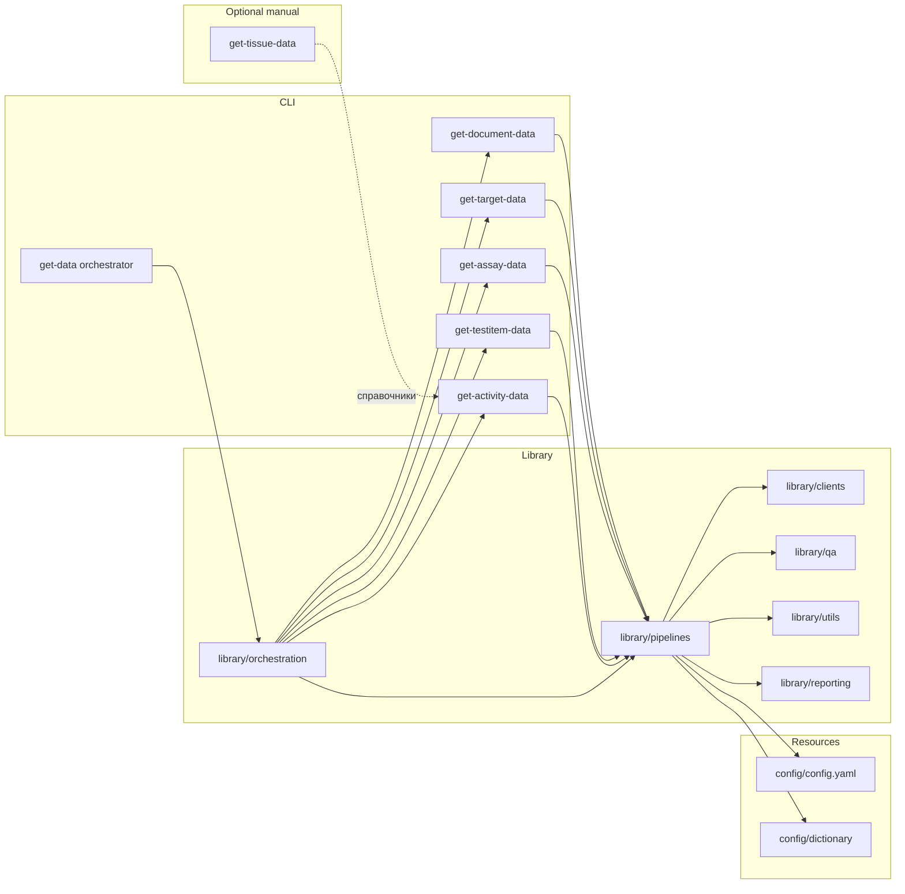

# Обзор архитектуры

Оркестратор инициализирует общую конфигурацию, логирование, лимитеры и по очереди
вызвает CLI до этапа активностей. Когда нужны связи по тканям, `get_tissue_data`
запускают отдельно, чтобы подготовить справочники перед объединением активностей.
Внутри используются общие компоненты `library/`:

- `library/orchestration` — реестр шагов, общий контекст выполнения и координация
  ретраев, которые используют `get_data.py`, тесты и кастомные сценарии.
- `library/clients` — HTTP-клиенты с ретраями и лимитами для ChEMBL, UniProt,
  PubMed, OpenAlex, CrossRef, PubChem.
- `library/pipelines` — логика загрузки, трансформации и экспорта по
  сущностям (`document`, `target`, `assay`, `testitem`, `tissue`, `activity`).
  Даже если оркестратор проходит только «документы → таргеты → ассайи → тестовые
  объекты → активности», все подпакеты доступны для ручного запуска.
- `library/utils` — вспомогательные утилиты: CLI-бустрап, детерминированное I/O,
  загрузка конфигурации.
- `library/reporting` — генерация манифестов запусков, слияние метаданных и
  агрегация QC, общие для оркестратора и отдельных пайплайнов.
- `library/qa` и `library/table_quality.py` — валидация Pandera, профили качества,
  формирование метаданных.

## Конвейеры извлечения данных

| Конвейер | CLI | Основные источники | Выходы |
|----------|-----|-------------------|--------|
| Document | `scripts/get_document_data.py` | ChEMBL `/document`, PubMed E-utilities, OpenAlex, CrossRef, Semantic Scholar. | `output.documents_<stamp>.csv` и метаданные. |
| Target | `scripts/get_target_data.py` | ChEMBL `/target`, UniProt, Guide to PHARMACOLOGY, локальные словари. | `output.targets_<stamp>.csv` и вспомогательные таблицы (`organism`, `isoform`, `names`, `IUPHAR`). |
| Assay | `scripts/get_assay_data.py` | ChEMBL `/assay`. | `output.assay_<stamp>.csv` с QC-артефактами. |
| Test item | `scripts/get_testitem_data.py` | ChEMBL `/molecule`, PubChem PUG-REST. | `output.testitems_<stamp>.csv` и метаданные. |
| Tissue | `scripts/get_tissue_data.py` | ChEMBL `/tissue`, онтологии UBERON, EFO, BTO, Caloha, LINCS, CCLE. | `output.tissue_<stamp>.csv` и отчёты качества; запускается вручную перед пайплайном активностей, если нужны связи по тканям. |
| Activity | `scripts/get_activity_data.py` | ChEMBL `/activity`. | `output.activity_<stamp>.csv` с обогащениями. |

Оркестратор выполняет последовательно «документы → таргеты → ассайи → тестовые
объекты → активности», если отдельные этапы не отключены флагами CLI. Пайплайн
тканей запускается отдельно.

Альтернативные сценарии можно описать в YAML и передать через
`--pipeline-registry`. Модуль
[`library/pipelines/registry.py`](../../../library/pipelines/registry.py)
проверяет структуру и позволяет менять порядок шагов, подменять вызываемые
функции или пропускать этапы без изменения исходников.

Внешние сервисы вызываются через токен-бакетные лимитеры (`sources.*`), все
запросы проходят через `system.retry`.

## Ответственность компонентов

| Компонент | Задачи |
|-----------|-------|
| `scripts/` | Парсинг аргументов, подготовка путей, запуск пайплайнов. |
| `library/pipelines/*` | Чтение входных CSV, вызовы API, объединение данных, валидация и экспорт. |
| `library/qa`, `library/table_quality.py` | Проверки схем, подсчёт метрик качества, предупреждения. |
| `library/postprocessing` | Упорядочивание колонок, генерация метаданных, сортировка. |
| `library/config/` | Слияние YAML, переменных окружения и CLI, проверка типов. |

## Модель выполнения

1. CLI загружает конфигурацию через `library.config.load_config`; при `--print-config`
   выводится итоговый YAML.
2. Входной CSV читается с учётом настроек кодировки, разделителей и маркеров NA.
3. Пайплайны обращаются к API через общие лимитеры и ретраят запросы.
4. Промежуточные DataFrame'ы валидируются, нормализуются и детерминированно
   сортируются перед экспортом.
5. Рядом с CSV создаются `.meta.yaml` и отчёты качества.

Подробности по шагам — в [`ETL_PROCESS.md`](./ETL_PROCESS.md), модель данных —
в [`DATA_MODEL.md`](./DATA_MODEL.md).
