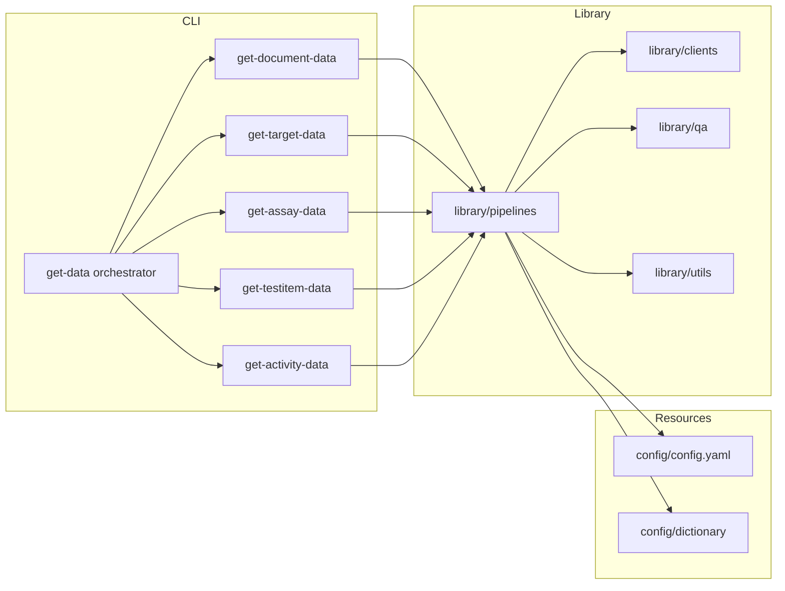

# Обзор архитектуры

Оркестратор инициализирует общую конфигурацию, логирование, лимитеры и по очереди
вызвает CLI для каждой сущности. Внутри используются общие компоненты `library/`:

- `library/clients` — HTTP-клиенты с ретраями и лимитами для ChEMBL, UniProt,
  PubMed, OpenAlex, CrossRef, PubChem.
- `library/pipelines` — логика загрузки, трансформации и экспорта по сущностям.
- `library/utils` — вспомогательные утилиты: CLI-бустрап, детерминированное I/O,
  загрузка конфигурации.
- `library/qa` и `library/table_quality.py` — валидация Pandera, профили качества,
  формирование метаданных.

Внешние сервисы вызываются через токен-бакетные лимитеры (`sources.*`), все
запросы проходят через `system.retry`.

## Ответственность компонентов

| Компонент | Задачи |
|-----------|-------|
| `scripts/` | Парсинг аргументов, подготовка путей, запуск пайплайнов. |
| `library/pipelines/*` | Чтение входных CSV, вызовы API, объединение данных, валидация и экспорт. |
| `library/qa`, `library/table_quality.py` | Проверки схем, подсчёт метрик качества, предупреждения. |
| `library/postprocessing` | Упорядочивание колонок, генерация метаданных, сортировка. |
| `library/config.py` | Слияние YAML, переменных окружения и CLI, проверка типов. |

## Модель выполнения

1. CLI загружает конфигурацию через `library.config.load_config`; при `--print-config`
   выводится итоговый YAML.
2. Входной CSV читается с учётом настроек кодировки, разделителей и маркеров NA.
3. Пайплайны обращаются к API через общие лимитеры и ретраят запросы.
4. Промежуточные DataFrame'ы валидируются, нормализуются и детерминированно
   сортируются перед экспортом.
5. Рядом с CSV создаются `.meta.yaml` и отчёты качества.

Подробности по шагам — в [`ETL_PROCESS.md`](./ETL_PROCESS.md), модель данных —
в [`DATA_MODEL.md`](./DATA_MODEL.md).
