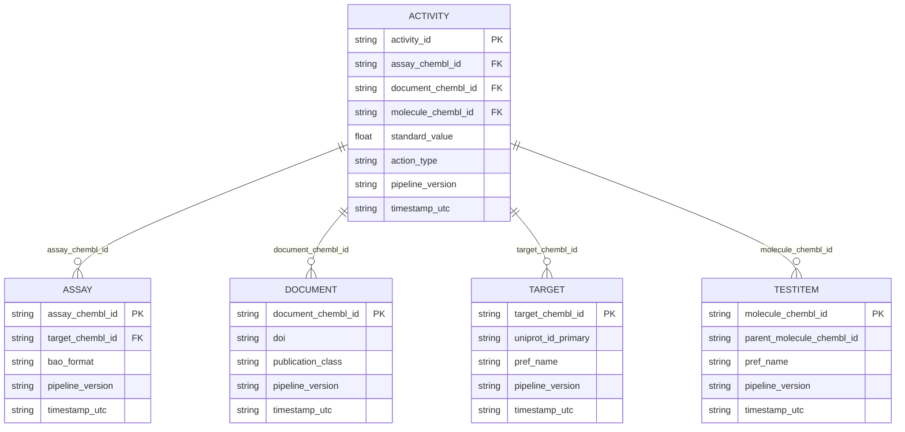

# Модель данных

Экспортируемые CSV формируют звёздную схему с таблицей фактов активностей.

## Использование измерений

- **Документы** — библиографические сведения для трассировки источников.
- **Таргеты** — белковые и генетические аннотации для дальнейшего обогащения.
- **Ассайи** — экспериментальный контекст, BAO и QA-флаги.
- **Тестовые объекты** — идентичность молекул, способы введения, данные PubChem,
  связи с родительскими молекулами.
- **Факт активностей** — нормализованные значения измерений, класс `action_type`,
  вычисленные границы и хэш дополнительного свойства.

## Ключи и временные метки

Каждая таблица содержит `pipeline_version` и `timestamp_utc`, что позволяет
отслеживать происхождение и строить инкрементальные загрузки. Активности ссылаются
на измерения по натуральным ключам; при необходимости downstream-хранилище может
создавать суррогатные ключи.
