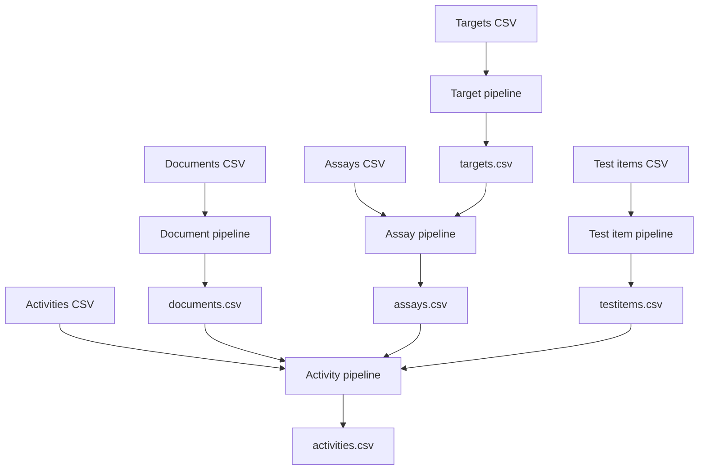
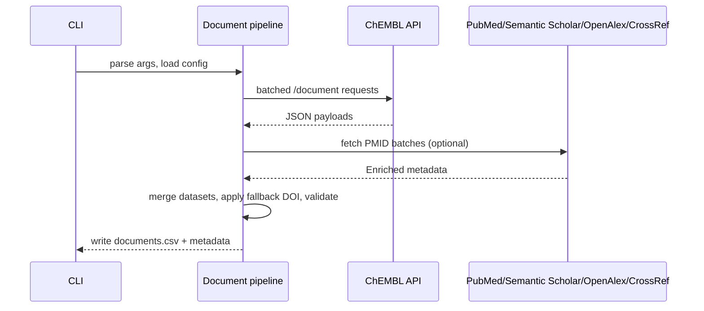
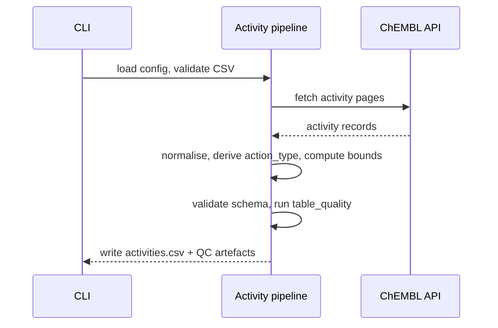

# Диаграммы потоков данных

## Общая схема

```mermaid
flowchart TD
    documents[Documents CSV] --> documentPipeline[Document pipeline]
    documentPipeline --> documentExport[documents.csv]
    targets[Targets CSV] --> targetPipeline[Target pipeline]
    targetPipeline --> targetExport[targets.csv]
    assays[Assays CSV] --> assayPipeline[Assay pipeline]
    assayPipeline --> assayExport[assays.csv]
    testitems[Test items CSV] --> testitemPipeline[Test item pipeline]
    testitemPipeline --> testitemExport[testitems.csv]
    activities[Activities CSV] --> activityPipeline[Activity pipeline]
    activityPipeline --> activityExport[activities.csv]

    documentExport --> activityPipeline
    targetExport --> assayPipeline
    assayExport --> activityPipeline
    testitemExport --> activityPipeline
```

## Обогащение документов

```mermaid
sequenceDiagram
    participant CLI as CLI
    participant Doc as Document pipeline
    participant Chembl as ChEMBL API
    participant Pubmed as PubMed/Semantic Scholar/OpenAlex/CrossRef

    CLI->>Doc: parse args, load config
    Doc->>Chembl: batched /document requests
    Chembl-->>Doc: JSON payloads
    Doc->>Pubmed: fetch PMID batches (optional)
    Pubmed-->>Doc: Enriched metadata
    Doc->>Doc: merge datasets, apply fallback DOI, validate
    Doc-->>CLI: write documents.csv + metadata
```

## Обогащение активностей

```mermaid
sequenceDiagram
    participant CLI
    participant Act as Activity pipeline
    participant Chembl as ChEMBL API

    CLI->>Act: load config, validate CSV
    Act->>Chembl: fetch activity pages
    Chembl-->>Act: activity records
    Act->>Act: normalise, derive action_type, compute bounds
    Act->>Act: validate schema, run table_quality
    Act-->>CLI: write activities.csv + QC artefacts
```
